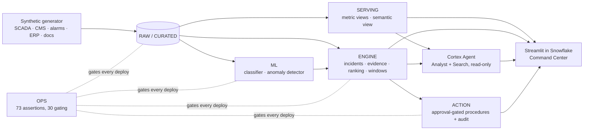

# Wind Ops AI

**A command center that turns a wind fleet's alarm flood into a short, honest, money-ranked list —
and never hides a real failure to get there.** Built entirely on Snowflake with Cortex Code.

> **The data is synthetic; the system is not.** Every turbine, sensor reading, alarm, work order and
> contract belongs to *Vayuveda Wind Systems*, a fictional Indian wind OEM. The pipeline, model,
> guards, agent and app are real and run end to end on a Snowflake account.

## In 60 seconds

A 100-turbine fleet raises hundreds of thousands of alarms in six months. Engineers cannot read them,
so real failures hide in the noise and end as unplanned crane campaigns and liquidated damages.

| Step | What Wind Ops AI does | Where you see it |
| --- | --- | --- |
| **Compress** | Groups raw alarms from four sources into incidents and classes each one **ACTIONABLE**, **NUISANCE** or **UNDETERMINED** from four stored evidence channels | *Alarms* tab: the funnel |
| **Refuse to guess** | "Undetermined" is a first-class answer: ranked below actionable, never hidden, never suppressible, its rate published | *Alarms* tab: undetermined rate |
| **Guard** | Suppression needs a reason, a time box and every safety gate passing — re-checked server-side, audited, reversible. **Real failures suppressed is shown beside compression and is 0** | *Alarms* tab: suppress panel |
| **Predict** | A trained `SNOWFLAKE.ML.CLASSIFICATION` model scores 30-day component failure risk, with drivers — and must beat a trivial single-signal rule, not just random, or the build fails | *Is the model real?* tab |
| **Rank by money** | Expected loss = risk × (part cost + LD cost of downtime), shown beside the probability-only ordering | *Risk triage* tab |
| **Plan** | Feasible maintenance windows from weather, crews, cranes and parts — or the binding constraint that blocks one | *Fleet & contracts* tab |
| **Explain** | A Cortex Agent answers in plain language, citing the fleet data or the maintenance procedure it used. It holds **no write privilege anywhere** | Sidebar assistant; Snowflake Intelligence |
| **Audit** | Every approval, refusal and rejection is a row | *Audit* tab |

**Headline results** are generated from the live system, never typed:
[`docs/08-delivery/results.md`](docs/08-delivery/results.md) (`just results`).

## How it is built



Object-by-object detail: [`docs/03-architecture/dataflow-as-built.md`](docs/03-architecture/dataflow-as-built.md).
Design and decisions: [`docs/03-architecture/`](docs/03-architecture/README.md).

## Run it

### Requirements

- A Snowflake account with `ACCOUNTADMIN` for the one-time foundation step, Cortex enabled, and
  `CORTEX_ENABLED_CROSS_REGION = ANY_REGION` (the agent uses `claude-sonnet-4-5`)
- [Snowflake CLI](https://docs.snowflake.com/en/developer-guide/snowflake-cli/index) `snow` ≥ 3.27, with
  a connection to that account
- Python 3.12+, [uv](https://docs.astral.sh/uv/), [just](https://github.com/casey/just)

### Deploy

```bash
git clone https://github.com/winds-of-change-blr/wind-ops-ai.git && cd wind-ops-ai
just bootstrap                                   # local venv + git hooks

export SNOWFLAKE_DEFAULT_CONNECTION_NAME=<your-connection>
export WOA_ACCOUNT=<ORG>-<ACCOUNT>               # only if not the team account; see below
just target                                      # prints what a deploy would hit — check it
just deploy                                      # the whole stack, then every gate (~25 min, XSMALL)
```

`just deploy` runs foundation → data → seed → ML → engine → agent → action → app → `verify`, and stops
at the first failing gate with the failure on screen. It is idempotent: run it twice and it converges.

**The account guard.** Every Snowflake recipe refuses a connection that is not on the expected
account, so a stray default connection can never deploy. The default is the team account; set
`WOA_ACCOUNT` to deploy into yours.

### Open it

- **App:** Snowsight › *Projects* › *Streamlit* › `WOA_COMMAND_CENTER` (database `WIND_OPS_AI`,
  schema `APP`)
- **Agent:** Snowflake Intelligence › `WOA_OPS_AGENT`
- **Proof:** `just verify` (every assertion, non-zero exit on any failure) and `just results`

Suggested path through the app: [`docs/08-delivery/walkthrough.md`](docs/08-delivery/walkthrough.md).

## What we do not claim

- **Synthetic data.** The model's near-perfect held-out precision reflects a generator whose damage →
  sensor mapping is cleaner than a real fleet's (`Q-84`). What is real is the method: a held-out
  evaluation, a trivial-rule baseline the model must beat, and a learnability gate on the data.
- **Repair allowances and some costs are illustrative** and labelled so wherever they appear.
- **Batch, not real-time**, except one incremental path with a declared target lag.
- **Approvals run under the app owner's rights**, with the viewer recorded beside the actor — not
  per-person authorisation ([`ADR-0020`](docs/03-architecture/decisions/adr-0020-app-platform.md)).

## Datasets and licences

| Dataset | Origin | Licence |
| --- | --- | --- |
| Fleet, SCADA, CMS, alarm, work-order, stock, contract and planning data | Generated by [`sql/10_generate`](sql/10_generate) | MIT, this repository |
| Maintenance procedures ([`data/maintenance_docs`](data/maintenance_docs), 11 PDFs) | Written by the team | MIT, this repository |
| App runtime: `streamlit`, `pandas`, `altair` | Snowflake Anaconda channel ([`app/environment.yml`](app/environment.yml)) | Apache-2.0 · BSD-3-Clause · BSD-3-Clause |
| Dev tooling: `pytest`, `ruff`, `pre-commit` | PyPI | MIT · MIT · MIT |

No public or third-party dataset is used ([`ADR-0006`](docs/03-architecture/decisions/adr-0006-synthetic-data.md)).

## Built with Cortex Code

Every phase — planning, development, execution, testing — has evidence entries with CoCo session IDs
verifiable in `ACCOUNT_USAGE`: [`docs/06-coco/evidence/`](docs/06-coco/evidence/README.md).

## Repository map

```
app/            Streamlit command center (warehouse runtime)
sql/            numbered deployment SQL: 00_setup … 90_teardown
data/           maintenance procedure PDFs for Cortex Search
docs/           business case, requirements, architecture, ADRs, quality, delivery, CoCo evidence
scripts/        results generator and helpers
skills/         reusable Cortex Code skills
justfile        the only deployment surface — `just` lists every recipe
STATE.md        where the build is, right now
```

## Contributing

Team workflow, branch naming and the PR rules: [CONTRIBUTING.md](CONTRIBUTING.md) and
[AGENTS.md](AGENTS.md). `main` is protected by a pre-commit hook; open PRs with `just pr`.

## License

MIT — see [LICENSE](LICENSE).
