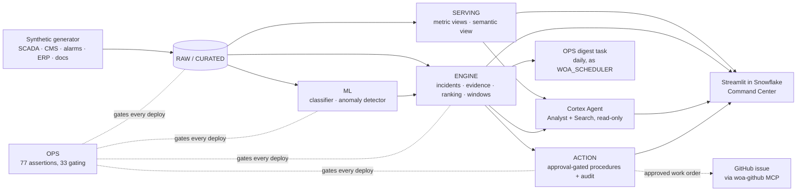

# Wind Ops AI

**A command center that turns a wind fleet's alarm flood into a short, honest, money-ranked list —
and never hides a real failure to get there.** Built entirely on Snowflake with Cortex Code.

> **The data is synthetic; the system is not.** Every turbine, sensor reading, alarm, work order and
> contract belongs to *Vayuveda Wind Systems*, a fictional Indian wind OEM. The pipeline, model,
> guards, agent and app are real and run end to end on a Snowflake account.

## In 60 seconds

A 100-turbine fleet raises hundreds of thousands of alarms in six months. Engineers cannot read them,
so real failures hide in the noise and end as unplanned crane campaigns and liquidated damages.

| Step | What Wind Ops AI does | Where you see it |
| --- | --- | --- |
| **Compress** | Groups raw alarms from four sources into incidents and classes each one **ACTIONABLE**, **NUISANCE** or **UNDETERMINED** from four stored evidence channels | *Alarms* tab: the funnel |
| **Refuse to guess** | "Undetermined" is a first-class answer: ranked below actionable, never hidden, never suppressible, its rate published | *Alarms* tab: undetermined rate |
| **Guard** | Suppression needs a reason, a time box and every safety gate passing — re-checked server-side, audited, reversible. **Real failures suppressed is shown beside compression and is 0** | *Alarms* tab: suppress panel |
| **Predict** | A trained `SNOWFLAKE.ML.CLASSIFICATION` model scores 30-day component failure risk, with drivers — and must beat a trivial single-signal rule, not just random, or the build fails | *Is the model real?* tab |
| **Rank by money** | Expected loss = risk × (part cost + LD cost of downtime), shown beside the probability-only ordering | *Risk triage* tab |
| **Plan** | Feasible maintenance windows from weather, crews, cranes and parts — or the binding constraint that blocks one | *Fleet & contracts* tab |
| **Explain** | A Cortex Agent answers in plain language, citing the fleet data or the maintenance procedure it used. It holds **no write privilege anywhere** | Sidebar assistant; Snowflake Intelligence |
| **Audit** | Every approval, refusal and rejection is a row | *Audit* tab |

**Headline results** are generated from the live system, never typed:
[`docs/08-delivery/results.md`](docs/08-delivery/results.md) (`just results`).

## For evaluators: how this maps to the criteria

Every row links to the code and to an **evidence entry** whose CoCo session and request IDs can be
checked in `SNOWFLAKE.ACCOUNT_USAGE.CORTEX_CODE_DESKTOP_USAGE_HISTORY`. Where we did not do
something, the row says so. A gap we state is not a gap we hid.

### CoCo ingenuity: the seven capabilities

| Capability | Verdict | What we built | Code | Evidence |
| --- | --- | --- | --- | --- |
| **Reusable, shareable skills** | Claimed | Three skills, each with `SKILL.md`, a real-output `EXAMPLE.md` and a `TEST.md`: **`approval-gated-agent-tools`** (an agent proposes, only a human role applies), **`alarm-noise-triage`** (the alarm-flood classifier that never reports compression without "real failures hidden" beside it), and **`semantic-view-audit`** (run on our own view, where it found 4 gaps). The teammate test (`T-19`) is pending | [`skills/`](skills/README.md) | [dev 13](docs/06-coco/evidence/development/13-reusable-skills.md) |
| **MCP connectors** | Claimed, scoped | **`woa-github`**, a local stdio MCP server in CoCo Desktop. It turns an *approved, audited* work order into a GitHub issue ([#27](https://github.com/winds-of-change-blr/wind-ops-ai/issues/27)), and refuses drafts, self-tests and unaudited rows. It is idempotent and holds no credentials. Interactive only, because the trial account cannot egress | [`mcp/woa_github`](mcp/woa_github/server.py) | [dev 14](docs/06-coco/evidence/development/14-github-mcp.md), [protocol log](docs/06-coco/evidence/development/artifacts/14-mcp-smoke.json) |
| **Automations / scheduled runs** | Claimed, Snowflake side | **`OPS.T_DAILY_DIGEST`**, daily at 05:30 IST, **owned by and run as `WOA_SCHEDULER`**. That role can read the engine, write one digest table, and touch nothing in `ACTION`: it refreshes, never applies. 4 assertions in `just verify` gate it. A CoCo agent-task automation was **not** built: the `cortex automation` CLI is not installed here | [`sql/85_ops`](sql/85_ops/01_daily_digest.sql) | [exec 02](docs/06-coco/evidence/execution/02-scheduled-digest.md) |
| **Custom tools / function calling** | Claimed | The Cortex Agent has two read-only tools: `fleet_data` (Cortex Analyst over `SV_WIND_OPS`) and `maintenance_docs` (Cortex Search over parsed PDFs). Writes happen only through approval-gated owner's-rights procedures. The agent has **no write tool**: absent, not disabled | [`sql/70_agent`](sql/70_agent/01_agent.sql), [`sql/50_action`](sql/50_action) | [dev 08](docs/06-coco/evidence/development/08-semantic-view-docs-and-agent.md), [dev 09](docs/06-coco/evidence/development/09-approval-gated-writes.md) |
| **Guardrails & graceful fallback** | Claimed | Guards refuse with a reason, and the refusal is audited. Real examples from today: a stale approval refused because the risk score was refreshed after the draft, and a duplicate draft refused. Safety-critical alarms can never be nuisance, and 0 real failures are hidden (gating). 10 adversarial agent probes and degraded-mode drills. Direct writes as the app and agent roles are refused | [`sql/15_quality`](sql/15_quality), [`scripts/agent_adversarial.py`](scripts/agent_adversarial.py) | [test 01](docs/06-coco/evidence/testing/01-adversarial-and-degraded.md), [test 02](docs/06-coco/evidence/testing/02-reverify-after-ingenuity.md) |
| **Working across surfaces** | Claimed | **Cortex Code Desktop** (the whole build), **Snowflake Intelligence** (the same agent, without our app), **Streamlit in Snowflake** (the command center) and **GitHub** (through MCP). We did not use the CoCo CLI or Cloud Agents | [`app/`](app/streamlit_app.py), [`sql/00_setup/04_snowflake_intelligence.sql`](sql/00_setup/04_snowflake_intelligence.sql) | [exec 01](docs/06-coco/evidence/execution/01-full-deploy-and-submission-surface.md) |
| **Multi-agent orchestration** | **Declined** | One governed agent is enough here. A second would add hand-offs and failure modes without adding capability, and a fragile demo is worse than a stated refusal | n/a | [coco-usage-plan §4](docs/06-coco/coco-usage-plan.md#4-ingenuity--e5) |

### CoCo across the lifecycle

| Phase | What CoCo did | Evidence |
| --- | --- | --- |
| **Planning** | The whole of `docs/`: business case, requirements, architecture and ADRs, from reference-solution forensics and live capability probes | [planning/](docs/06-coco/evidence/planning/) (2 entries) |
| **Development** | Generator, ML, engine, semantic view, agent, approval procedures, app, skills, MCP connector | [development/](docs/06-coco/evidence/development/) (14 entries) |
| **Execution, incl. scheduled runs** | A full `just deploy` forced by a failing freshness gate, and the **scheduled** daily digest running as `WOA_SCHEDULER` | [execution/](docs/06-coco/evidence/execution/) (2 entries) |
| **Testing & validation** | 77 assertions (33 gating) across 8 suites, an adversarial agent suite, an MCP protocol smoke test, and a re-verify that caught stale data | [testing/](docs/06-coco/evidence/testing/) (2 entries) |

### Recommended tasks

| Task | Status | Where |
| --- | --- | --- |
| Synthetic data generation | **Done**: 100 turbines, 108M signal rows, four alarm streams, ground-truth failures, and a learnability gate | [`sql/10_generate`](sql/10_generate), [dev 03](docs/06-coco/evidence/development/03-synthetic-data-generator.md) |
| Data pipelines (dynamic tables, tasks, streams) | **Partly**: a staged SQL pipeline gated end to end, and **one scheduled task**. No streams. **No dynamic table**: designed, not built | [`justfile`](justfile) `deploy`, [`sql/85_ops`](sql/85_ops) |
| Semantic model, ontology, verified queries | **Partly**: `SV_WIND_OPS` has 10 tables, 32 dimensions, 22 facts and 15 metrics, all described, with metric parity tested. **No verified queries yet**: our own audit skill found that | [`sql/30_serve/02_semantic_view.sql`](sql/30_serve/02_semantic_view.sql), [skill example](skills/semantic-view-audit/EXAMPLE.md) |
| Streamlit app | **Done**: `WOA_COMMAND_CENTER` (triage, alarms, plan, approvals, audit, agent sidebar) | [`app/`](app/streamlit_app.py), [dev 07](docs/06-coco/evidence/development/07-app-and-prerequisites.md) |
| MCP connections (Jira, Slack, Drive) | **GitHub instead**: none of those connectors is configured on the account, and the trial cannot egress | [dev 14](docs/06-coco/evidence/development/14-github-mcp.md) |
| Document & unstructured processing | **Done**: 11 maintenance PDFs, `AI_PARSE_DOCUMENT`, Cortex Search, cited by the agent | [`sql/60_docs`](sql/60_docs), [dev 08](docs/06-coco/evidence/development/08-semantic-view-docs-and-agent.md) |

Full criterion-by-criterion map (`E1`–`E9`): [`docs/08-delivery/evaluation-traceability.md`](docs/08-delivery/evaluation-traceability.md).

## How it is built



Object-by-object detail: [`docs/03-architecture/dataflow-as-built.md`](docs/03-architecture/dataflow-as-built.md).
Design and decisions: [`docs/03-architecture/`](docs/03-architecture/README.md).

## Run it

### Requirements

- A Snowflake account with `ACCOUNTADMIN` for the one-time foundation step, Cortex enabled, and
  `CORTEX_ENABLED_CROSS_REGION = ANY_REGION` (the agent uses `claude-sonnet-4-5`)
- [Snowflake CLI](https://docs.snowflake.com/en/developer-guide/snowflake-cli/index) `snow` ≥ 3.27, with
  a connection to that account
- Python 3.12+, [uv](https://docs.astral.sh/uv/), [just](https://github.com/casey/just)

### Deploy

```bash
git clone https://github.com/winds-of-change-blr/wind-ops-ai.git && cd wind-ops-ai
just bootstrap                                   # local venv + git hooks

export SNOWFLAKE_DEFAULT_CONNECTION_NAME=<your-connection>
export WOA_ACCOUNT=<ORG>-<ACCOUNT>               # only if not the team account; see below
just target                                      # prints what a deploy would hit — check it
just deploy                                      # the whole stack, then every gate (~25 min, XSMALL)
```

`just deploy` runs foundation → data → seed → ML → engine → agent → action → app → ops → `verify`, and stops
at the first failing gate with the failure on screen. It is idempotent: run it twice and it converges.

**The account guard.** Every Snowflake recipe refuses a connection that is not on the expected
account, so a stray default connection can never deploy. The default is the team account; set
`WOA_ACCOUNT` to deploy into yours.

### Open it

- **App:** Snowsight › *Projects* › *Streamlit* › `WOA_COMMAND_CENTER` (database `WIND_OPS_AI`,
  schema `APP`)
- **Agent:** Snowflake Intelligence › `WOA_OPS_AGENT`
- **Proof:** `just verify` (every assertion, non-zero exit on any failure) and `just results`
- **MCP connector (optional):** copy [`mcp/mcp.example.json`](mcp/mcp.example.json) into
  `~/.snowflake/cortex/mcp.json`, with `gh auth login` done. Then ask CoCo to "file an issue for
  work order `<id>`". Smoke test: `uv run --with 'mcp>=1.2,<2' python scripts/mcp_smoke.py <approved_wo> <selftest_wo>`
- **Skills:** copy any `skills/<name>/` folder into your workspace and follow its `TEST.md`

Suggested path through the app: [`docs/08-delivery/walkthrough.md`](docs/08-delivery/walkthrough.md).

## What we do not claim

- **Synthetic data.** The model's near-perfect held-out precision reflects a generator whose damage →
  sensor mapping is cleaner than a real fleet's (`Q-84`). What is real is the method: a held-out
  evaluation, a trivial-rule baseline the model must beat, and a learnability gate on the data.
- **Repair allowances and some costs are illustrative** and labelled so wherever they appear.
- **Batch, not real-time.** The pipeline is a staged deploy plus one daily task. There is no stream
  or dynamic table.
- **Approvals run under the app owner's rights**, with the viewer recorded beside the actor — not
  per-person authorisation ([`ADR-0020`](docs/03-architecture/decisions/adr-0020-app-platform.md)).

## Datasets and licences

| Dataset | Origin | Licence |
| --- | --- | --- |
| Fleet, SCADA, CMS, alarm, work-order, stock, contract and planning data | Generated by [`sql/10_generate`](sql/10_generate) | MIT, this repository |
| Maintenance procedures ([`data/maintenance_docs`](data/maintenance_docs), 11 PDFs) | Written by the team | MIT, this repository |
| App runtime: `streamlit`, `pandas`, `altair` | Snowflake Anaconda channel ([`app/environment.yml`](app/environment.yml)) | Apache-2.0 · BSD-3-Clause · BSD-3-Clause |
| Dev tooling: `pytest`, `ruff`, `pre-commit` | PyPI | MIT · MIT · MIT |

No public or third-party dataset is used ([`ADR-0006`](docs/03-architecture/decisions/adr-0006-synthetic-data.md)).

## Built with Cortex Code

Every phase (planning, development, execution, testing) has evidence entries with CoCo session IDs
verifiable in `ACCOUNT_USAGE`: [`docs/06-coco/evidence/`](docs/06-coco/evidence/README.md). The map
above is the short version.

## Repository map

```
app/            Streamlit command center (warehouse runtime)
sql/            numbered deployment SQL: 00_setup … 90_teardown
data/           maintenance procedure PDFs for Cortex Search
docs/           business case, requirements, architecture, ADRs, quality, delivery, CoCo evidence
scripts/        results generator, agent adversarial suite, MCP smoke test
skills/         three published, reusable Cortex Code skills
mcp/            woa-github: local MCP connector (approved work order -> GitHub issue)
justfile        the only deployment surface — `just` lists every recipe
STATE.md        where the build is, right now
```

## Contributing

Team workflow, branch naming and the PR rules: [CONTRIBUTING.md](CONTRIBUTING.md) and
[AGENTS.md](AGENTS.md). `main` is protected by a pre-commit hook; open PRs with `just pr`.

## License

MIT — see [LICENSE](LICENSE).
