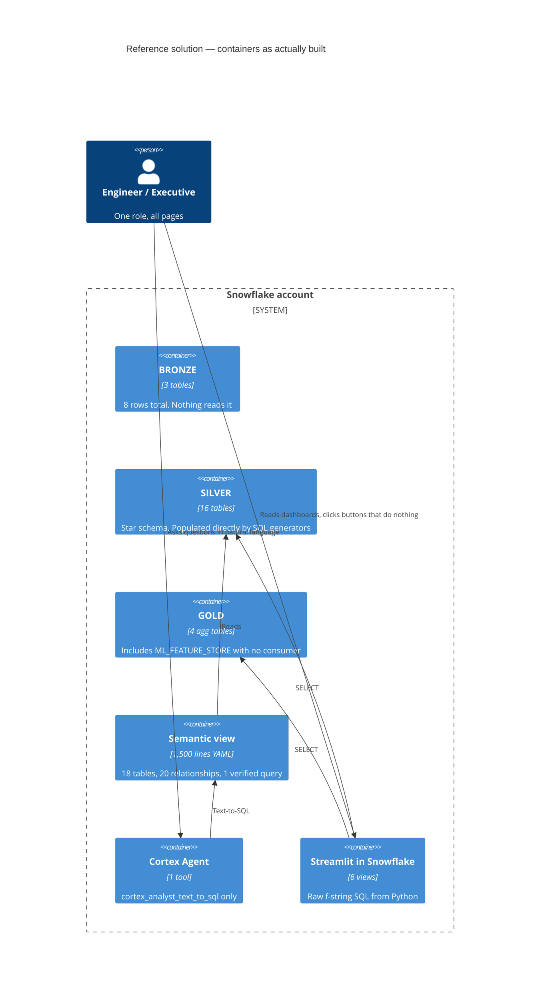

# Reference Solution: Analysis & Differentiators

> **Status:** Draft v0.2 · **Owner:** NK · **Last updated:** 2026-09-18
>
> **Why this document exists.** Snowflake publishes an official predictive-maintenance
> reference solution for this exact problem statement. Judges may know it. Anything we build
> that merely reproduces it scores nothing. This document establishes **what the reference
> solution actually does versus what it claims**, and turns each gap into a differentiator
> we can be held to.
>
> **Read [company-profile.md](../01-business/company-profile.md) first** for our scenario, and
> [problem-statement.md](problem-statement.md) for the `E1…E9` criteria used below.

---

## 1. What we reviewed, and how

| Item | Detail |
| --- | --- |
| Guide | [AI-Powered Predictive Maintenance on Snowflake](https://www.snowflake.com/en/developers/guides/predictive-maintenance-with-snowflake-cortex/) — authors Tripp Smith, Charlie Hammond; marked "CERTIFIED SOLUTION"; updated 3 Feb 2026 |
| Repository | [`Snowflake-Labs/sfguide-getting-started-with-predictive-maintenance`](https://github.com/Snowflake-Labs/sfguide-getting-started-with-predictive-maintenance) |
| Reviewed on | 2026-09-17, default branch at that date |
| Scope of review | **All 23 files.** `scripts/setup.sql` (3,265 lines) and `scripts/teardown.sql` line by line; all 15 Python files and `line_visualization.html` (477 lines); `README.md` |
| Method | Read the code, then checked each marketing claim against it. Grepped for every ML and Cortex entry point by name to establish absence, not just presence |

The guide itself carries the disclaimer: *"This content is provided as is, and is not maintained
on an ongoing basis. It may be out of date with current Snowflake instances."* That is fair, and
this analysis is not a criticism of the authors' intent — it is an assessment of what a judge
would find if they compared the claims to the code, because that is the bar we have to clear.

**Their scenario is a factory** (2 plants, 6 lines, 18 processes, 18 assets — robot arms, pumps,
CNC). Ours is a wind fleet under availability contracts. That difference matters and is discussed
in [§6](#6-our-scenario-advantage).

## 2. Architecture as built



Note what is **absent** from that diagram: no streams, no tasks, no dynamic tables, no Snowpipe,
no ML model, no Cortex Search service, no document stage, no write path, no audit table.

## 3. Claim versus code

### 3.1 The headline finding: there is no model

The guide promises failure prediction, health scores, remaining useful life and failure-mode
classification. **None of it is a model.** A repository-wide search for `snowflake.ml`,
`ml.modeling`, `FORECAST`, `ANOMALY_DETECTION`, `CLASSIFICATION` returns zero matches in any SQL
or Python file. The only occurrence of the word "model" is the orchestration LLM name and the
semantic-model path.

| Guide claim | What the code actually computes | Location |
| --- | --- | --- |
| "Predict failures in advance" | Nothing is predicted | — |
| "composite Health Score (e.g. 31/100)" | `CASE` on **`asset_id`** plus `UNIFORM(25,45,RANDOM())`. Reads no temperature, no vibration, no pressure, no maintenance history | `setup.sql:881-901` |
| "predicts the specific Failure Mode (e.g. Bearing Failure)" | A 4-branch `CASE` on failure probability — and it lives in the **Streamlit presentation layer**, not the warehouse | `streamlit/utils/data_loader.py:222-227` |
| "Actionable RUL ... (e.g. 100 Days)" | `health_score / 100 * 500 − UNIFORM(0,20)` | `setup.sql:924` |
| Failure probability | `0.01 + (100 − health_score) / 90.0 * 0.94` — a linear rescale of health, correlation −1.0 by construction | `setup.sql:918` |

The health score is a function of primary key and a random number:

```sql
-- setup.sql:881-901 (abridged)
100 - (days_since_decay_start * 0.3) - (hour_of_day * 0.06) -
CASE
    WHEN asset_id IN (1,7)    THEN UNIFORM(25, 45, RANDOM())  -- Pumps worst condition
    WHEN asset_id = 4         THEN UNIFORM(15, 30, RANDOM())
    WHEN asset_id IN (10,16)  THEN UNIFORM(-5, 5, RANDOM())
    ...
END
```

Chain the substitutions and the demo's red alert — *"Bearing Failure predicted on Primary Coolant
Pump"* (`fleet_operations.py:151`) — reduces to **`asset_id IN (1,7)`**. It is a relabelled
primary key. One judge question, *"what model produces this number?"*, ends the demo.

### 3.2 Two arithmetic bugs make it worse on any run today

**Bug A — the data is stale before you start.** Generators are bounded by `ROWCOUNT`, not by the
date predicate:

```sql
-- setup.sql:836-839
FROM TABLE(GENERATOR(ROWCOUNT => 10000))  -- Enough for ~13 months
WHERE DATEADD(HOUR, h.hour_seq, dp.start_timestamp) <= dp.end_timestamp
```

10,000 hours from 2024-11-01 ends **2025-12-22**. `end_timestamp` is `CURRENT_TIMESTAMP()`, so
the `WHERE` never binds. Consequence: the dashboard's "real-time monitoring" panel filters
`RECORDED_AT >= DATEADD(hour, -24, CURRENT_TIMESTAMP())` (`data_loader.py:275`) and returns
**zero rows**. The README's claim of data "to current date" is false on any run after ~Dec 2025.

**Bug B — the degradation trend is mathematically dead.** `decay_start_timestamp` is 90 days ago
(`setup.sql:815`); every generated row predates it, so
`GREATEST(0, DATEDIFF(...))` clamps `days_since_decay_start` to **0 for all 180,000 rows**
(`:827`). Every decay term therefore vanishes. Vibration collapses to a flat
`0.3 + UNIFORM(0, 0.4)` band, and the anomaly thresholds become unreachable — `vibration > 1.5`
(`:929`) against a maximum of 0.70, `temperature > 85` (`:930`) against a maximum of 78.5.

**Nothing trends before a failure.** And failures themselves are a coin flip independent of all
telemetry: `WHEN UNIFORM(0, 100, RANDOM()) < 2 THEN 1` (`:980`). The `ML_FEATURE_STORE` label
`FAILED_IN_NEXT_7_DAYS` derives from that coin flip (`:1399-1405`), so the feature store's target
is **provably unlearnable from its own features**. Training on it yields AUC ≈ 0.5.

### 3.3 The rest of the gap list

| # | Theme | Finding | Evidence |
| --- | --- | --- | --- |
| G-1 | **Dark data** | The "PDF repair manuals, schematics, logs" claim has **zero supporting code**. No PDFs, no `AI_PARSE_DOCUMENT`, no Cortex Search service, no directory table. The only "unstructured" field is `TECHNICIAN_NOTES`, generated by `CASE MOD(asset_id, 6)` — **19 distinct strings** across ~2,000 rows | `setup.sql:1021-1052` |
| G-2 | **Real time** | No streams, tasks, dynamic tables or Snowpipe. The refresh mechanism is *re-run the 3,265-line script by hand*. Gold is not incrementally maintained | repo-wide |
| G-3 | **Write-back** | Three action buttons emit `st.toast("✅ Work Order created for … in CMMS!")` and write nothing. The message is a literal falsehood shown to an operator | `fleet_operations.py:123-128` |
| G-4 | **Agent tools** | An 8-tool executor exists but is **unreachable dead code** — `_process_agent_response` is never called. `_create_maintenance_work_order` carries the comment *"For now, we'll simulate"*. The agent is a text-to-SQL box | `snowflake_intelligence.py:146-149`, `:848` |
| G-5 | **Guardrails** | LLM-generated SQL is executed unconditionally, with no validation, allowlist, dry-run or approval. Model output is rendered with `unsafe_allow_html=True`. f-string SQL throughout. `verify_ssl` is configurable off | `cortex_analyst.py:176`, `unified_assistant.py:228` |
| G-6 | **Audit** | None. Conversation history is `storage_backend="session"`, so it dies with the browser tab; the Snowflake path writes to `SNOWCORE_INDUSTRIES.ANALYTICS`, **a schema `setup.sql` never creates**, through a `@st.cache_data`-wrapped function | `unified_assistant.py:105`, `conversation_manager.py:155` |
| G-7 | **OEE integrity** | `Performance = UNIFORM(80,98)` in SQL and `0.95` hardcoded in Python — two fake definitions of one KPI. `OEE_PERCENT` draws a **second, independent** `UNIFORM`, so `OEE ≠ A × P × Q`, while the semantic view tells the LLM it is | `setup.sql:1463`, `:1475`; `calculations.py:76` |
| G-8 | **Explainability** | No driver attribution, no feature importance, no citation, no confidence interval. `"Predicted Failure Mode: Spindle Bearing Wear"` is a hardcoded literal, identical for every asset | `financial_risk.py:72-73` |
| G-9 | **Medallion is cosmetic** | Bronze holds 8 orphan rows and nothing reads it. Silver is populated by independent generators. There is **no Bronze→Silver transformation anywhere** | `setup.sql:179-191`, `:497-507` |
| G-10 | **"3D digital twin"** | Not 3D. No WebGL, canvas, Three.js or perspective transform in 477 lines — it is `display: flex` with cards and `box-shadow`. The UI promises "zoom, pan, and rotate controls" that do not exist | `line_visualization.html`, `line_visualization.py:470` |
| G-11 | **Least privilege** | `USE ROLE ACCOUNTADMIN` unconditionally; `ALTER ACCOUNT SET EVENT_TABLE` hijacks the account-wide event table; egress rule `0.0.0.0:443`; `GRANT USAGE ON WAREHOUSE … TO ROLE public` | `setup.sql:24`, `:57`, `:95`, `:149` |
| G-12 | **Semantic-view hygiene** | Financial-services copy-paste survives: `FAILED_IN_NEXT_7_DAYS` is described as *"whether the **customer failed to make a payment**"*; `ASSET_ID` as *"a **stock, bond, or commodity**"*. `sample_values` contradict the loaded data (`EQ-PUMP-001-VIB` vs `eq_pump_001_vib`), which silently breaks literal filtering | `setup.sql:1712`, `:1720`, `:2377` |
| G-13 | **Reproducibility** | `CREATE OR REPLACE DATABASE` destroys any same-named database. Database name unparameterised, so no dev clone. README instructs uploading `streamlit/pages/…` but the repo ships `views/` — following it verbatim produces a broken app. `setup.sql:1600` defers to a `deploy.sh` that does not exist | `setup.sql:37`, `README.md:123` |
| G-14 | **Personas** | No role separation. Every user sees every page. No least-privilege story despite broad documented grants | repo-wide |
| G-15 | **Debug output shipped** | `st.info("🔍 Loading data for: …")`, `st.success("✅ Loaded 5 processes…")`, `st.info("Drill path state saved…")`, raw tracebacks via `st.code(traceback.format_exc())` | `line_visualization.py:72`, `:337`; `oee_drilldown.py:65` |
| G-16 | **Fragility** | SiS-only (OAuth token read from `/snowflake/session/token`); requires `SNOWFLAKE_HOST`, an external access integration and a container runtime; agent request body is *guessed* — three shapes tried in a loop, up to 6 HTTP calls per message at 50s timeout; module-level singletons leak conversation context between users | `data_loader.py:100-107`, `snowflake_intelligence.py:736-819` |

## 4. What is genuinely strong

Honesty requires stating this plainly: on two axes the reference solution is good work, and we
should **reuse the pattern rather than compete with it**.

| Strength | Why it matters | Our stance |
| --- | --- | --- |
| **The semantic view is the real asset** — ~1,500 lines, 18 tables, 20 explicit relationships, per-column descriptions, declared primary keys, one verified query | This is what makes text-to-SQL behave. It represents real effort and we will not out-scale it in 15 days | **Reuse the approach**, narrower and cleaner. Depth over breadth: fewer tables, every description correct, more verified queries |
| **Properly conformed star schema** — surrogate keys, real FK declarations, SCD-2 scaffolding, `CLUSTER BY` on the time-series fact | Sound dimensional modelling | **Adopt.** Add component genealogy, which they lack |
| **ISA-95 / Unified Namespace natural keys** (`PLANT_UNS_NK` → … → `SENSOR_UNS_NK`) | A thoughtful nod to real OT practice | **Adopt**, mapped onto the company profile's own `site → turbine → component → signal` hierarchy |
| **Availability is the one honest calculation** — maintenance downtime genuinely propagates into runtime into availability | A real causal chain | **Adopt and extend** to IEC 61400-26 states and contractual exclusions |
| **Agent prompt engineering** — chart-type routing, anti-re-query rules, explicit data-gap handling | Well crafted, if pointed at hollow numbers | **Adopt the craft**, point it at real numbers |
| **Two-fragment Streamlit layout** — chat pinned beside the dashboard, isolated so page interaction does not reset the conversation | Genuinely good UX and non-obvious to build | **Adopt the pattern** |

## 5. Differentiators

Each `D-` below is a commitment. It must be traceable to scope, a requirement, a test and a demo
moment by Stage 6, or it gets cut rather than left as a claim.

| ID | Differentiator | Closes | Serves | Demo-visible? |
| --- | --- | --- | --- | --- |
| **D-1** | **A real, trained, evaluated model.** Snowflake ML classification and/or anomaly detection over engineered features, with a held-out evaluation and a published metric. Verified available in our account | §3.1 | E2, E3 | Yes — show the metric |
| **D-2** | **Physically plausible synthetic data with a learnable label.** Degradation actually trends before failure; failures are *caused by* the degradation path, not an independent coin flip. A stated signal-to-noise design and a test that proves the label is learnable | §3.2, Bugs A & B | E1, E2 | Yes — the trend chart |
| **D-3** | **Prediction drivers, always.** Every risk score carries its top contributing features with magnitudes. No number appears in the UI without a "why" | G-8 | E2, E3 | Yes — the "why?" panel |
| **D-4** | **Deterministic engine, explaining model.** Feasibility, constraints, grouping and arithmetic live in SQL/Snowpark that is unit-tested. The agent ranks and explains what the engine produced; it never invents a window, a crew, a part or an incident | G-5, G-7 | E2, E8 | Yes — same answer twice |
| **D-5** | **Approval-gated, idempotent, audited writes.** Work-order drafting that actually writes, behind an explicit human approval, with an append-only audit trail and a reversible suppression path. No destructive agent tools | G-3, G-4, G-6 | E3, E8 | Yes — approve, then show the audit row |
| **D-6** | **Real documents, really parsed.** Synthetic OEM manuals, service bulletins and CMS condition reports as actual files, parsed with `AI_PARSE_DOCUMENT` and retrieved through a Cortex Search service. Answers carry citations to the source document and section | G-1 | E3, E7 | Yes — cited procedure |
| **D-7** | **Genuinely incremental pipeline.** Dynamic tables and/or streams and tasks with a declared target lag, so new SCADA and CMS data flows through without re-running a setup script | G-2, G-9 | E2 | Yes — land data, watch it arrive |
| **D-8** | **One definition per metric.** Availability, lost energy, LD exposure and Turbine OEE defined once, in SQL, tested, and consumed identically by the app, the semantic view and the agent | G-7, G-12 | E2, E8 | Yes — dashboard and agent agree |
| **D-9** | **Contractual and financial consequence.** Availability guarantee, exclusions and liquidated damages modelled from the O&M contract, so risk is ranked by money at stake rather than by mechanical severity | — (they invent cost constants) | E1, E6 | Yes — LD exposure ranking |
| **D-10** | **Role-scoped access.** Least-privilege roles per persona, no `ACCOUNTADMIN` in application code, and personas that see different things | G-11, G-14 | E2, E8 | Partially — show two roles |
| **D-11** | **Reproducible from a clean account.** Parameterised database name, idempotent setup, a scripted teardown, and a documented degraded mode for anything the demo depends on | G-13, G-16 | E8, E9 | Indirectly — judges can run it |
| **D-12** | **Honest UI.** No claim in the interface that the code does not support. No debug output. Graceful empty and error states | G-10, G-15 | E8 | Yes — by absence of embarrassment |
| **D-13** | **A triage system that admits uncertainty.** Four alarm sources normalised into one stream, correlated into incidents, with chattering, standing and flood labelled — and every incident classified actionable, nuisance or **`UNDETERMINED`**, with its evidence stored. Compression is never published without the count of real failures suppressed beside it | The reference solution has **no alarm handling at all** — no normalisation, no correlation, no noise labelling, and no concept of an unresolved alarm | E1, E3, E7 | **Yes — the opening beat** |

Two observations about this list. First, `D-1` through `D-8` are not stretch goals — **every
platform capability they need was verified working in our account on 2026-09-17** (see
[§7](#7-platform-capability-verified)). The reference solution's gaps are addressable, not
aspirational. Second, `D-4`, `D-5` and `D-8` are simply our AGENTS.md engineering rules applied
honestly; the reference solution violates all three. That is a comfortable position to defend
under the "Technical Execution" criterion.

**`D-13` deserves separate comment**, because it is the only differentiator that answers a gap the
reference solution does not merely implement badly but **does not attempt at all**. Its alarm data is
a `FCT_ALARM`-shaped table nothing triages: no normalisation across sources, no correlation into
incidents, no noise labelling, and no notion of an alarm whose status is genuinely unresolved. Since
alert fatigue is the scenario's biggest day-to-day pain
([profile §3](../01-business/company-profile.md#3-the-problem-in-company-terms), item 5), this is the
largest unclaimed ground in the problem statement — and the `UNDETERMINED` class is the part no
dashboard-shaped competitor will have, because admitting uncertainty looks like weakness until you
explain that the alternative is a system which quietly guesses.

**We will not compete on:** breadth of semantic model, number of dashboard pages, or 3D
visualisation. Those are either their strength or their vanity, and neither wins us anything.

## 6. Our scenario advantage

The reference solution's factory has no financial consequence for downtime that isn't invented on
the spot (`$150,000 / $50,000` literals in `executive_summary.py:403-404`, presented as "Cost
Avoidance (YTD)"). Our scenario has one built into the contract.

| Dimension | Reference (factory) | Ours (wind O&M) |
| --- | --- | --- |
| Consequence of downtime | Invented cost constants | **Contractual liquidated damages** plus lost energy, from the O&M agreement ([profile §2](../01-business/company-profile.md#2-business-model--contracts)) |
| Why timing matters | Not modelled | **Wind season May–September**; the same failure costs far more in July than in March ([profile §3](../01-business/company-profile.md#3-the-problem-in-company-terms)) |
| Repair decision | Not modelled | **Up-tower versus crane campaign** — a genuine, expensive, lead-time-driven choice |
| Signal quality | Flat random noise | Real CMS vibration-feature practice: band energies, kurtosis, oil-debris counts ([profile §5](../01-business/company-profile.md#5-anatomy-of-an-asset-turbine--components--sensors)) |
| Asset history | Asset ID only | **Component genealogy** — serials move between positions, so failure history follows the part |
| Grid context | None | Indian forecasting/scheduling and DSM deviation penalties |

This is directly worth points under `E1` Real World Relevance, and it is not something the
reference solution can be retrofitted to match.

## 7. Platform capability verified

Confirmed by execution in account `BGTCHIX-UZ86048` (Azure Central India) on 2026-09-17, then
cleaned up. Recorded here because `D-1`…`D-8` depend on it and because
[the prompt](../../prompt/generate-plan.md) requires us never to describe an unconfirmed
capability.

| Capability | Result | Needed by |
| --- | --- | --- |
| `SNOWFLAKE.ML.CLASSIFICATION` | ✅ Trained an instance | D-1 |
| `SNOWFLAKE.ML.ANOMALY_DETECTION` | ✅ Trained an instance | D-1 |
| `CREATE SEMANTIC VIEW` (native DDL) | ✅ Created | D-4, D-8 |
| `CREATE CORTEX SEARCH SERVICE` | ✅ Created | D-6 |
| `AI_PARSE_DOCUMENT` | ✅ Present in `SNOWFLAKE.CORTEX` | D-6 |
| `AI_EXTRACT` | ✅ Returned structured output | D-6 |
| `CREATE AGENT` | ✅ Created in `snowflake_intelligence.agents` | D-4, D-5 |
| `CREATE DYNAMIC TABLE` | ✅ Created with `TARGET_LAG = '1 minute'` | D-7 |
| `AI_COMPLETE` with `claude-sonnet-4-5` | ✅ Responded | D-3, D-4 |
| Cross-region inference | ✅ `CORTEX_ENABLED_CROSS_REGION = ANY_REGION` | D-3, D-4 |
| Cortex Analyst | ✅ `ENABLE_CORTEX_ANALYST = true` | D-4 |
| Compute pools | ⚠️ System pools only (`CPU_X64_S`, `GPU_NV_SM`); custom pool untested | — |
| Streamlit object creation | ⚠️ **Not yet verified** (`Q-12`) | D-12 |

Two dependencies to watch. `claude-sonnet-4-5` resolves **only via cross-region inference**, so
that account parameter is a single point of failure for the agent — a degraded mode using an
in-region model is required. And this is a **trial account** with a $400 credit cap
(Official Rules §4.3), so anything requiring a custom compute pool is at risk.

## 8. Risks created by differentiating

Being honest about the cost of this strategy.

| ID | Risk | Mitigation |
| --- | --- | --- |
| `R-REF-1` | A real model on synthetic data can still look like a toy if the data generator is naive. The whole of `D-1` rests on `D-2` | Design the generator from documented failure physics; test that the label is learnable **and** that a trivial baseline does not match the model |
| `R-REF-2` | `D-2` is the hardest single item and everything downstream depends on it | Build it first. Treat "learnable label" as a milestone gate, not a nice-to-have |
| `R-REF-3` | Twelve differentiators against limited capacity | The `D-` list is deliberately ordered. `D-1`, `D-2`, `D-5`, `D-6`, `D-8`, `D-13` carry the demo; the rest are droppable in reverse order. Scope decision belongs to [scope.md](../02-functional/scope.md) |
| `R-REF-4` | We criticise the reference solution, then ship the same bugs | Their specific defects become explicit test cases: no stale data, no unreachable threshold, no metric defined twice, no toast that lies |
| `R-REF-5` | Judges may not know the reference solution, so the contrast lands as unearned criticism | Never mention it in the pitch. Show real drivers, real citations, a real audit row. The differentiation must be self-evident without the comparison |

## 9. Open questions

| ID | Question | Owner |
| --- | --- | --- |
| `Q-12` | Can we create a Streamlit object, and a custom compute pool, on this trial account? Blocks the front-end decision | NK |
| `Q-14` | Do we mirror their ISA-95/UNS natural-key convention exactly, or adapt the profile's `site-turbine-component-signal` IDs? Recommendation: adapt the profile's, and add UNS-style keys as an attribute | JP |
| `Q-15` | `D-1`: one classifier over all components, or per-component-class models? Recommendation: one, with component class as a feature — cheaper, and enough for the demo | SA |

Tracked centrally in the [RAID log](../08-delivery/raid-log.md).

## 10. Sources

- [AI-Powered Predictive Maintenance on Snowflake](https://www.snowflake.com/en/developers/guides/predictive-maintenance-with-snowflake-cortex/) — the guide
- [`Snowflake-Labs/sfguide-getting-started-with-predictive-maintenance`](https://github.com/Snowflake-Labs/sfguide-getting-started-with-predictive-maintenance) — the code, reviewed 2026-09-17
- Related repos noted but not analysed: [`sfguide-ai-powered-predictive-grid-maintenance`](https://github.com/Snowflake-Labs/sfguide-ai-powered-predictive-grid-maintenance), [`sfguide-intelligent-jidoka-system-for-ev-manufacturing`](https://github.com/Snowflake-Labs/sfguide-intelligent-jidoka-system-for-ev-manufacturing)
- Platform capability: executed in account `BGTCHIX-UZ86048`, 2026-09-17. Not cited to documentation because it was verified directly
- Wind-industry facts are carried by [company-profile.md §13](../01-business/company-profile.md#13-sources); this document adds none of its own
