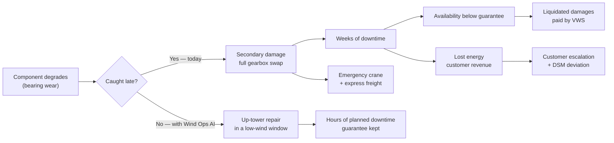

# Business Case

> **Status:** Draft v0.2 · **Owner:** NK · **Last updated:** 2026-09-18
>
> **Derived from, and subordinate to, [company-profile.md](company-profile.md).** Every pain
> point, role, system and KPI below comes from that document. Where this file states a number
> the profile does not, it is marked *(illustrative)* and its arithmetic is shown so the team can
> change the inputs.
>
> **All data is synthetic.** VWS is fictional. No real company, customer or personal data.

---

## 1. In one paragraph

Vayuveda Wind Systems sells turbines and then sells the promise that they will be **available
when the wind blows**. That promise is contractual: 95% availability in years 1–2, 97% from year 3,
with liquidated damages when it is missed
([profile §2](company-profile.md#2-business-model--contracts)). Today VWS finds out about a major
failure when it has already happened, because the vibration evidence, the SCADA alarms, the work
orders, the spares and the contract terms live in five different systems and nobody joins them
([profile §3](company-profile.md#3-the-problem-in-company-terms)). Wind Ops AI joins them: it
predicts component failure early enough to plan the repair, explains why it believes that, and
turns the decision into an approved work order with parts, crew and crane lined up — before the
wind season, up-tower, instead of after the failure, with a crane.

## 2. The problem in money terms

Four things convert a mechanical event into a financial one. The profile establishes all four; the
job of this section is to connect them.



The asymmetry that makes this worth building: **the cost of being wrong early is a wasted
inspection. The cost of being wrong late is a crane campaign and an LD payment.**

### 2.1 Illustrative value of one avoided gearbox failure

Scenario: one VW-3.0 turbine, gearbox HSS bearing, the case already told in
[profile §9](company-profile.md#9-a-day-in-the-life-one-failure-two-ways). Every input below is
*(illustrative)* unless the profile states it. The arithmetic is shown so it can be argued with.

| Input | Value | Source |
| --- | --- | --- |
| Rated capacity | 3.0 MW | Profile §1 (VW-3.0) |
| Downtime, full gearbox swap | 30 days = 720 h | *(illustrative)* — profile says "weeks" |
| Downtime, planned up-tower bearing repair | 16 h | *(illustrative)* |
| Availability guarantee (year 3+) | 97% | Profile §2 |
| LD rate | ₹50,000 per turbine per 1% shortfall per contract year | Profile §2 *(illustrative there)* |
| Net capacity factor | 30% | *(illustrative)* |
| Energy tariff | ₹3.00/kWh | *(illustrative)* — replace with the contract value |

**Liquidated damages avoided**

```
Availability with failure   = (8,760 − 720) / 8,760          = 91.8%
Shortfall vs 97% guarantee  = 97.0 − 91.8                    = 5.2 percentage points
LD on this turbine          = 5.2 × ₹50,000                  ≈ ₹2.6 lakh
```

**Lost energy avoided** (this cost falls on the **customer**, not VWS — but it drives escalation,
DSM deviation and contract renewal risk)

```
Energy not generated        = 3.0 MW × 720 h × 0.30          = 648 MWh
Value at ₹3.00/kWh                                            ≈ ₹19.4 lakh
```

**Plus, borne by VWS and not modelled above:** emergency crane mobilisation, express freight on an
imported gearbox, and the opportunity cost of a crew pulled off planned work. The profile notes
imported bearings and gearboxes have long lead times ([§3](company-profile.md#3-the-problem-in-company-terms)).

So the order of magnitude for **one** avoided drivetrain failure is **≈ ₹2.6 lakh of LD exposure
to VWS and ≈ ₹19 lakh of energy to the customer**, before crane and freight. Against a fleet of
100 turbines where published reliability studies report gearboxes causing a small share of stops
but **more than half of downtime** ([profile §3](company-profile.md#3-the-problem-in-company-terms)),
catching even a handful per year pays for the platform.

**Season multiplier.** India's high-wind months are roughly May–September, when most annual
generation happens (profile §3). The same 720 hours of downtime in July costs materially more
energy than in March. This is why the product's real output is not a prediction — it is a
**scheduling decision**.

## 3. Business goals

| ID | Goal | Owner (profile §6) | KPI it moves (profile §8) |
| --- | --- | --- | --- |
| `BG-1` | Keep contractual availability above the guarantee, and see LD exposure **before** it crystallises | COO: Services; O&M Controller | Contractual availability; LD exposure |
| `BG-2` | Move drivetrain repairs from corrective to planned — up-tower where possible, bundled with preventive work, outside the wind season | Maintenance Planner | MTTR; preventive-maintenance compliance; crane mobilisation lead time |
| `BG-3` | Cut alert fatigue so the few alarms that signal real degradation are acted on — and say so honestly when the evidence is ambiguous | RMC / SCADA Engineer | Mean time to respond; compression ratio paired with real failures suppressed |
| `BG-4` | Recover lost production from underperformance, not just from downtime | Performance Analyst | Energy-based availability / lost production; CUF |
| `BG-5` | Give supply chain an early demand signal, so parts and cranes are booked ahead instead of air-freighted | Warehouse Manager; Procurement | Spares fill rate / stock-out days |
| `BG-6` | Make failure knowledge reusable — cited causes, similar past failures, correct procedures | Reliability Engineer | First-time fix rate |
| `BG-7` | One governed IT/OT source of truth instead of point-to-point integrations | Data Platform Engineer | (enabler for all of the above) |
| `BG-8` | Plan work into safe, low-wind windows rather than into breakdowns | Safety Officer | Lost-time injury frequency rate |

`BG-1` is the goal the demo must land. `BG-7` is the goal the architecture must earn.

## 4. Value hypotheses

Each hypothesis is falsifiable and names how we would measure it. **We do not claim any of these
are proven** — this is a 15-day prototype on synthetic data, and §7 says so explicitly.

| ID | Hypothesis | Measured by | Testable in the prototype? |
| --- | --- | --- | --- |
| `H-1` | Component failure can be predicted with enough lead time to plan an up-tower repair rather than react to a breakdown | Model recall at a fixed precision, evaluated on held-out seeded failures, reported with lead-time distribution | **Yes** — this is the core claim |
| `H-2` | Fusing CMS vibration features with SCADA temperature and operating state beats any single source | Ablation: model trained on CMS only, SCADA only, and both | **Yes**, cheaply |
| `H-3` | Ranking alerts by money at stake (LD exposure + lost energy) rather than by mechanical severity changes which alerts get worked first | Compare the top-10 list under both rankings on the same day | **Yes** — a strong demo moment |
| `H-4` | Classifying alarms into three classes — actionable, nuisance and an explicit `UNDETERMINED` — beats forced binary classification: it compresses the flood substantially **without losing a single real failure**, and it tells the operator when the system is unsure | Compression ratio **paired with** the count of real failures suppressed or dismissed; plus the undetermined rate | **Yes** — `T-60` is the blocking test, zero tolerance |
| `H-5` | Drivers plus citations make an engineer act on a prediction they would otherwise ignore | Qualitative only, in this timeframe | **Partly** — we can show it, not prove it |
| `H-6` | Drafting the work order with parts, crew and crane pre-checked removes the manual steps that cause delay | Count of manual steps before versus after, from profile §3 item 6 | **Yes**, as a walkthrough |
| `H-7` | Scheduling predicted heavy work before the wind season materially reduces lost energy versus repairing on failure | Simulated: same failure, in-season versus pre-season, using the §2.1 model | **Yes**, as a calculation |
| `H-9` | A planner offered typed schedule changes with their evidence and pre-commit impact will act on them, where they would not act on a ranked list of risks | Qualitative in this timeframe; measurable as accept/edit/reject rates | **Partly** — we can show the loop, not prove the behaviour change |
| `H-10` | Reporting the **binding constraint** when nothing is feasible is more useful to a planner than an empty result or a nearest-fit guess | Whether a planner can say what to do next after seeing it | **Yes**, as a walkthrough |

## 5. Who benefits

For `E6` Impact. Roles and pains are quoted from
[profile §6](company-profile.md#6-organisation-departments-roles--needs); personas are defined in
[personas-and-journeys.md](personas-and-journeys.md).

| Beneficiary | Today | With Wind Ops AI | Persona |
| --- | --- | --- | --- |
| COO: Services | Finds out about big failures after they hit availability | Fleet risk and LD exposure ahead of time | `P-1` |
| CMS Analyst | Few analysts for many turbines; findings sit outside the CMMS | Automated triage; findings attached to work orders | `P-2` |
| Maintenance Planner | Juggles crane, crew, parts and weather in spreadsheets | Risk-ranked backlog; drafted work orders with checks done | `P-3` |
| Field Technician | Unclear scope; wrong parts; long climbs for nothing | A job pack: procedure, parts, history, safety notes | `P-4` |
| O&M Controller | LDs are known only after the fact | LD exposure forecast; cost of acting versus waiting | `P-5` |
| Data Platform Engineer | Point-to-point integrations, no single source of truth | A governed, converged IT/OT platform | `P-6` |
| RMC / SCADA Engineer | Alarm floods; cannot tell a nuisance trip from real degradation | Ranked alerts across SCADA and CMS; one-click escalation | `P-7` |
| Reliability Engineer | Correlates SCADA, CMS, work orders and serials by hand | Cited root cause; similar-failure search across the fleet | `P-8` |
| Site Stores In-charge | Emergency stock-outs; costly air freight | Early demand signal; reservation linked to the work order | `P-9` |
| Key Account Manager | Numbers assembled by hand; surprises with customers | Trusted availability figures; proactive outage communication | `P-10` |
| **The customer (IPP / C&I)** | Unplanned outages, lost revenue, schedule deviation | Fewer outages, planned in low-wind windows, communicated ahead | — |

The last row matters for `E6`: the beneficiary of a wind O&M platform is ultimately the energy
buyer and the grid, not only the OEM.

## 6. Metrics

**We do not redefine any KPI.** All definitions are
[profile §8](company-profile.md#8-kpis-the-company-runs-on) and that section is the single source
of truth — this is the "single definition" rule from the Stage 6 self-audit. The table below only
records which KPIs the prototype will actually compute, because claiming all twelve would be
dishonest at this capacity.

| KPI (profile §8) | Prototype computes it? | Notes |
| --- | --- | --- |
| Contractual availability (time-based) | **Yes** | With contract exclusions modelled |
| Technical availability | **Yes** | Falls out of the same state model |
| Energy-based availability / lost production | **Yes** | Needs a power curve per platform |
| LD exposure / LDs paid | **Yes** | The ranking signal for `H-3` |
| Capacity Utilisation Factor | Yes, trivially | |
| MTBF / MTTR per component class | **Yes** | From seeded failure history |
| Mean time to respond | **Yes** | Falls out of alarm acknowledgement timestamps in `M9`. `Q-18` resolved in favour of committing |
| Preventive-maintenance compliance | Stretch | |
| First-time fix rate | Stretch | |
| Spares fill rate / stock-out days | Stretch | |
| Crane mobilisation lead time | No | Modelled as a constraint, not reported as a KPI |
| Lost-time injury frequency rate | No | Out of scope; safety appears as a scheduling constraint |

**Turbine OEE.** The profile proposes `Availability × Performance × Quality` with wind-specific
definitions and explicitly flags it as *"our proposal, not an industry standard"* requiring an ADR
([profile §8](company-profile.md#8-kpis-the-company-runs-on)). We adopt that definition unchanged
and will record the ADR in [Stage 4](../03-architecture/decisions/README.md). Two commitments
follow from the reference-solution analysis: the composed value must **equal** the product of its
three stored parts, and **no component of it may be a constant or a random number**
([G-7](../00-hackathon/reference-solution-analysis.md#33-the-rest-of-the-gap-list)).

## 7. What we are not claiming

Stating this plainly protects the entry's credibility under questioning, and is required by the
honesty rule.

| We are **not** claiming | Because |
| --- | --- |
| That the model's accuracy transfers to a real fleet | It is trained on synthetic data we designed. Reported metrics describe our generator, not the world |
| That the ₹ figures in §2.1 are VWS's actuals | VWS is fictional and the inputs are marked *(illustrative)* |
| That any downtime reduction has been observed | Nothing has been deployed. `H-1`…`H-8` are hypotheses with named tests, not results |
| That Turbine OEE is an industry standard | The profile says it is our proposal. IEC 61400-26 covers availability, not OEE |
| That the agent can act autonomously | Every write is approval-gated by design ([`D-5`](../00-hackathon/reference-solution-analysis.md#5-differentiators)) |
| That we replace SCADA, CMS or the CMMS | We converge their data; we do not replace the systems ([profile §7](company-profile.md#7-systems-landscape-where-predictive-maintenance-data-comes-from)) |

## 8. Cost of the prototype

| Item | Value |
| --- | --- |
| Snowflake credit budget | **$400** trial credit (Official Rules §4.3) |
| Consumed by planning (to 2026-09-18) | **≈16.75 credits** — 15.07 CoCo Desktop tokens + 1.68 warehouse |
| Alerting | Report consumption to NK at each $100 band |
| **Accounting rule** | Sum **both** `CORTEX_CODE_*_USAGE_HISTORY` and `WAREHOUSE_METERING_HISTORY`. Warehouse credits alone under-report by ~10× |
| Main cost risks | **CoCo's own token usage** — the largest single consumer so far; then synthetic-data generation, model training, Cortex Search indexing, and any always-on warehouse |

The first cost lesson is already in: **the agent is more expensive than the compute.** Planning
consumed ≈16.75 credits, of which 90% was CoCo tokens rather than warehouse time. Build phases will
add warehouse cost, but token spend scales with how much we iterate in chat, so long exploratory
sessions are a budget item, not a free good.

Cost control is a design constraint, not an afterthought: the data volumes in
[profile §11](company-profile.md#11-data-scale-for-the-synthetic-dataset) (≈5.26 M SCADA rows and
≈7.0 M CMS rows per year) are explicitly flagged there as needing confirmation against credits.
That confirmation belongs to [Stage 5](../04-data/data-sources-and-synthetic-data.md).

## 9. Open questions

| ID | Question | Owner |
| --- | --- | --- |
| `Q-16` | Confirm the energy tariff and net capacity factor for §2.1, or agree to keep them *(illustrative)* | NK |
| `Q-17` | Does lost energy sit in our value story at all, given it is the customer's revenue and not VWS's? Recommendation: yes — it drives escalation and renewal, but label whose money it is | NK |
| `Q-18` | Which of the four "stretch" KPIs in §6 do we commit to? Recommendation: mean time to respond only, since `D-5` produces the timestamps for free | JP |
| `Q-19` | Do we model DSM deviation penalties, or note them as context? Recommendation: context only — real Indian DSM rules are intricate and out of scope at this capacity | SA |

Tracked centrally in the [RAID log](../08-delivery/raid-log.md).
