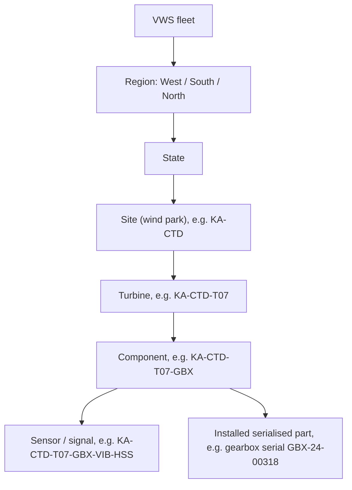
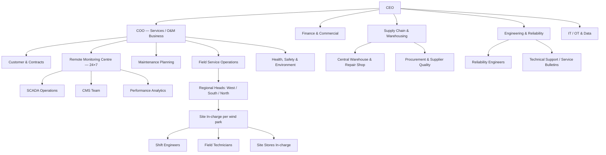
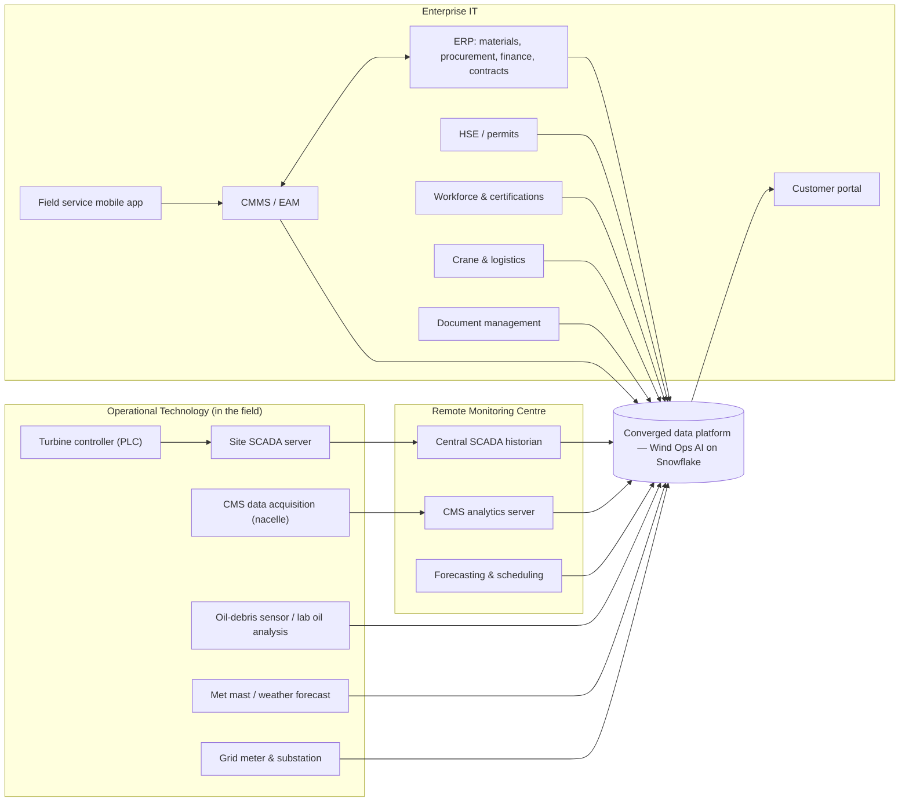

# Company Profile: Vayuveda Wind Systems

> **Status:** Draft v0.1 · **Owner:** _TBD (business lead)_ · **Last updated:** 2026-09-15
>
> **Read this first.** It explains *who* we are building for, and how the hackathon problem
> statement shows up in a real-world-style business.
>
> **Vayuveda Wind Systems Pvt. Ltd. ("VWS") is fictional.** It is modelled on publicly
> described patterns from Indian wind-turbine OEMs and O&M service providers, industry
> standards and published reliability studies (see [Sources](#13-sources)). Any resemblance
> to a real company is unintended. Real-world facts are cited. Numbers marked
> *(illustrative)* are scenario assumptions we can change.

---

## 1. At a glance

| Item | Value |
| --- | --- |
| What VWS does | Designs and sells wind turbines (WTGs), and **operates and maintains them under multi-year service contracts** |
| Fleet under our O&M | **100 turbines** at 6 wind parks in 5 states (see [§4](#4-fleet--geography)) |
| Turbine platforms | VW-2.1 (2.1 MW, legacy) and VW-3.0 (3.0 MW, current) *(illustrative, fictional models)* |
| Asset structure | 1 turbine → **10 major components** → several sensors each (see [§5](#5-anatomy-of-an-asset-turbine--components--sensors)) |
| Headquarters and Remote Monitoring Centre | Bengaluru, Karnataka *(illustrative)* |
| Central warehouse and repair shop | Coimbatore, Tamil Nadu *(illustrative)* |
| Customers | Independent power producers (IPPs), commercial & industrial (C&I) power buyers, public-sector utilities |
| What customers buy from O&M | Turbines that are **available when the wind blows**, backed by an availability guarantee |
| Why predictive maintenance matters | Missing the guarantee triggers **liquidated damages (LDs)**. A single drivetrain failure can take a turbine offline for weeks |

**Real-world context:**

- India's wind capacity reached about **57.4 GW by June 2026**. The largest states are:
  - Gujarat: 16,086 MW
  - Tamil Nadu: 12,273 MW
  - Karnataka: 8,896 MW
  - Maharashtra: 6,318 MW
  - Rajasthan: 5,516 MW
- Large Indian OEMs run centralised monitoring for their fleets. Suzlon, for example, states
  that more than 300 sensors in each turbine stream data 24×7 to its monitoring centre, which
  covers about 14.8 GW of assets. Pure-play O&M companies such as Inox Green also exist.

VWS is a much smaller, fictional player in the same kind of business.

## 2. Business model & contracts

| Revenue stream | Description |
| --- | --- |
| Turbine supply & installation | Sell WTGs to project developers and install them on customer sites |
| **Comprehensive O&M contracts** | Multi-year contracts (e.g. 10 years *(illustrative)*). VWS provides preventive and corrective maintenance, spares, monitoring and reporting |
| Spares & repairs | Chargeable parts and refurbishment outside contract scope |
| Upgrades & retrofits | Performance upgrades and service-bulletin campaigns |

**How a typical O&M contract works** (industry pattern, with VWS values marked *(illustrative)*):

- **Availability guarantee.** It's common to warrant around **95% availability initially,
  rising to 97% later**. VWS guarantees 95% in years 1–2 and 97% from year 3 onwards.
- **Liquidated damages.** If contractual availability falls below the guarantee, the O&M
  provider pays LDs to the owner. VWS pays ₹50,000 per turbine per 1% shortfall per contract
  year *(illustrative)*.
- **Contractual vs technical availability.** *Contractual* availability is the metric
  negotiated in the O&M agreement, and it should be tracked precisely from SCADA.
  *Technical* availability reflects the turbine's own reliability. The contract lists
  exclusions that don't count against the provider, such as grid or balance-of-plant outages,
  force majeure, and an allowance of scheduled-maintenance hours.
- **Reporting.** VWS sends each customer a monthly availability and generation report, which
  is the basis for any LD statement.

## 3. The problem in company terms

The brief says: *"Manufacturers lose value to unplanned downtime because OT sensor data sits
apart from ERP and maintenance context."* At VWS that looks like this:

1. **Downtime is directly penalised.** Every hour a turbine is down counts against the
   availability guarantee. It also costs the customer energy revenue, which strains the
   relationship.
2. **Drivetrain failures dominate downtime.** Published reliability studies report that
   gearboxes cause a small share of stops but more than half of downtime, and that most
   gearbox failures start in bearings. Blade issues also account for a large share of
   failure events. Heavy components often need a **crane campaign**, and imported bearings or
   gearboxes have long lead times.
3. **Timing matters.** India's high-wind months are roughly **May–September**, when most
   annual generation happens. A failure in the wind season costs far more than the same
   failure in March. Planned heavy work should happen *before* the season.
4. **Data sits in silos.** Each team has its own tools and its own slice of the truth:
   - The **Remote Monitoring Centre** watches SCADA alarms.
   - The **CMS team** reviews vibration trends in a separate condition-monitoring tool and
     emails PDF reports.
   - **Planners** work in the CMMS.
   - **Stores** work in the ERP.
   - **Engineers** search manuals and service bulletins by hand.
5. **Alert fatigue.** Hundreds of SCADA alarms a day, many of them nuisance trips or auto-resets,
   hide the few that signal real degradation.
6. **Reactive execution.** Even when a CMS analyst spots bearing wear, several things are done
   by hand and often too late:
   - raising a work order
   - checking spares at the nearest warehouse
   - booking a crane
   - scheduling a certified crew outside the wind season
7. **Knowledge is locked away.** Failure causes and fixes live in free-text technician notes,
   OEM manuals and experienced engineers' heads.
8. **Grid obligations.** Indian forecasting, scheduling and **Deviation Settlement Mechanism
   (DSM)** rules penalise generation that deviates from schedule beyond a tolerance, and those
   tolerances are tightening. An unexpected turbine outage also creates a scheduling
   deviation for the customer.

**What VWS wants:** predict component failures early enough to plan the repair, preferably
up-tower, bundled with preventive maintenance, and outside the wind season. Explain *why* the
risk exists, with evidence. Turn the decision into a work order with the parts, crew and
crane lined up. Measure the effect on availability, lost energy and LDs.

## 4. Fleet & geography

The mix below roughly follows the real state ranking of Indian wind capacity. All site names
and counts are *(illustrative)*.

| Site code | Wind park (fictional) | State | Region | Platform | Turbines | Commissioned | Customer type |
| --- | --- | --- | --- | --- | --- | --- | --- |
| `GJ-KCH` | Kutch Ridge Wind Park | Gujarat | West | VW-3.0 | 28 | 2023–2025 | IPP |
| `TN-TVL` | Tirunelveli Coast Wind Park | Tamil Nadu | South | VW-2.1 | 22 | 2016–2018 | C&I (group captive) |
| `KA-CTD` | Chitradurga Plateau Wind Park | Karnataka | South | VW-3.0 | 18 | 2022–2024 | IPP |
| `MH-STR` | Satara Ghats Wind Park | Maharashtra | West | VW-2.1 | 14 | 2017–2019 | C&I (captive) |
| `RJ-JSM` | Jaisalmer Desert Wind Park | Rajasthan | North | VW-3.0 | 12 | 2024–2025 | Public-sector utility |
| `KA-GDG` | Gadag Wind Park | Karnataka | South | VW-2.1 | 6 | 2019 | C&I |
| | | | | **Total** | **100** | | |

**Fleet age** ranges from new (2025) to about 10 years old (2016). Older VW-2.1 turbines are
expected to show more wear-related failures.

**Site environments** add distinct stresses:

- Coastal salinity at Tirunelveli
- Dust and heat at Jaisalmer
- Monsoon wind and lightning at the Western Ghats sites

These are *(illustrative)* scenario assumptions for the synthetic data.

### Asset hierarchy & IDs

- **Turbine ID:** `<site>-T<nn>`. **Component ID:** `<turbine>-<component code>`.
  **Signal ID:** `<component>-<measure>-<location>`.
- Components carry a **serial number**. When a gearbox is swapped or refurbished, the
  turbine's position keeps its ID, but the installed serial changes. This is called
  *component genealogy*, and it matters for failure history.

## 5. Anatomy of an asset: turbine → components → sensors

Real reference points:

- The major-component list published for a 3 MW-class Indian turbine includes blades, tower,
  gearbox (**2 planetary stages and 1 helical stage**), generator, main bearing (**single-row
  tapered roller**), pitch bearing (**double-row four-point-contact slewing bearing**) and yaw
  bearing.
- Condition monitoring guidance lists a minimum drivetrain vibration setup: at least **1
  sensor on the main bearing, 2 on the generator bearings and 5 on the gearbox**, usually
  piezo-electric accelerometers. It adds **oil-debris particle counting** for the gearbox.

VWS models each turbine as 10 components *(illustrative model: a simplified subset of the
300+ signals a real turbine can have)*:

| # | Code | Component | Function | Key sensors / signals (vibration, temperature, RPM and others) | Typical failure modes | Repair profile |
| --- | --- | --- | --- | --- | --- | --- |
| 1 | `BLD` | Rotor blades (×3) | Capture wind energy | Lightning strike counter; blade-root load (VW-3.0); rotor imbalance from nacelle vibration; drone inspection images | Leading-edge erosion, lightning damage, cracks | Rope-access repair; replacement needs a crane |
| 2 | `PIT` | Pitch system | Turns blades to control power and stop the rotor | Pitch angle (per blade); pitch motor current and temperature; backup battery voltage | Pitch bearing wear or cracks, drive or motor faults, battery failure | Up-tower mostly; bearing needs a crane |
| 3 | `MSB` | Main shaft & main bearing | Carries rotor loads into the drivetrain | **CMS vibration** (≥1); main bearing **temperature**; **rotor speed (RPM)** | Bearing spalling or wear, lubrication failure | Major; crane |
| 4 | `GBX` | Gearbox | Steps up rotor speed to generator speed | **CMS vibration** (≥5: planetary stages, intermediate shaft, high-speed shaft); oil and HSS-bearing **temperatures**; oil pressure; **oil-debris particle count**; HSS speed | HSS/intermediate bearing failure, gear pitting or wear, oil cooler or pump failure | Bearing up-tower if caught early; full swap needs a crane (long downtime) |
| 5 | `GEN` | Generator | Converts mechanical to electrical energy | **CMS vibration** (≥2: drive end and non-drive end); winding and bearing **temperatures**; **generator speed (RPM)**; slip-ring temperature (DFIG) | Bearing failure, winding insulation faults, slip-ring or brush wear | Bearing up-tower; stator or rotor needs a crane |
| 6 | `CNV` | Power converter | Conditions power for the grid | IGBT/module **temperature**; DC-link voltage; coolant temperature; fault codes | IGBT failure, cooling-pump failure, capacitor ageing | Up-tower module swap |
| 7 | `TRF` | Unit transformer | Steps up voltage to the collection grid | Oil and winding **temperature**; load current; protection trips | Overheating, insulation degradation | Ground level; replacement needs lifting |
| 8 | `YAW` | Yaw system | Points the nacelle into the wind | Nacelle position vs wind direction (yaw error); yaw motor current; cable-twist counter | Yaw drive or gear wear, brake-pad wear, sustained misalignment (lost energy) | Up-tower |
| 9 | `NAC` | Nacelle auxiliaries & controller | Hydraulics, lubrication, cooling, PLC | Hydraulic pressure; pump run hours; coolant **temperature**; controller status codes | Leaks, pump failure, sensor or controller faults | Up-tower |
| 10 | `TWR` | Tower & foundation | Structural support | Tower-top **vibration** / acceleration; tilt; bolt-tension inspection records | Bolt loosening, corrosion, foundation cracking (rare) | Inspection-driven |

Every turbine also records **environmental and operational context**:

- wind speed and direction (nacelle anemometer)
- ambient and nacelle temperature
- active and reactive power
- operating state and status/alarm codes

## 6. Organisation: departments, roles & needs

Role titles follow common Indian wind O&M job roles, such as state or regional head, site
head, WTG O&M manager, shift engineer, technician, HSE officer and stores in-charge.

| Department | Role | Responsibilities | Pain today | What they need from our solution | Main systems | Planning persona |
| --- | --- | --- | --- | --- | --- | --- |
| Leadership | **COO: Services** | Fleet availability vs guarantees, O&M margin, LD exposure | Finds out about big failures after they hit availability | Fleet risk and LD exposure ahead of time; availability trend vs guarantee | Reports, ERP | P-1 |
| Customer & Contracts | **Key Account Manager** | Monthly availability and generation reports, LD statements, customer escalations | Numbers are assembled by hand; surprises with customers | Trusted availability and lost-energy figures; proactive outage communication | Customer portal, ERP | P-5 (extend) |
| Remote Monitoring Centre | **RMC / SCADA Engineer** | 24×7 alarm monitoring, remote resets, dispatching sites | Alarm floods; can't tell a nuisance trip from real degradation | Ranked alerts combining SCADA and CMS signals; one-click escalation | SCADA historian | P-3 (extend) |
| Remote Monitoring Centre | **CMS Analyst** (vibration specialist) | Reviews CMS trends and spectra; issues condition reports | Few analysts for many turbines; findings sit outside the CMMS | Automated triage of CMS features; findings attached to work orders | CMS software | P-2 |
| Remote Monitoring Centre | **Performance Analyst** | Power-curve checks, underperformance, lost-production accounting | Manual power-curve analysis | Automated underperformance and yaw-misalignment detection | SCADA, BI | P-2 (extend) |
| Engineering & Reliability | **Reliability Engineer** | Root-cause analysis, repeat failures, fleet campaigns, spares strategy | Correlating SCADA, CMS, work orders and serial history by hand | Cited root cause; similar-failure search across the fleet | CMMS, CMS, documents | P-2 |
| Maintenance Planning | **Maintenance Planner** | Preventive-maintenance calendar; bundles work; plans major repairs outside the wind season | Juggles crane, crew, parts and weather in spreadsheets | Risk-ranked backlog; work-order drafts with parts, crew and crane checks | CMMS, ERP | P-3 |
| Field Service | **Regional Head / Site In-charge** | Site availability, crews, permits, daily plan | Reactive firefighting; poor visibility of upcoming risk | Site risk board; the next 2 weeks of likely work | CMMS, mobile app | P-3 / P-1 |
| Field Service | **Shift Engineer** | First response, fault reset, shift handover | Repeated trips without a diagnosis | Asset history and likely cause before climbing | Mobile app, SCADA view | P-4 (extend) |
| Field Service | **Field Technician** (certified for working at height) | Executes preventive and corrective work and inspections up-tower | Unclear job scope; wrong or missing parts; long climbs for nothing | Clear job pack: procedure, parts, history, safety notes | Mobile app | P-4 |
| Supply Chain | **Warehouse Manager / Site Stores In-charge** | Stock levels, reservations, goods issue and receipt, repair returns | Emergency stock-outs; costly air freight | Early demand signal from predicted failures; reservation linked to work orders | ERP (materials) | New |
| Supply Chain | **Procurement & Supplier Quality** | Purchase orders, lead times, supplier warranty claims | Can't show evidence of component defects to suppliers | Failure evidence by component serial and supplier | ERP | New |
| HSE | **Safety Officer** | Permit to work, lock-out/tag-out, working-at-height rules, incidents | Risky rushed work during breakdowns | Planned work instead of emergencies; weather-aware job planning | HSE system | New |
| Finance & Commercial | **O&M Controller** | O&M P&L, LD provisions, cost per turbine | LDs are known only after the fact | LD exposure forecast; cost of acting vs waiting | ERP (finance) | P-5 |
| IT / OT & Data | **Data Platform Engineer** | SCADA and CMS integration, data platform, security | Point-to-point integrations; no single source of truth | Governed, converged IT/OT platform | Snowflake (our solution) | P-6 |

The last column maps each role to the planning personas in
[personas-and-journeys.md](personas-and-journeys.md). Those personas will be renamed to VWS
roles in the next revision (see [§12](#12-impact-on-other-planning-docs)).

## 7. Systems landscape: where predictive-maintenance data comes from

| # | System | Owner | Data it generates | Frequency | Used for predictive maintenance | Simulate in hackathon |
| --- | --- | --- | --- | --- | --- | --- |
| S1 | **Central SCADA historian** (fed by turbine PLCs through site SCADA) | RMC | 10-minute statistics (average/min/max/standard deviation) per signal: wind, power, rotor and generator RPM, pitch, yaw, component temperatures | Every 10 min | Operating context, temperature trends, power-curve performance, availability states | **Must** |
| S2 | **SCADA events & alarms** | RMC | Status and alarm codes with start/end times; operating-state changes | Event-driven | Trip patterns, downtime classification, availability | **Must** |
| S3 | **CMS** (data acquisition + analytics) | CMS team | Vibration features per monitored point (overall level, bearing and gear-mesh band energies, kurtosis); CMS alarms; analyst condition reports | Features hourly; reports weekly | Early bearing and gear degradation: the strongest failure signal | **Must** (features only, not raw waveforms) |
| S4 | **Oil condition monitoring** | CMS team | Online particle counts; lab oil reports (wear metals, water, viscosity) | Hourly / quarterly | Gearbox wear confirmation | Should |
| S5 | **Met mast & weather forecast** | RMC | Measured wind; wind and weather forecasts | Hourly | Plan work in safe, low-wind windows; lost-energy estimates | Should |
| S6 | **Grid meter & substation** | RMC / site | Exported energy; grid outages; curtailment instructions | 15 min | Energy-based availability; separates grid causes from turbine causes | Could |
| S7 | **Forecasting & scheduling (DSM)** | RMC | Scheduled vs actual generation, deviations | 15-min blocks | Customer impact of outages | Could |
| S8 | **CMMS / EAM** | Planning | Asset register (hierarchy, serials); preventive-maintenance plans; work orders (type, status, failure code, cause, remedy, labour hours, downtime); technician notes | Transactional | Labels (failures), history, work-order automation target | **Must** |
| S9 | **Field service mobile app** | Field ops | Checklists, readings, photos, sign-offs | Transactional | Inspection findings, first-time-fix evidence | Could (folded into S8) |
| S10 | **ERP: materials & procurement** | Supply chain | Stock by warehouse and site, reservations, goods issues, purchase orders, lead times | Transactional / daily | Parts availability for planned repairs; demand signal | **Must** |
| S11 | **ERP: finance & contracts** | Finance / Customer | O&M contracts (guarantee %, LD rate, exclusions), cost centres, work-order costs, LD statements | Monthly / transactional | LD exposure, cost of acting vs waiting | **Must** |
| S12 | **Component genealogy / repair shop** | Supply chain | Serial installed per position, refurbishment cycles | Transactional | Failure history per component serial and supplier | Should |
| S13 | **Document management** | Engineering | OEM manuals, maintenance procedures, service bulletins, inspection reports, drone blade images | Ad hoc | Cited root-cause answers and repair procedures | **Must** (synthetic documents) |
| S14 | **Workforce & certifications** | HR / Field ops | Rosters, skills, certification expiry, availability | Daily | Assign certified crew | Should |
| S15 | **Crane & logistics** | Field ops | Crane bookings, availability, mobilisation lead time and cost | Transactional | Plan heavy repairs; choose up-tower vs crane | Could |
| S16 | **HSE / permits** | HSE | Permits to work, isolations, incidents, weather limits | Transactional | Safe scheduling constraints | Could |
| S17 | **Customer portal / reports** | Customer | Availability and generation reports, LD statements | Monthly | Output of the solution, not an input | Could |

## 8. KPIs the company runs on

| KPI | Definition | Owner |
| --- | --- | --- |
| **Contractual availability (time-based)** | Available hours ÷ (period hours − contract exclusions), using the state definitions in the O&M agreement | Customer & Contracts |
| **Technical availability** | Availability counting only turbine-caused downtime as unavailable | Reliability |
| **Energy-based availability / lost production** | 1 − (lost energy ÷ potential energy). Potential energy comes from the power curve at the measured wind speed | Performance |
| **LD exposure / LDs paid** | Forecast or actual shortfall below guarantee × LD rate | Finance |
| **Capacity Utilisation Factor (CUF)** | Energy generated ÷ (rated capacity × hours) | COO |
| **MTBF / MTTR** | Mean time between failures / mean time to repair, per component class | Reliability |
| **Mean time to respond** | From RMC detection to site acknowledgement | RMC |
| **Preventive-maintenance compliance** | Preventive-maintenance work orders done on time ÷ due | Planning |
| **First-time fix rate** | Corrective work orders closed on the first visit ÷ all corrective work orders | Field ops |
| **Spares fill rate / stock-out days** | Reservations met from stock ÷ requested | Supply chain |
| **Crane mobilisation lead time** | From request to crane on site | Field ops |
| **Lost-time injury frequency rate** | Lost-time injuries per million hours worked | HSE |

**The standard availability framework.** A well-known industry white paper classifies every
unit of time as **Ready (R)**, **Unavailable (U)** or **Neglected (N)**, giving:

> Availability = R ÷ (R + U)

Two calculation styles exist:

- **Full-period:** available hours ÷ all hours in the period.
- **Wind-in-limits:** only counts time when wind and temperature are within specification, and
  the grid and balance of plant are available.

IEC 61400-26 defines time-based (part 1) and production-based (part 2) availability for wind
turbines.

**Turbine OEE (our adaptation for the brief).** The brief asks us to "lift OEE", which is a
factory metric. For VWS we propose:

> **Turbine OEE = Availability × Performance × Quality**
>
> - **Availability:** time-based availability using wind-in-limits
> - **Performance:** actual energy ÷ expected energy from the power curve while available
>   (catches underperformance such as yaw misalignment or pitch issues)
> - **Quality:** energy delivered within the forecast-schedule tolerance ÷ energy generated
>   (links to Indian DSM rules)

This is **our proposal, not an industry standard**. Confirm it in round 2 and record it as an
ADR.

## 9. A day in the life: one failure, two ways

The scenario is *(illustrative)*: turbine `KA-CTD-T07` (VW-3.0), gearbox high-speed-shaft
(HSS) bearing.

| | **Today** | **With Wind Ops AI** |
| --- | --- | --- |
| Week 1 | CMS vibration in the HSS band slowly rises. It's noted in the CMS analyst's weekly PDF, which nobody links to a work order | The model combines rising HSS band energy, oil-debris count and bearing temperature at the same RPM and load. It flags **high 14-day failure risk** |
| Week 2 | SCADA "gearbox bearing over-temperature" alarm. The RMC resets it remotely; it trips again. A technician climbs, finds nothing obvious and closes the job "no fault found" | The alert is **ranked top for the South region** by LD exposure and lost energy. The RMC engineer asks "why?" and gets the CMS trend, a similar past failure at `TN-TVL-T03`, and a cited up-tower HSS bearing procedure |
| Week 3 | The bearing fails in high wind. Secondary gear damage means a full gearbox swap. No gearbox at the South warehouse, crane booked for next week, turbine down for weeks, availability below 97%, **LDs triggered** | The planner approves a drafted work order: **up-tower bearing replacement**, bundled with a preventive-maintenance visit in a low-wind window. Bearing reserved from the Chitradurga store, certified crew assigned, technician notified in Slack |
| Outcome | Emergency crane, express freight, weeks of downtime, customer escalation | Hours of planned downtime, no crane, guarantee kept. Avoided LD and lost energy recorded |

This is journey [J-1](personas-and-journeys.md#j-1-alert-to-action-core-demo-flow) and golden
scenario GS-1 told in VWS terms.

## 10. How the hackathon brief maps to VWS

| Brief says | At VWS it means |
| --- | --- |
| "Manufacturers lose value to unplanned downtime" | VWS pays LDs, customers lose energy revenue, emergency cranes and freight inflate O&M cost |
| "OT sensor data" | SCADA 10-minute data and alarms, CMS vibration, oil debris, met data, grid meters |
| "ERP and maintenance context" | CMMS work orders, failure codes and notes; ERP stock, purchasing, contracts, costs, component serials |
| "Correlate real time sensor streams (vibration, temperature, RPM)" | CMS vibration + component temperatures + rotor and generator speed, joined with operating state, history and contract terms |
| "Predict failures in advance" | Component-level failure risk (gearbox, main bearing, generator, pitch, converter) with lead time to plan work outside the wind season |
| "Root cause investigation in natural language" | Engineers and CMS analysts ask why, and get evidence, similar failures and cited procedures |
| "Automate work orders" | CMMS work-order draft with parts reservation, crew and crane checks, approved by a planner |
| "Command center experience for alert triage and action" | An RMC command center: fleet → region → site → turbine → component |
| "Lift OEE" | Lift availability and Turbine OEE ([§8](#8-kpis-the-company-runs-on)); reduce lost production and LDs |

## 11. Data scale for the synthetic dataset

All figures in this table are *(illustrative)*; confirm them against credits and scope.

| Data | Calculation | Approximate volume |
| --- | --- | --- |
| Turbines / components | 100 turbines × 10 components | 1,000 components |
| Modelled signals | ~40 signals per turbine | ~4,000 signal channels |
| SCADA 10-minute rows | 100 turbines × 144 per day | 14,400 per day ≈ **5.26 M per year** |
| CMS feature rows | 8 monitored points × 100 turbines × 24 per day | 19,200 per day ≈ **7.0 M per year** |
| SCADA events | Tens per turbine per day (calibrate) | ~1–2 M per year |
| Work orders | Preventive visits + corrective + inspections (calibrate) | Thousands per year |
| Seeded failures | Drivetrain-heavy mix across failure modes | Dozens per year, enough for model evaluation |
| History window | 12–24 months plus a live replay feed | — |

## 12. Impact on other planning docs

Choosing this company changes several existing drafts. Update them in the next revision round:

| Document | Change needed |
| --- | --- |
| [Personas & journeys](personas-and-journeys.md) | Rename plant personas to VWS roles (§6). Add CMS Analyst, RMC Engineer, Stores In-charge and Key Account Manager |
| [Business case](business-case.md) | Add availability, LD exposure and lost-production KPIs. Define Turbine OEE |
| [Data sources & synthetic data](../04-data/data-sources-and-synthetic-data.md) | Replace the plant scenario with this fleet, the component and sensor model (§5), the systems (§7) and volumes (§11) |
| [Data model](../04-data/data-model.md) | Plant/Line/Asset → Region/State/Site/Turbine/Component/Sensor. Add contracts, availability states, weather, genealogy |
| [Semantic model](../04-data/semantic-model-and-ontology.md) | Add availability, lost-production, LD-exposure and Turbine OEE metrics. Rewrite the verified queries in wind terms |
| [Scope](../02-functional/scope.md), [Requirements](../02-functional/requirements.md) | Reword M1/FR-2 sensors to SCADA and CMS signals. Add availability-guarantee requirements |
| [Decisions](../03-architecture/decisions/README.md) | Write ADR-0002 (scenario). Add a new ADR for the Turbine OEE definition |

## 13. Sources

Real-world context used to shape this fictional profile. Figures are as reported by these
sources on the dates accessed.

- MNRE-based state capacity figures, June 2026:
  - [India's Wind Capacity Climbs To 57.44 GW](https://windinsider.com/2026/07/15/indias-wind-capacity-climbs-to-57-44-gw-with-gujarat-capturing-over-43-of-new-installations-in-h1-2026/)
  - [India's Wind Power Capacity Reaches 57.4 GW](https://greentechlead.com/wind/indias-wind-power-capacity-reaches-57-4-gw-as-fy26-generation-hits-106-bn-units-suzlon-inox-adani-green-drive-growth-54515)
  - [India Adds Record 6,057 MW Wind Power in FY26](https://indianmasterminds.com/news/government/india-installed-wind-power-capacity-57443-mw-june-2026-218824/)
- OEM O&M monitoring and fleet scale:
  - [Suzlon — Operations & Maintenance Services](https://newsroom.suzlon.com/operations-maintenance-services/)
  - [Suzlon — Wind Turbine Operations and Fleet Management](https://www.suzlon.com/in-en/energy-services/operations-and-maintanence-services)
  - [Suzlon — Multi Brand O&M Services](https://newsroom.suzlon.com/multi-brand-om-services/)
  - [Business of Inox Green Energy](https://contrarianportfolio.substack.com/p/business-of-inox-green-energy)
- 3 MW-class major component list:
  - [Major Component details for Wind Turbine Model No. S144-3.0/3.15MW](https://cdnbbsr.s3waas.gov.in/s3716e1b8c6cd17b771da77391355749f3/uploads/2025/10/202510011574403449.pdf)
  - [Suzlon S144 turbine](https://www.suzlon.com/in-en/energy-solutions/s144-wind-turbine-generator)
- Condition monitoring sensors and oil debris:
  - [Windpower Basics — Condition Monitoring Systems](https://www.windpowermonthly.com/condition-monitoring-systems)
  - [Wind Turbine Condition Monitoring — Beginner's Guide](https://windyproductions.com/wind-turbine-condition-monitoring-the-complete-beginners-guide/)
  - [SkySpecs CMS software](https://skyspecs.com/cms-software/)
- SCADA 10-minute statistics pattern: [Kelmarsh wind farm data (Zenodo)](https://zenodo.org/records/5841834)
- Availability definitions:
  - [DNV GL — Definitions of Availability Terms for the Wind Industry](https://www.ourenergypolicy.org/wp-content/uploads/2017/08/Definitions-of-availability-terms-for-the-wind-industry-white-paper-09-08-2017.pdf)
  - [IEC 61400-26-1 overview](https://standards.globalspec.com/std/13327126/iec-61400-26-1)
- O&M availability guarantees and LDs:
  - [Clifford Chance — O&M Agreement Issues for Wind Turbines](https://www.cliffordchance.com/content/dam/cliffordchance/PDFs/Operation_and_Maintenance_Agreement_Issues_for_Wind_Turbines_10-14.pdf)
  - [ESMAP — Renewable Energy Technical Due Diligence](https://www.esmap.org/sites/esmap.org/files/DocumentLibrary/ESMAP_SAR_EAP_Renewable_Energy_Technical_Due_Diligence_Krohn.pdf)
  - [Powerica — Wind Asset Management](https://www.powericaltd.com/wind/asset-management/)
- Component reliability and downtime:
  - [Windpower Monthly — Component fault rates analysed](https://www.windpowermonthly.com/article/1302791/data-component-fault-rates-analysed)
  - [MDPI — Wind Turbine Reliability and Long-Term Performance review](https://www.mdpi.com/2076-3417/16/13/6311)
  - [US DOE — No. 1 Cause of Wind Turbine Gearbox Failures](https://www.energy.gov/eere/wind/articles/zeroing-no-1-cause-wind-turbine-gearbox-failures)
- Indian wind season, forecasting and DSM:
  - [CEEW — Forecasting, Scheduling & DSM for Wind in India](https://www.ceew.in/gfc/quick-reads/analysis/streamlining-forecasting-scheduling-dsm-regulations-for-wind-in-india)
  - [Mercom — Tamil Nadu DSM rules](https://www.mercomindia.com/tamil-nadu-deviation-settlement-mechanism-solar-wind)
  - [India's proposed renewable power rules](https://finance.yahoo.com/news/india-proposed-renewable-power-rules-115337451.html)
- CMMS, ERP and spares in wind O&M:
  - [Infosys — Role of CMMS in Wind Farm Maintenance](https://blogs.infosys.com/infosys-cobalt/digital-supply-chain/role-of-cmms-in-wind-farm-maintenance-part-5-of-6.html)
  - [osapiens — CMMS for Wind Energy](https://osapiens-cmms.com/field-service/cmms-wind-energy/)
- Indian wind O&M roles:
  - [WTG O&M Manager (TRS Staffing)](https://www.trsstaffing.com/job/wtg-o-and-m-manager-in-india-mumbai-maharashtra-jid-40827)
  - [Site Head Wind BOP O&M](https://bebee.com/in/jobs/site-head-wind-bop-om-mitarsh-energy-fatehgarh-mundra-shajapur--t7xk-782146168)
  - [Operations & Maintenance Head — Wind Energy](https://career.sperton.com/jobs/7832408-operations-n-maintenance-head-wind-energy)
