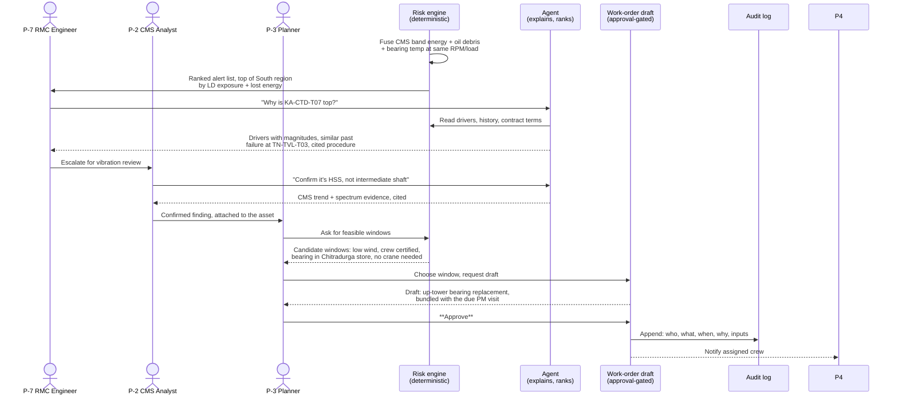
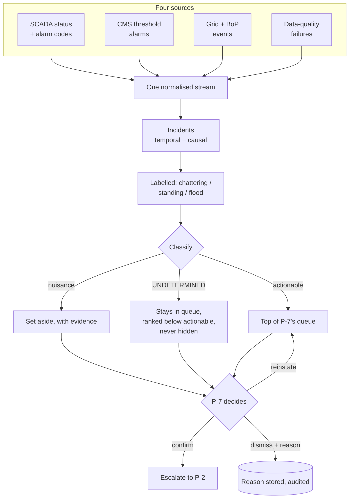

# Personas & Journeys

> **Status:** Draft v0.2 · **Owner:** JP · **Last updated:** 2026-09-18
>
> **Derived from [company-profile.md §6](company-profile.md#6-organisation-departments-roles--needs).**
> Every persona below is one of VWS's real roles, with that section's stated responsibilities,
> pains and needs. Personal names are *(illustrative)* labels for readability — they are not real
> people and carry no personal data.
>
> This document replaces the generic plant personas the profile's §12 asked us to rename.

---

## 1. Persona set

Ten personas. **`P-1`…`P-6` are primary** — the build serves them directly and each owns at least
one journey. **`P-7`…`P-10` are secondary** — they appear in journeys and shape requirements, but
if capacity runs out they lose their dedicated surface, not their data.

| ID | Persona *(name illustrative)* | VWS role (profile §6) | Department | Primary need | Journeys |
| --- | --- | --- | --- | --- | --- |
| `P-1` | Priya Menon | **COO: Services** | Leadership | Fleet risk and LD exposure ahead of time | `J-5` |
| `P-2` | Arun Krishnan | **CMS Analyst** (vibration specialist) | Remote Monitoring Centre | Automated triage of CMS features, findings attached to work orders | `J-1`, `J-2` |
| `P-3` | Deepa Rao | **Maintenance Planner** | Maintenance Planning | Risk-ranked backlog; work-order drafts with parts, crew and crane checked | `J-1`, `J-3` |
| `P-4` | Suresh Patil | **Field Technician** (working-at-height certified) | Field Service | A clear job pack: procedure, parts, history, safety notes | `J-4` |
| `P-5` | Ravi Iyer | **O&M Controller** | Finance & Commercial | LD exposure forecast; cost of acting versus waiting | `J-5` |
| `P-6` | Nisha Verma | **Data Platform Engineer** | IT / OT & Data | A governed, converged IT/OT platform | `J-7` |
| `P-7` | Karthik Nair | **RMC / SCADA Engineer** | Remote Monitoring Centre | Ranked alerts across SCADA and CMS; one-click escalation | `J-1`, `J-6` |
| `P-8` | Meera Joshi | **Reliability Engineer** | Engineering & Reliability | Cited root cause; similar-failure search across the fleet | `J-2` |
| `P-9` | Ganesh Kumar | **Site Stores In-charge** | Supply Chain | Early demand signal; reservation linked to a work order | `J-3` |
| `P-10` | Anjali Desai | **Key Account Manager** | Customer & Contracts | Trusted availability figures; proactive outage communication | `J-5` |

### 1.1 Mapping back to the profile, and two deliberate splits

[Profile §6](company-profile.md#6-organisation-departments-roles--needs) carries a "planning
persona" column that maps roles onto an earlier `P-1…P-6` set, and its §12 records that those
personas were due to be renamed. We have done that rename. In two places the profile's column
collapsed two distinct roles onto one persona, and we have **split them** — flagged here rather
than done silently, per the duplication rule.

| Profile role | Profile's column said | We assign | Why |
| --- | --- | --- | --- |
| CMS Analyst | `P-2` | `P-2` | Unchanged |
| Reliability Engineer | `P-2` | **`P-8`** | Different job, different tempo. `P-2` triages *this week's* degradation; `P-8` investigates *why it keeps happening* across the fleet. Merging them hides the root-cause journey |
| Performance Analyst | `P-2` (extend) | folded into `P-8` | Underperformance analysis is reliability work at this scope. Not a separate surface |
| Maintenance Planner | `P-3` | `P-3` | Unchanged |
| RMC / SCADA Engineer | `P-3` (extend) | **`P-7`** | The 24×7 alarm-triage actor is the *entry point* of the core demo. Folding them into the planner would erase the alert-to-action handoff, which is the flow the brief asks for |
| Regional Head / Site In-charge | `P-3` / `P-1` | folded into `P-3` | Same information need at a different scope filter |
| Shift Engineer | `P-4` (extend) | folded into `P-4` | Same job pack, earlier in the visit |
| Field Technician | `P-4` | `P-4` | Unchanged |
| Warehouse Manager / Stores In-charge | New | **`P-9`** | As the profile requested |
| Procurement & Supplier Quality | New | out of scope | Supplier warranty evidence is real but cannot be served at this capacity. Recorded, not built |
| Safety Officer | New | out of scope as a persona | Safety appears as a **scheduling constraint** in `J-3`, not a surface |
| O&M Controller | `P-5` | `P-5` | Unchanged |
| Key Account Manager | `P-5` (extend) | **`P-10`** | As the profile requested |
| COO: Services | `P-1` | `P-1` | Unchanged |
| Data Platform Engineer | `P-6` | `P-6` | Unchanged |

**Proposed change to a given document:** profile §6's planning-persona column and §12 should be
updated to this set. Per the read-only rule we have not edited it — this table is the proposal.

## 2. Journeys

| ID | Journey | Actors | Serves | In the demo? |
| --- | --- | --- | --- | --- |
| `J-1` | [Alert to action](#j-1-alert-to-action-core-demo-flow) | `P-7` → `P-2` → `P-3` | `BG-1`, `BG-2`, `BG-3` | **Yes — the core flow** |
| `J-2` | [Root cause with citations](#j-2-root-cause-with-citations) | `P-8`, `P-2` | `BG-6` | Yes |
| `J-3` | [Pre-season campaign planning](#j-3-pre-season-campaign-planning) | `P-3`, `P-9` | `BG-2`, `BG-5`, `BG-8` | Yes, briefly |
| `J-4` | [The technician's job pack](#j-4-the-technicians-job-pack) | `P-4` | `BG-6` | If time |
| `J-5` | [Availability, LD exposure and the customer report](#j-5-availability-ld-exposure-and-the-customer-report) | `P-1`, `P-5`, `P-10` | `BG-1`, `BG-4` | Yes — the opening frame |
| `J-6` | [Nuisance-alarm triage](#j-6-nuisance-alarm-triage) | `P-7` | `BG-3` | If time |
| `J-7` | [Platform operations](#j-7-platform-operations) | `P-6` | `BG-7` | No — evidence only |

### J-1 Alert to action (core demo flow)

The journey the brief asks for end to end: *correlate → predict + explain → triage → act.* This is
[profile §9](company-profile.md#9-a-day-in-the-life-one-failure-two-ways) told as a sequence, and
it is golden scenario `GS-1`.

**The two rules this journey exists to demonstrate.** The engine decides *what is feasible* —
windows, crews, parts, crane need — in tested SQL. The agent only *ranks and explains* what the
engine produced; it never invents a window, a crew, a part or an incident. And the write happens
only after `P-3` approves, with an audit row. Those are
[`D-4`](../00-hackathon/reference-solution-analysis.md#5-differentiators) and `D-5`.

| Step | Acceptance signal | Degraded mode |
| --- | --- | --- |
| Ranked alert list | Ranking by money at stake differs visibly from ranking by severity (`H-3`) | Fall back to severity ranking, labelled as such |
| "Why?" answer | Named drivers with magnitudes, not prose (`D-3`) | Show the driver table without the narrative |
| Cited procedure | Citation resolves to a document and section (`D-6`) | Link the document without the section anchor |
| Feasible windows | Every candidate satisfies every constraint, provably | Show constraint results without ranking |
| Approval + audit | Audit row exists, is append-only, and names the approver (`D-5`) | **None. If the audit path fails, the write must fail** |

That last degraded mode is deliberate: an unaudited write is worse than no write.

### J-2 Root cause with citations

`P-8` asks why a failure happened, or why a class of failures keeps happening, in natural
language, and gets an answer grounded in evidence rather than a plausible story.

| Step | What happens |
| --- | --- |
| 1 | `P-8` asks: *"Why did the gearbox on KA-CTD-T07 fail, and has this happened elsewhere?"* |
| 2 | Retrieval spans structured history (SCADA states, CMS features, work orders, component genealogy) and documents (service bulletins, CMS condition reports, OEM procedures) |
| 3 | Answer names the evidence: which signals moved, when, on which serial, alongside similar failures on other serials from the same supplier batch |
| 4 | Every factual claim carries a citation — a table and row, or a document and section |
| 5 | `P-8` can disagree: the drivers and the underlying rows are inspectable |

**Component genealogy is what makes this more than search.** Because serials move between
positions ([profile §4](company-profile.md#asset-hierarchy--ids)), "this position failed twice" and
"this part failed twice" are different questions with different answers — and the second one is
what tells Procurement they have a supplier problem.

### J-3 Pre-season campaign planning

The journey where the money is actually saved, and now the surface a planner decides in — `M10`
absorbs the former `C1`. India's wind season is roughly May–September, so heavy work belongs *before*
it.

| Step | What happens |
| --- | --- |
| 1 | `P-3` opens the schedule view: completed and planned work per site and region, wind season shaded, access constraints marked, over a rolling 12 weeks |
| 2 | `P-3` presses **Suggest schedule**, scoped to a site or region, optionally with a free-text constraint such as *"no crane before November"* — which is **parsed into a filter, echoed back for confirmation, and refused if unparseable** |
| 3 | The constraint engine produces feasible windows. The suggestion layer groups, ranks and explains them — it never invents one |
| 4 | Each suggestion is a **typed change** (add, move, bundle, cancel) carrying its reasoning and evidence: risk and lead time, last maintenance and interval due, parts stock and lead time (`P-9`), crew and crane availability, the weather window, and the seasonal value of the energy at stake |
| 5 | **"Plan the season"** mode extends to 12 months for crane-dependent and long-lead work, returning a ranked list of campaign proposals |
| 6 | Before committing, `P-3` sees the plan's effect: **risk left uncovered**, and **expected lost energy before versus after**, using the model from [business-case §2.1](business-case.md#21-illustrative-value-of-one-avoided-gearbox-failure) |
| 7 | `P-3` **accepts, edits or rejects with a reason**. Acceptance goes through the existing approval-gated action service; rejection reasons are stored |
| 8 | When nothing is feasible, the **binding constraint** is reported — *"no certified crew until week 44"* is a good answer |

Bundling is the point: one crane mobilisation serving three turbines is a different economic event
from three separate emergencies.

Note how step 8 mirrors `UNDETERMINED` in `J-6`. Both say *here is what is blocking me* rather than
forcing an answer, and together they read as a design principle rather than two unrelated features.

### J-4 The technician's job pack

`P-4` climbs 80+ metres. The cost of arriving without the right part or procedure is a wasted day.

| Needs before climbing | Source |
| --- | --- |
| What am I doing, and why do we think that? | Prediction drivers (`D-3`) |
| What has been done to this component before? | Work-order history by position **and** by serial |
| Which parts, and are they actually reserved? | ERP materials, linked to the work order |
| The correct procedure for *this* platform | Parsed OEM manual, cited (`D-6`) |
| Safety notes, isolation points, weather limits | HSE constraints carried on the work order |

Deliberately read-heavy and low-interaction: this persona is on a mast, not at a desk.

### J-5 Availability, LD exposure and the customer report

The frame the demo should open with, because it establishes stakes before showing mechanism.

| Actor | Question | Answer |
| --- | --- | --- |
| `P-1` | Where is the fleet against guarantee, and what is my LD exposure this contract year? | Availability by site and turbine against 95%/97%, with forecast shortfall converted to rupees |
| `P-5` | What does acting cost versus waiting? | Cost of planned intervention against expected LD plus lost energy |
| `P-10` | What do I tell the customer, and can I trust the number? | The monthly availability and generation figures, with exclusions applied and every number traceable to its state data |

`P-10`'s "can I trust the number" is the requirement that forces
[`D-8`](../00-hackathon/reference-solution-analysis.md#5-differentiators): one definition per
metric, so the dashboard, the agent and the customer report cannot disagree.

### J-6 Nuisance-alarm triage

The monitoring centre's day. Hundreds of alarms hide the few that matter
([profile §3](company-profile.md#3-the-problem-in-company-terms), item 5), and this is the scenario's
biggest day-to-day pain — which is why it is now `M9` rather than a Should.

| Step | What happens |
| --- | --- |
| 1 | Four sources are normalised into one stream — source, turbine, component, code, severity, start, end, auto-reset |
| 2 | Alarms correlate into **incidents**: same turbine and component within a window, plus causal patterns. A site-wide grid dip is **one** incident, not forty. A sensor fault producing a code cascade is one |
| 3 | Three noise conditions are labelled explicitly: **chattering** (repeated trip and auto-reset), **standing** (open with nobody acting), **flood** (rate above a per-site threshold) |
| 4 | Each incident is classified **actionable**, **nuisance** or **`UNDETERMINED`**, with the evidence stored: does another channel agree at matched operating conditions, does load or RPM already explain it, did it auto-reset and never recur, and what does the risk score say |
| 5 | `P-7` **confirms**, **dismisses with a reason**, or **reinstates**. Every decision goes through the approval-gated action service and is audited |
| 6 | The noise numbers are published — and the compression ratio is **never shown without the count of real failures suppressed beside it** |

**`UNDETERMINED` is the point of this journey.** When corroboration is missing, the system says so
rather than forcing a call. An undetermined incident stays in `P-7`'s queue, ranked below actionable,
never hidden and never auto-suppressible, and the undetermined *rate* is itself a published figure — a
rising rate means the evidence base is degrading.

**Three hard constraints**, from AGENTS.md rule 3 and unchanged: nothing is auto-suppressed on an
asset with elevated risk; nothing is auto-suppressed for a safety-critical alarm code; every
suppression is time-boxed, reversible, visible and audited. **`T-60` is the blocking test** — no seeded
real failure may ever be suppressed or dismissed, zero tolerance.

**Deliberately not built** ([`W13`](../02-functional/scope.md#6-wont-this-hackathon)): automatic
proposal of suppression patterns from dismissal history. Designed and documented, but with no real
operators we would be seeding the dismissals ourselves and then presenting the loop "learning" a
pattern we planted.

**Byproduct worth naming:** standing-alarm detection needs acknowledgement timestamps, which gives us
**mean time to respond** ([profile §8](company-profile.md#8-kpis-the-company-runs-on)) for free.

### J-7 Platform operations

`P-6` is not a demo persona but is the reason the rest works, and is where `E2` and `E8` evidence
comes from: pipeline freshness and lag, failed loads, data-quality checks, model training and
evaluation runs, cost per pipeline, and the least-privilege role grants that let `P-1` and `P-4`
see different things.

## 3. Golden scenarios

`GS-` items are the concrete, scripted instances used for the demo and for tests. The demo script
itself belongs to [demo-and-submission.md](../08-delivery/demo-and-submission.md); this section
just fixes what they are, so requirements and tests can reference them.

| ID | Scenario | Journey | Asset | Why this one |
| --- | --- | --- | --- | --- |
| `GS-1` | Gearbox HSS bearing degradation caught 14+ days out, repaired up-tower in a low-wind window, bundled with a due PM visit | `J-1` | `KA-CTD-T07` (VW-3.0) | The profile's own worked example ([§9](company-profile.md#9-a-day-in-the-life-one-failure-two-ways)). Drivetrain dominates downtime |
| `GS-2` | The same failure mode recurring on a second serial from one supplier batch | `J-2` | `TN-TVL-T03` (VW-2.1) | Proves component genealogy, and gives Procurement evidence |
| `GS-3` | Three elevated-risk components at one site bundled into a single pre-season crane campaign | `J-3` | `GJ-KCH` | Where the money is actually saved. **Now `M10`'s season mode rather than a separate item** |
| `GS-4` | **A day of alarms across the fleet** collapsing to a short actionable list — including one genuine nuisance (chattering, auto-resetting, uncorroborated) and one honest `UNDETERMINED` | `J-6` | `TN-TVL` + fleet | **The opening demo beat.** Coastal salinity is the profile's stated stressor. Tests both directions of `H-4` |
| `GS-5` | Yaw misalignment causing sustained underperformance with no alarm at all | `J-5` | `RJ-JSM` | Lost energy without downtime. Availability alone would miss it entirely |

`GS-5` earns its place by being the case the reference solution's model of the world cannot
express: the turbine is available, nothing is alarming, and energy is being lost anyway.

## 4. Coverage check

| Persona | Has a journey? | Has a surface? | Notes |
| --- | --- | --- | --- |
| `P-1` | `J-5` | Fleet view | |
| `P-2` | `J-1`, `J-2` | Alert detail + ask | |
| `P-3` | `J-1`, `J-3` | Backlog + planning | Heaviest persona; owns approval |
| `P-4` | `J-4` | Job pack (read-only) | Droppable to a printed view |
| `P-5` | `J-5` | Shares `P-1`'s view with a cost lens | |
| `P-6` | `J-7` | Operational evidence, not a page | |
| `P-7` | `J-1`, `J-6` | Triage list — the demo entry point | |
| `P-8` | `J-2` | Ask, with citations | |
| `P-9` | `J-3` | Appears inside planning; no own page | Secondary |
| `P-10` | `J-5` | Report output | Secondary |

Every persona has at least one journey, and every journey has at least one persona. Requirements
and tests per journey are Stage 3's job.

## 5. Open questions

| ID | Question | Owner |
| --- | --- | --- |
| `Q-20` | Does the team accept splitting `P-7` from `P-3` and `P-8` from `P-2` (§1.1), and the profile-update proposal that follows? | JP |
| `Q-21` | `P-4`'s job pack: a real mobile-shaped surface, or a printable panel inside the planner view? Recommendation: printable panel — `P-4` is the persona most safely degraded | JP |
| `Q-22` | Do we build a distinct `P-1` surface, or one fleet view filtered by role? Recommendation: one view, role-filtered, which also demonstrates `D-10` | NK |
| `Q-23` | `GS-5` needs a power curve per platform to detect underperformance. Confirm we model one, or drop `GS-5` | SA |

Tracked centrally in the [RAID log](../08-delivery/raid-log.md).
