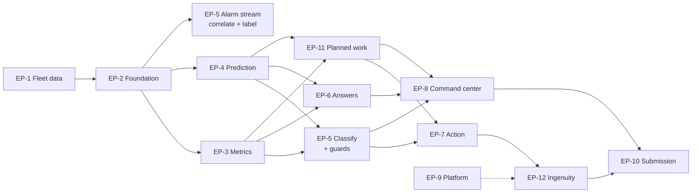

# Epics & User Stories

> **Status:** Draft v0.4 · **Owner:** SA · **Last updated:** 2026-09-18
>
> **v0.4 adds** `US-94`…`US-97`: the baseline comparison shown, the aggregate outcome generated, the
> guard refusal demonstrable, and a cold external scoring run on D14.
>
> **v0.3 added** `EP-13` the scoring surface, and `US-85`…`US-93`.
>
> **Person-hour estimates have been removed.** They implied a precision we did not have, and the
> person building this is not the bottleneck. Each epic now carries the **gate** it sits behind and
> the **review and decision load** it places on a human — which is the actual constraint. See
> [scope §7](scope.md#7-what-constrains-us).

---

## 1. Epics

| ID | Epic | Scope | Gate | Review load on NK |
| --- | --- | --- | --- | --- |
| `EP-1` | **Believable fleet data** — degradation real enough to learn from | `M2` | **G1** | Low once `T-10` passes. High if it fails |
| `EP-2` | **Converged foundation** — SCADA, CMS, CMMS, ERP, contracts in one model | `M1` | **G1** | Low — mechanical, test-verified |
| `EP-3` | **Truthful metrics** — defined once, hand-worked fixtures | `M4` | **G3** | Medium — fixtures need a human to work out by hand |
| `EP-4` | **Real prediction, explained** — trained, evaluated, with drivers | `M3` | **G2** | Medium — confirm the operating point and that drivers read honestly |
| `EP-5` | **From alarm flood to a short, honest list** — normalise, correlate, label, classify with `UNDETERMINED` | `M9` | G1 (data), **G4** (guards) | **High, front-loaded** — classification policy and the ADR |
| `EP-6` | **Grounded answers** — documents parsed, indexed, cited | `M6` | — | Medium — read the answers and check citations resolve |
| `EP-7` | **Action with a paper trail** — approval-gated, idempotent, audited | `M7` | **G4** | Medium — the invariants are unforgiving but testable |
| `EP-11` | **Planned work, decided in one place** — engine, suggestions, decision loop | `M10` | **G4** | **Highest, and taste-dependent** — only a human can judge whether a suggestion reads as credible to a planner |
| `EP-8` | **The command center** — two views, done properly | `M8` | — | Medium — the reusable evidence panel is one design conversation, not three |
| `EP-12` | **Committed ingenuity** — one run, digest, MCP, four surfaces | `M11` | **G5** | Low, plus **two early decisions**: scheduler role and MCP target |
| `EP-13` | **The scoring surface** — judge-facing README, walkthrough, results summary, criteria traceability | `M13` | **G5** | **Medium, and cannot be cut.** This *is* what gets judged |
| `EP-9` | **Trustworthy platform** — roles, secrets, reproducibility, cost | `S5` | **G5** | Low |
| `EP-10` | **Evidence & submission** — CoCo evidence per phase, deck, repo, rehearsal | — | **G5** | Medium, and **cannot be cut** |

Note `EP-5` splitting in two. The alarm **stream, correlation and noise labelling need no model**, so
they sit in the foundation window; only **classification** needs corroboration and the risk guard.
That split is what stops D12–D14 from carrying three surfaces at once.

## 2. Stories

Format: *As `<persona>`, I want `<capability>`, so that `<outcome>`.*

### EP-1 — Believable fleet data

| ID | Story | Satisfies | Acceptance |
| --- | --- | --- | --- |
| `US-1` | As `P-6`, I want the fleet, turbines, components and signals generated from the company profile | `FR-8` | 100 turbines, 6 sites, 2 platforms, IDs match the profile |
| `US-2` | As `P-2`, I want SCADA signals with diurnal and seasonal wind behaviour | `FR-8`, `FR-12` | Data reaches generation date; wind season shows higher output |
| `US-3` | As `P-2`, I want CMS features that **trend upward before a seeded failure** | `FR-9` | `T-8` passes for every seeded failure |
| `US-4` | As `SA`, I want failure timing driven by **accumulated damage** | `FR-10` | `T-9`: correlates with damage, not with asset ID |
| `US-5` | As `SA`, I want a test proving the label is **learnable** | `FR-11` | `T-10`: beats random **and** a trivial single-signal rule |
| `US-6` | As `P-7`, I want every threshold to be **reachable** | `FR-13` | `T-12` |
| `US-7` | As `P-8`, I want drivetrain-weighted failures with matching work orders | `FR-14`, `FR-3` | `T-7` |
| `US-52` | As `P-7`, I want **alarm streams generated for all four sources**, including seeded chattering, a site-wide grid dip and a sensor-fault code cascade | `FR-57`, `FR-59` | Each source populated; each seeded pattern present and detectable |

### EP-2 — Converged foundation

| ID | Story | Satisfies | Acceptance |
| --- | --- | --- | --- |
| `US-8` | As `P-6`, I want raw landing tables for every source | `FR-1`, `FR-3`, `FR-4` | `T-1` |
| `US-9` | As `P-2`, I want CMS features joined to SCADA at **matched RPM and load bands** | `FR-2` | `T-2`, `T-3`: a load-only change produces no feature shift |
| `US-10` | As `P-8`, I want component genealogy tracked | `FR-5` | `T-4` |
| `US-11` | As `P-6`, I want curation re-runnable without duplicating rows | `NFR-5` | `T-51` |
| `US-93` | As `P-6`, I want **one incremental path** — alarms or CMS features — as a dynamic table with a declared `TARGET_LAG`, and the refresh time visible on the surface | `FR-89`, `NFR-18` | `T-88`: land a batch, it appears within the lag, no manual rebuild |
| `US-12` | As `P-10`, I want operating state on every fact row | `FR-7` | `T-6` |

### EP-3 — Truthful metrics

| ID | Story | Satisfies | Acceptance |
| --- | --- | --- | --- |
| `US-13` | As `P-10`, I want availability with exclusions applied | `FR-22`, `FR-23` | `T-20`, incl. a guarantee step from 95% to 97% mid-fixture |
| `US-14` | As `P-1`, I want lost energy from the power curve | `FR-24` | `T-21` |
| `US-15` | As `P-5`, I want LD exposure per turbine and aggregated | `FR-25` | `T-22` |
| `US-16` | As `P-1`, I want Turbine OEE whose composed value **equals** `A × P × Q` | `FR-26`, `FR-28` | `T-23`, `T-25` |
| `US-17` | As `P-10`, I want one definition per metric across app, semantic view and agent | `FR-27`, `FR-56` | `T-24` |

### EP-4 — Real prediction, explained

| ID | Story | Satisfies | Acceptance |
| --- | --- | --- | --- |
| `US-18` | As `SA`, I want features engineered per component class at matched conditions | `FR-2`, `FR-16` | Documented definition per feature |
| `US-19` | As `P-2`, I want a trained risk classifier with an explicit horizon | `FR-16`, `FR-17` | `T-14`, `T-15` |
| `US-20` | As `P-7`, I want **top drivers with magnitude and direction** on every score | `FR-18` | `T-16`: no score without drivers |
| `US-21` | As `P-3`, I want the lead-time distribution reported | `FR-19` | `T-17` |
| `US-22` | As `P-2`, I want anomaly detection as an independent second signal | `FR-20` | `T-18`: not collinear with risk |

### EP-5 — From alarm flood to a short, honest list

| ID | Story | Satisfies | Acceptance |
| --- | --- | --- | --- |
| `US-53` | As `P-7`, I want **four alarm sources normalised into one stream** with a conformed schema | `FR-57` | `T-62`: all four conform; schema accepts a fifth without change |
| `US-24` | As `P-7`, I want alarms **correlated into incidents** by turbine and component | `FR-30`, `FR-58` | `T-27`, `T-63` |
| `US-54` | As `P-7`, I want a **site-wide grid dip to be one incident**, not forty, and a sensor-fault cascade to be one | `FR-59` | `T-64` |
| `US-55` | As `P-7`, I want **chattering** labelled — repeated trip and auto-reset | `FR-60` | `T-65` |
| `US-56` | As `P-7`, I want **standing alarms** labelled — open with nobody acting | `FR-61` | `T-66`. Byproduct: mean-time-to-respond |
| `US-57` | As `P-7`, I want **flood periods** labelled per site | `FR-62` | `T-67` |
| `US-58` | As `P-7`, I want each incident classified **actionable, nuisance or `UNDETERMINED`**, with the evidence stored | `FR-63` | `T-68`: evidence rows present for every incident |
| `US-59` | As `P-7`, I want **undetermined incidents to stay in my queue** — never hidden, never auto-suppressed — and the undetermined rate published | `FR-64` | `T-61` |
| `US-25` | As `P-7`, I want suppression candidates with evidence, and suppression to remain my decision | `FR-31` | `T-28`: no automatic suppression path exists |
| `US-26` | As `P-7`, I want the suppression guards enforced | `FR-32` | `T-29`, `T-30` |
| `US-60` | As `P-6`, I want a **blocking test that no seeded real failure is ever suppressed or dismissed** | `FR-32`, `FR-63` | **`T-60` — zero tolerance, one hit fails the build** |
| `US-61` | As `P-7`, I want **confirm / dismiss-with-reason / reinstate**, through the existing action service | `FR-65` | `T-74`: audited, no second write path |
| `US-62` | As `P-1`, I want the noise numbers, with **compression never shown without real-failures-suppressed beside it** | `FR-67`, `FR-68`, `FR-87` | `T-70` |
| `US-63` | As `P-7`, I want classification **precision per source** against ground truth | `FR-66` | `T-69` |
| `US-23` | As `P-7`, I want what survives triage ranked by **money at stake** | `FR-29` | `T-26`: money ranking differs visibly from severity |

### EP-11 — Planned work, decided in one place

| ID | Story | Satisfies | Acceptance |
| --- | --- | --- | --- |
| `US-33` | As `P-3`, I want candidate windows that satisfy **every** constraint | `FR-33` | `T-31`: violations excluded, never ranked down |
| `US-64` | As `P-3`, I want a **schedule view** of completed and planned work per site and region, wind season shaded, access constraints marked, over a rolling 12 weeks | `FR-69` | `T-80` |
| `US-65` | As `P-3`, I want **one control** to suggest a schedule, scoped by site or region | `FR-70`, `FR-72` | `T-81`: default horizon is 12 weeks |
| `US-66` | As `P-3`, I want a **"plan the season" mode** returning ranked campaign proposals for crane and long-lead work | `FR-71` | `T-82`. Absorbs `C1` |
| `US-67` | As `P-3`, I want an optional **free-text constraint** parsed into a filter, its interpretation echoed back, and refused if unparseable | `FR-73` | `T-73`: the model translates, never reasons about feasibility |
| `US-68` | As `P-3`, I want each suggestion to be a **typed change** carrying its reasoning and evidence | `FR-74`, `FR-75` | `T-83` |
| `US-69` | As `P-5`, I want each suggestion's **expected impact** in avoided LD and lost energy | `FR-76` | `T-75`: reconciles to the metric layer |
| `US-70` | As `P-3`, I want suggestions drawn **only from engine-produced windows** | `FR-77` | **`T-71`** — adversarial |
| `US-71` | As `P-3`, I want the **binding constraint** reported when nothing is feasible | `FR-78` | `T-72`: "no certified crew until week 44" |
| `US-72` | As `P-3`, I want to **accept, edit or reject-with-reason**, acceptance going through the existing action service | `FR-79` | `T-74`: reasons stored, no second write path |
| `US-73` | As `P-3`, I want to see **risk left uncovered and lost energy before versus after** before I commit | `FR-80` | `T-75` |
| `US-34` | As `P-3`, I want a drafted work order carrying the evidence that justified it | `FR-34` | `T-32` |
| `US-37` | As `P-9`, I want a parts reservation requested against the work order | `FR-38` | `T-36` |

### EP-7 — Action with a paper trail

| ID | Story | Satisfies | Acceptance |
| --- | --- | --- | --- |
| `US-35` | As `P-3`, I want nothing written until I approve, with my identity recorded | `FR-35` | `T-33` |
| `US-36` | As `P-6`, I want writes idempotent and audit-first | `FR-36`, `FR-37` | `T-34`, `T-35`: audit failure blocks the write |
| `US-74` | As `P-6`, I want **one write path** serving work orders, suppressions, alarm decisions and schedule acceptances | `FR-35`, `FR-65`, `FR-79` | No second write path exists in any component |

### EP-6 — Grounded answers

| ID | Story | Satisfies | Acceptance |
| --- | --- | --- | --- |
| `US-27` | As `P-8`, I want synthetic documents as **real files** | `FR-39` | 8–12 documents on a stage |
| `US-28` | As `P-8`, I want them parsed with structure retained | `FR-39` | `T-37`: section resolvable |
| `US-29` | As `P-8`, I want them indexed in a search service | `FR-40` | `T-38` |
| `US-30` | As `P-8`, I want every factual claim to carry a citation | `FR-41` | `T-39`, `T-40` |
| `US-31` | As `P-6`, I want generated SQL validated and no destructive tools | `FR-53`, `FR-54` | `T-47`, `T-48` |
| `US-32` | As `P-2`, I want the agent to choose only among engine-produced candidates | `FR-52`, `FR-55` | `T-46`, `T-49`, `T-71` |

### EP-13 — The scoring surface

The prototype submission is a **deck plus a repo**. A judge gives an entry 5–15 minutes and will not
read `docs/`. This epic is the entire surface that gets scored before the Finals, which is why it is
uncuttable and why the deck is written **first**, not last.

| ID | Story | Satisfies | Acceptance |
| --- | --- | --- | --- |
| `US-85` | As NK, I want the **deck drafted on D1 as a specification** of what the demo must show, so we build to it rather than describing whatever we happened to build | — (`E9`) | Twelve slides exist on D1, each stating a claim. A slide that cannot be filled by D13 means that feature is cut |
| `US-86` | As a judge, I want a **root `README` that pitches in 60 seconds** and gives me runnable steps | `FR-93`, `NFR-20` | **`T-89`** — someone who did not write it follows it from a clean clone and succeeds |
| `US-87` | As a judge, I want a **2-minute recorded walkthrough**, so I can see it work without running it | `FR-94` | `T-90`. Covers `GS-4` then `GS-1` |
| `US-88` | As NK, I want a **results summary generated from `OPS`**, so "effective results" is measured rather than asserted | `FR-95` | `T-92`: reconciles to `OPS`; not hand-written |
| `US-89` | As NK, I want **every criterion `E1`–`E9` mapped to an artefact and a demo moment** | `FR-96` | `T-93`: no placeholders |
| `US-94` | As a judge, I want to see **what a threshold rule would have flagged, beside what the model flagged**, and how many of each actually failed | `FR-97` | **`T-94`**: reconciles to the recorded evaluation run. The rule must be the obvious one, defined **before** the comparison is run |
| `US-95` | As `P-1`, I want **one generated sentence** stating failures flagged of failures seeded, median lead time, and LD exposure identified before it crystallised | `FR-98` | `T-95`: computed from `OPS`, never hand-written |
| `US-96` | As `P-7`, I want to **watch the guard refuse** — attempt to suppress an elevated-risk asset and see the refusal with its reason | `FR-99` | `T-96`: reachable from the UI, and the attempt is logged |
| `US-97` | As NK, I want **someone outside the team to score us cold against the rubric on D14**, given only the deck, README and walkthrough | — (`E9`) | Findings triaged the same day. Whatever they cannot find, a judge will not find |

### EP-8 — The command center

| ID | Story | Satisfies | Acceptance |
| --- | --- | --- | --- |
| `US-75` | As any user, I want **one reusable evidence panel** serving drivers, alarm evidence and schedule reasoning | `FR-88` | `T-85`. **Built once, first** — before the three surfaces that use it |
| `US-90` | As `P-7`, I want the **alarm collapse shown as a funnel** — alarms in → incidents → actionable / nuisance / undetermined — with real-failures-suppressed beside it | `FR-90` | **`T-86`**: reconciles to `MET_NOISE`; cannot render without the pairing |
| `US-91` | As `P-2`, I want the model's **held-out metric on screen** beside the score it produced | `FR-91` | **`T-87`**: matches the recorded evaluation run |
| `US-92` | As `P-7`, I want my **override recorded and visible** — when I dismiss an incident or reject a suggestion, it stays visible with my reason | `FR-92` | `T-91` |
| `US-39` | As `P-7`, I want the triage list with risk, horizon, drivers and money at stake | `FR-46` | `T-26` |
| `US-76` | As `P-7`, I want the **noise header** above the list | `FR-87` | `T-70` |
| `US-38` | As `P-1`, I want to move fleet → region → site → turbine → component | `FR-45` | `T-43` |
| `US-40` | As `P-1`, I want availability, lost energy, LD exposure and OEE at the selected scope | `FR-47` | `T-23` |
| `US-41` | As `P-2`, I want an ask box in context whose answers carry drivers or citations | `FR-48` | `T-39` |
| `US-42` | As `P-3`, I want to approve and immediately see the audit entry | `FR-49` | `T-33` |
| `US-43` | As any user, I want defined empty and error states | `FR-51` | `T-45`, `T-57` |

### EP-12 — Committed ingenuity

| ID | Story | Satisfies | Acceptance |
| --- | --- | --- | --- |
| `US-77` | As `P-6`, I want **one daily run** refreshing scores, suggestions and the digest together | `FR-81` | `T-76`: one task, one schedule, one freshness stamp |
| `US-78` | As `P-7`, I want a **digest of what changed** delivered before my shift | `FR-82`, `FR-83` | `T-77`: server-side via notification integration |
| `US-79` | As `P-6`, I want the run to **refresh only and never apply** | `FR-85` | **`T-76`** |
| `US-80` | As `P-6`, I want the run to execute as **`WOA_SCHEDULER`**, never a human's default role | `NFR-19` | `T-78`. **Decided on D1, not D14** |
| `US-81` | As `P-4`, I want an **approval notification** where I actually work | `FR-84` | `T-79`: optional — absence never blocks an approval |
| `US-82` | As any user, I want **freshness visible** wherever derived output is shown | `NFR-18` | `T-77` |
| `US-83` | As NK, I want the solution demonstrated across **four surfaces**, each with an evidence artefact | `FR-86` | `T-84` |

### EP-9 — Trustworthy platform

| ID | Story | Satisfies | Acceptance |
| --- | --- | --- | --- |
| `US-44` | As `P-6`, I want least-privilege roles and no `ACCOUNTADMIN` in application code | `NFR-3` | `T-50` |
| `US-45` | As `P-6`, I want setup parameterised, idempotent and teardown-able | `NFR-6` | `T-52`: succeeds twice in a row |
| `US-46` | As `P-6`, I want no secrets in git and licences recorded | `NFR-11`, `NFR-17` | `T-56`, `T-59` |
| `US-47` | As NK, I want freshness, quality, model runs and **credits from both sources** queryable | `NFR-8`, `NFR-14` | `T-54`, `T-58` |

### EP-10 — Evidence & submission

| ID | Story | Satisfies | Acceptance |
| --- | --- | --- | --- |
| `US-48` | As NK, I want a CoCo evidence entry per phase, **with verifiable identifiers** | — (`E4`) | One entry per phase, each carrying session and request IDs |
| `US-49` | As NK, I want every core-demo dependency to have a **tested** degraded mode | `NFR-7` | `T-53` |
| `US-50` | As NK, I want the deck and repo documentation complete | — | Judged runnable from the README |
| `US-51` | As NK, I want the demo rehearsed against the golden scenarios | — | `GS-4` then `GS-1`, end to end, twice |
| `US-84` | As NK, I want a **CLAIMED / DECLINED table** covering all seven ingenuity capabilities | — (`E5`) | Every row has a one-line reason |

## 3. Coverage check

| Check | Result |
| --- | --- |
| Stories | 97 |
| Every Must has ≥1 story | `M1` `US-8`…`US-12`, `US-93`; `M2` `US-1`…`US-7`, `US-52`; `M3` `US-18`…`US-22`, `US-91`, `US-94`; `M4` `US-13`…`US-17`; `M5` `US-23`; `M6` `US-27`…`US-32`; `M7` `US-35`, `US-36`, `US-74`; `M8` `US-38`…`US-43`, `US-75`, `US-76`, `US-90`…`US-92`; `M9` `US-24`…`US-26`, `US-53`…`US-63`, `US-96`; `M10` `US-33`, `US-34`, `US-37`, `US-64`…`US-73`; `M11` `US-77`…`US-83`; `M12` `US-93`; `M13` `US-85`…`US-89`, `US-94`, `US-95` — **Pass** |
| Every gating test has an owning story | `T-8` `US-3`; `T-10` `US-5`; `T-11` `US-2`; `T-16` `US-20`; `T-23` `US-16`; `T-24` `US-17`; `T-25` `US-16`; `T-29` `US-26`; `T-33` `US-35`; `T-34` `US-36`; `T-35` `US-36`; `T-47` `US-31`; `T-60` `US-60`; `T-71` `US-70`; `T-76` `US-79`; `T-86` `US-90`; `T-87` `US-91`; **`T-94` `US-94`** — **Pass** |
| Stories naming no requirement | 7 — `US-48`, `US-50`, `US-51`, `US-74`, `US-84`, `US-85`, `US-97`. Submission and process obligations, marked deliberately |
| Personas with no story | none |

## 4. Sequencing notes

| Note | Why it matters |
| --- | --- |
| **`US-94`, `US-96` add no build surface** | Both *surface* work the plan already does — `T-10`'s baseline comparison and `FR-32`'s guards. They convert an internal test into an audience-visible proof, which is the cheapest scoring move available |
| **`US-97` runs on D14, not D15** | A cold external score is only useful if there is a day left to act on it |
| **`US-85` is a D1 story, not a D14 story** | The deck is one of only two things judged at submission. Writing it first turns it into a specification and a cut-decision tool; writing it last turns it into a description of whatever happened |
| **`US-93` restores one incremental path** | Without it we must strip "real time" from every artefact and score worse on the brief's first bullet than teams who batch-load and claim it. One dynamic table buys the honest version |
| **`US-75` (evidence panel) is built before `US-39`, `US-58`, `US-68` and `US-90`** | One design conversation instead of four, and the product reads as coherent rather than assembled |
| **`US-52` sits in `EP-1`, not `EP-5`** | Alarm-source generation is data work and belongs behind `G1`. It has no dependency on the model |
| **`US-53`…`US-57` need no model** | Normalisation, correlation and noise labelling land in the foundation window, keeping D12–D14 clear |
| **`US-58` onwards need `EP-4`** | Classification corroboration and the suppression guard both read the risk score |
| **`US-80` is a D1 decision** | Automations inherit their creator's default role. Discovering this on D14 would break `NFR-3` |
| **`US-33` restored to D10** | `EP-11` is impossible without it, so it is load-bearing rather than a Should |

## 5. Open questions

| ID | Question | Owner |
| --- | --- | --- |
| `Q-36` | Spike the matched-band join early — it remains the subtlest data work | JP |
| `Q-37` | Split `US-33` into hard constraints and ranking? Recommendation: yes | JP |
| `Q-38` | Who owns `EP-10`? It cannot be cut and it is nobody's favourite work | NK |
| `Q-76` | Does `US-67`'s free-text parsing use the model at all, or a fixed grammar? Recommendation: fixed grammar first, model only if the grammar proves too rigid | SA |
| `Q-77` | `US-62`: is compression-with-failures-suppressed shown as two numbers or one ratio-plus-caveat? Recommendation: two numbers, side by side, equal weight | NK |
