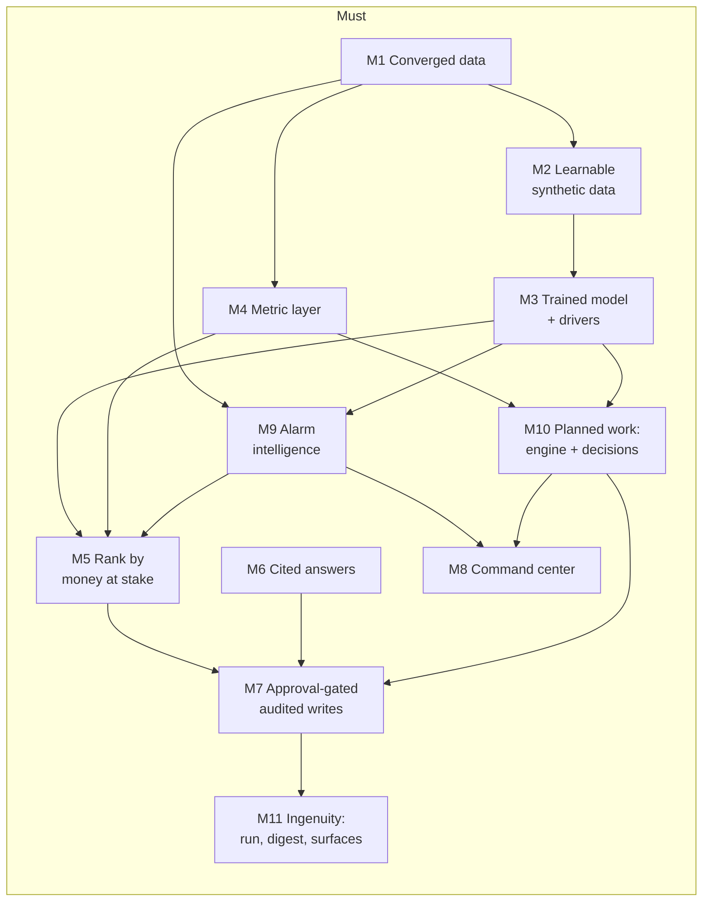

# Scope (MoSCoW)

> **Status:** Draft v0.4 · **Owner:** NK · **Last updated:** 2026-09-18
>
> **v0.4 changes.** `M13` gains the **baseline comparison displayed** and a **generated aggregate
> outcome sentence**; `M9` gains **demonstrable** suppression guards. None adds build surface — each
> surfaces work already planned where a judge can see it. A cold external scoring run is added on D14.
>
> **v0.3 changes.** `M12` demonstrable freshness restores **one** incremental path as a Must, so the
> brief's "real time" ask is addressed honestly rather than dropped. `M13` makes the submission
> artefacts explicit Musts. `M8` gains the alarm funnel and the on-screen model metric. A **minimum
> viable submission** is now defined. Cut order revised: the alarm triage surface is no longer
> cuttable.
>
> **v0.2 changes.** Alarm handling promoted from `S2` to **`M9`**. Constraint engine plus a
> scheduling decision loop promoted from `S3` to **`M10`**, absorbing `C1`. Ingenuity bonuses moved
> from opportunistic to committed as **`M11`**. `S6` displaced; `M8` re-pointed from breadth to depth.
> Sizing is no longer expressed in person-hours — see [§7](#7-what-constrains-us).
>
> Reads on from [business-case.md](../01-business/business-case.md) (`BG-`, `H-`),
> [personas-and-journeys.md](../01-business/personas-and-journeys.md) (`P-`, `J-`, `GS-`) and
> [reference-solution-analysis.md](../00-hackathon/reference-solution-analysis.md) (`D-`).

---

## 1. The one-sentence scope

**A converged IT/OT command center for a wind O&M fleet that turns an alarm flood into a short,
honest actionable list, predicts component failure with explained drivers, answers "why" with
citations, and turns the decision into approval-gated, audited planned work.**

## 2. What is in, at a glance

`M2 → M3 → M5 → M7` remains the critical path and is **untouchable**. `M9` and `M10` hang off it;
neither is allowed to delay it.

## 3. Must

| ID | Item | Why it must exist | Serves | Journeys | `D-` |
| --- | --- | --- | --- | --- | --- |
| `M1` | **Converged data foundation.** SCADA signals and events, CMS vibration features, CMMS work orders and asset register, ERP stock and O&M contract terms in one governed schema | The brief's first bullet | `BG-7` | all | `D-11` |
| `M2` | **Physically plausible synthetic data with a learnable label.** Degradation trends before failure; failures caused by the degradation path | Everything downstream is worthless otherwise | `H-1`, `H-2` | all | `D-2` |
| `M3` | **Trained, evaluated risk model with drivers.** Held-out evaluation, published metric, top features with magnitudes on every score | "Predict failures in advance". A `CASE` statement is not a prediction | `H-1`, `H-2` | `J-1` | `D-1`, `D-3` |
| `M4` | **Metric layer, one definition each.** Availability, lost energy, LD exposure, Turbine OEE | `P-10`'s "can I trust the number" | `BG-1`, `BG-4` | `J-5` | `D-8`, `D-9` |
| **`M9`** | **Alarm intelligence.** Four sources normalised into one stream; correlation into incidents; chattering, standing and flood labelled; three-way classification with an explicit **`UNDETERMINED`** class; confirm / dismiss-with-reason / reinstate; noise metrics published with an anti-gaming pairing | **The biggest day-to-day pain in the scenario.** The RMC drowns in alarms and cannot tell which few matter. Previously `S2`, i.e. the sixth thing we would have thrown away | `BG-3`, `H-4` | `J-1`, `J-6` | **`D-13`** |
| `M5` | **Triage ranked by money at stake.** LD exposure plus lost energy, not mechanical severity | The brief's third bullet, and the sharpest single contrast in the demo | `BG-1`, `BG-3` | `J-1` | `D-9` |
| `M6` | **Cited answers over real documents.** Synthetic files parsed and retrieved, cited to document and section | "Root cause investigation in natural language" | `BG-6`, `H-5` | `J-2` | `D-6` |
| **`M10`** | **Planned work, decided in one place.** The constraint engine producing feasible windows, plus the surface a planner decides in: rolling 12-week suggestions, a season mode for crane and long-lead work, typed changes with reasoning and evidence, pre-commit impact, and accept / edit / reject-with-reason | The engine alone produces candidates nobody acts on. This is where prediction becomes planned work — the scenario's whole thesis. Absorbs `C1` | `BG-2`, `BG-5`, `BG-8`, `H-6`, `H-7` | `J-1`, `J-3` | `D-4` |
| `M7` | **Approval-gated, idempotent, audited writes.** One write path serving work orders, suppressions, alarm decisions and schedule acceptances | "Automate work orders". A toast that lies is worse than nothing | `BG-2`, `H-6` | `J-1`, `J-3`, `J-6` | `D-5` |
| `M8` | **Command center — two views, done properly.** Triage (alarms → incidents → actionable, with the **funnel visual** and evidence on demand) and asset detail (risk, drivers **with the held-out metric on screen**, history, documents), plus the schedule surface from `M10` | The brief's "command center experience", and the only thing judges see | `BG-1`, `BG-3` | `J-1`, `J-5` | `D-12` |
| **`M12`** | **Demonstrable freshness.** **One** incremental path — alarms or CMS features — as a dynamic table with a declared target lag, and a visible refresh time on every derived surface | The brief's first bullet says *"**real time** sensor streams"*. Without this we must strip the word entirely and score worse than teams who batch-load and claim it anyway. One dynamic table lets us say "incremental, declared lag" **truthfully**. Capability already verified working in our account | `BG-7` | `J-7` | `D-7` |
| `M13` | **Submission artefacts that stand alone.** A judge-facing root `README` that pitches in 60 seconds; a 2-minute recorded walkthrough; a generated **results summary**; the deck; **the baseline comparison displayed**; and **one generated aggregate outcome sentence** | The prototype submission *is* a deck plus a repo. A judge gives an entry 5–15 minutes and will not read `docs/`. These are the entire scoring surface before the Finals — and the baseline comparison is the most persuasive number we own, currently tested in the dark | — | — | `D-11` |
| **`M11`** | **Ingenuity, committed rather than hoped for.** One daily scheduled run refreshing scores, suggestions and a digest; digest delivered server-side; approval notification over MCP; four named surfaces; three reusable skills; a CLAIMED/DECLINED table | `E5` is a scored bonus that we were leaving on the table. Small, deliberate, and the declines are part of the story | — | `J-7` | — |

**On `M8`'s change of shape.** It was five thin views; it is now two deep ones plus the schedule
surface. This is not a reduction in brief coverage — a triage screen that collapses a day of alarms
into a short actionable list *is* "a command center experience for alert triage and action", far more
than an OEE drill-down page is.

## 4. Should

| ID | Item | Status | Degraded mode in force |
| --- | --- | --- | --- |
| `S1` | Incremental pipeline with declared target lag | **Narrowed to `M12`** | `M12` restores **one** path as a Must. The remaining layers stay batch. "Real-time" is still never claimed — "incremental, declared lag" is |
| `S2` | Alarm grouping and suppression | **Promoted to `M9`** | Retained as a pointer so existing references resolve |
| `S3` | Feasibility and constraint engine | **Promoted into `M10`** | Retained as a pointer. `M10` is impossible without it |
| `S4` | Component genealogy and similar-failure search | **Kept** | Position-only history; loses `GS-2` |
| `S5` | Role-scoped access, least privilege | **Kept** | One application role. `ACCOUNTADMIN` prohibition holds regardless |
| `S6` | Observability surface | **Displaced** | Manual queries, screenshotted as evidence |

`S4` is kept deliberately: it is high differentiation for very little work, and it is the only thing
that makes "has *this part* failed before?" answerable.

## 5. Could

All remaining `Could` items are **dropped for this hackathon** unless the Musts land early. `C1` is
not dropped — it is folded into `M10`.

| ID | Item | Status |
| --- | --- | --- |
| `C1` | Pre-season campaign bundling | **Folded into `M10`** as the season mode |
| `C2` | Technician job pack as its own surface | Dropped. `P-4` served by a printable panel at most |
| `C3` | Yaw-misalignment underperformance detection | Dropped unless the power curve lands cheaply (`GS-5`) |
| `C4` | Customer-facing monthly report artefact | Dropped |
| `C5` | Parts reservation written to the ERP model | Dropped. `M10` requests, does not reserve |
| `C6` | Oil-debris particle counts | Dropped, and with it oil-debris as an alarm source |
| `C7` | Scheduled / automated run | **Promoted into `M11`** |
| `C8` | MCP connector | **Promoted into `M11`** |
| `C9` | Marketplace weather | Dropped. Synthetic weather windows instead |

## 6. Won't (this hackathon)

| ID | Item | Why not |
| --- | --- | --- |
| `W1` | Raw vibration waveforms and spectra | Profile §7 scopes CMS to features only |
| `W2` | Real streaming ingestion from live equipment | No live equipment exists. Simulated arrival is honest |
| `W3` | Autonomous agent action without approval | Prohibited by design, not deferred |
| `W4` | Indian DSM penalty modelling | Intricate, state-varying. Context only |
| `W5` | Drone blade imagery and computer vision | Separate modality, no time to do it credibly |
| `W6` | Procurement supplier-warranty workflow | `S4` produces the evidence a future version would use |
| `W7` | HSE as a persona and surface | Safety is a scheduling constraint in `M10` |
| `W8` | Mobile application | Responsive read-only panel is the ceiling |
| `W9` | Multi-tenant partitioning | One fictional OEM |
| `W10` | Integration with real SCADA/CMS/CMMS products | We converge data shapes, not APIs |
| `W11` | Rewriting the given documents | Read-only. Proposals only |
| **`W12`** | **Event-driven re-planning** | The third trigger. Adds a stream/task dependency and no judge will see it. Button plus nightly refresh is the complete story |
| **`W13`** | **Suppression patterns proposed automatically from dismissal history** | **Designed, documented, deliberately not built.** With no real operators, we would seed the dismissals ourselves and then present the loop "learning" a pattern we planted. That is manufactured evidence, and it is adjacent to the exact failure mode we differentiate against. Human-initiated suppression with all of `FR-32`'s guards stays |
| **`W14`** | **Twelve-month calendar grid** | A year-wide visual for a demo that shows twelve weeks. The season *mode* survives as a ranked list of campaign proposals; the grid was decoration |
| **`W15`** | **Oil-debris and overdue-PM as alarm sources** | Oil debris: CMS band energy plus bearing temperature already corroborate gearbox wear. Overdue PM: a planning backlog item, not a monitoring-centre triage item — folding it in would muddle the ontology, since an alarm is an event and an overdue PM is a state |

`W13` and `W15` are refusals with reasons, and both belong in the pitch rather than being hidden.

## 7. What constrains us

**Not person-hours.** Estimating them was pretending to a precision we do not have, and the person
building this is not the bottleneck. Four things actually constrain the plan:

| Constraint | How it binds |
| --- | --- |
| **The D1–D15 calendar and gates `G1`–`G5`** | Work has to land somewhere real, behind a gate that proves it |
| **Human review and decision load** | Every change needs reading, testing and approving by a person. **This is the scarce resource.** Named per item in [project-plan.md](../08-delivery/project-plan.md#7-review-and-decision-load) |
| **Credits against $400** | Warehouse cost is manageable; **CoCo token spend is the real consumer** — 90% of planning spend |
| **Risk and blast radius** | What breaks, and how far it spreads, if an item lands late or misbehaves |

### Cut order

Cut from the top down. Never break `M2 → M3 → M5 → M7`.

| Order | Cut this | Consequence | Still demo-able? |
| --- | --- | --- | --- |
| 1 | MCP approval notification (`M11`) | The only external dependency in the plan. Lose one bonus | Yes |
| 2 | Nightly run and digest (`M11`) | Latest-landing item, most schedule risk. Suggestions refresh on the button only | Yes |
| 3 | Schedule decision loop surface (`M10`) | **Keep the engine.** Work orders still draft, approve and audit; `J-1`'s action beat is untouched | Yes |
| 4 | `S4` genealogy → position-only | Lose `GS-2` and the supplier-batch story | Yes |
| 5 | `M6` search ranking → document-level citations only | Weakens the brief's second bullet | Yes |
| 6 | `M8` asset-detail view → triage only | One screen. Ugly but survivable | Barely |
| — | **Never cut** `M2`, `M3`, `M4`, `M5`, `M7`, the classification core of `M9`, `M12`, and `M13` | Without these there is no entry, only a dashboard | — |

**Two items moved into the never-cut set, deliberately.** `M12` is one dynamic table and it is the
difference between honestly addressing the brief's first bullet and silently failing it. `M13` is the
entire scoring surface — an unsubmitted or unreadable entry scores zero regardless of what was built.
The **alarm triage surface is no longer cuttable** either: it carries the opening beat, the funnel and
the `UNDETERMINED` class, which together are the bulk of our `E7` and much of our `E3`.

**If only one addition could survive: `M9`.** It is the biggest felt pain, it gives the demo an
opening beat we do not otherwise have, and it is the only new item carrying a blocking safety test.
`M10` is the better product feature; `M9` is the better entry.

### Minimum viable submission

The floor. If the build collapses, this is what still goes in on D15, and it still addresses all four
brief asks.

| Must be true | Why |
| --- | --- |
| Alarm funnel renders from real generated data, with compression **and** failures-suppressed | `E3`, `E7`, and the opening beat |
| One component carries a **trained** risk score with drivers, and the held-out metric is on screen | `E2` — 40% of the score |
| **The baseline comparison is visible** — what a threshold rule flags versus what the model flags | `E2`. The single most persuasive artefact we have |
| **The guards refuse something, visibly** | `E2`, `E8`. A demonstrated guard beats an asserted one |
| One question answered with a resolvable citation | The brief's second bullet |
| One approved write with its audit row visible | The brief's third bullet, and `D-5` |
| One incremental path with a visible refresh time | The brief's first bullet, honestly |
| **One generated aggregate outcome sentence** | The number a judge repeats to another judge |
| Judge-facing README, 2-minute walkthrough, results summary, deck | The scoring surface itself |

Everything else — the schedule surface, the second view, the nightly run, MCP, genealogy — is above
the floor.

## 8. Explicit boundaries between overlapping items

| Pair | Boundary |
| --- | --- |
| `M3` risk model ↔ `M9` alarm classification | `M3` predicts *future* failure from trends. `M9` classifies *current* alarms into incidents. `M9` consumes `M3`'s score as corroboration and as a suppression guard; `M3` never consumes alarm state |
| `M4` metric layer ↔ `M5` ranking | `M4` computes numbers. `M5` orders alerts using them. Ranking holds no metric arithmetic |
| `M5` ranking ↔ `M9` classification | `M9` decides *whether this deserves attention at all*. `M5` orders what survives, by money. Classification never uses cost; ranking never re-litigates classification |
| `M5` ranking ↔ `M10` feasibility | `M5` answers "what deserves attention". `M10` answers "when can it be done". **Ranking must not filter by feasibility**, or easy-but-trivial work outranks urgent-but-hard work |
| `M9` dismiss-with-reason ↔ `M10` reject-with-reason | **Same table, same audit path, two vocabularies.** "Auto-reset, no corroboration" and "crew unavailable, customer refused access" are unrelated lists; forcing one would produce a dropdown useless in both places |
| `M9` binding-constraint reporting ↔ `M10` binding-constraint reporting | Same idea, two contexts: *"no corroborating channel, so undetermined"* and *"no certified crew until week 44"*. One pattern, deliberately reused |
| `M6` documents ↔ `S4` similar failures | `M6` retrieves documents; `S4` retrieves structured failure history. An answer cites both, via two tools |
| `M3` drivers ↔ `M9` evidence ↔ `M10` reasoning | Three uses of **one reusable evidence panel**: a decision, the evidence behind it, and what you can do about it. Built once, first |
| `M7` write path ↔ everything | `M7` is the **only** write path. Work orders, suppressions, alarm decisions and schedule acceptances all go through it. A second write path would be a defect |
| `M11` scheduled run ↔ `M7` | The run **refreshes only, never applies**. Automation cannot write state |

## 9. Traceability to the brief

| Brief bullet | Covered by | Demo moment |
| --- | --- | --- |
| "Correlate **real time** sensor streams (vibration, temperature, RPM) with ERP and maintenance records" | `M1`, `M2`, `M9`, **`M12`** | Drivers panel showing CMS band energy and bearing temperature at matched RPM/load beside work-order history — **with a visible refresh time** |
| "Predict failures in advance and support root cause investigation in natural language" | `M3`, `M6`, `S4` | Risk score with lead time and drivers, **the held-out metric on screen**; then "why?" with a citation |
| "Deliver a command center experience for alert triage and action" | **`M9`**, `M5`, `M10`, `M7`, `M8` | The **funnel**: 900 alarms → 14 incidents → 3 actionable and 2 undetermined; then money-ranked; then reject one, approve another → audit row |
| "Lift Overall Equipment Effectiveness" | `M4` | Turbine OEE decomposed, with `A × P × Q` equal to its parts |

Full criterion-by-criterion mapping, including `E1`–`E9`, is in
[evaluation-traceability.md](../08-delivery/evaluation-traceability.md).

## 10. Open questions

| ID | Question | Owner |
| --- | --- | --- |
| `Q-26` | How many synthetic documents is credible? Recommendation: 8–12 substantial ones | JP |
| `Q-27` | History window — 6 months plus a failure-rich period | SA |
| `Q-28` | `M8`: confirm two views is the right shape | NK |
| `Q-73` | Alarm severity taxonomy — adopt one scale across all four sources, or keep per-source and map? Recommendation: map to one 4-level scale, retain the source's own value | JP |
| `Q-74` | Flood threshold — fleet-wide, per site, or per operator? Recommendation: per site, since a site-wide grid dip is the canonical flood | JP |
| `Q-75` | Does `GS-5` survive now that `C3` is dropped? Recommendation: keep the scenario only if the power curve lands for `M4` anyway | SA |
