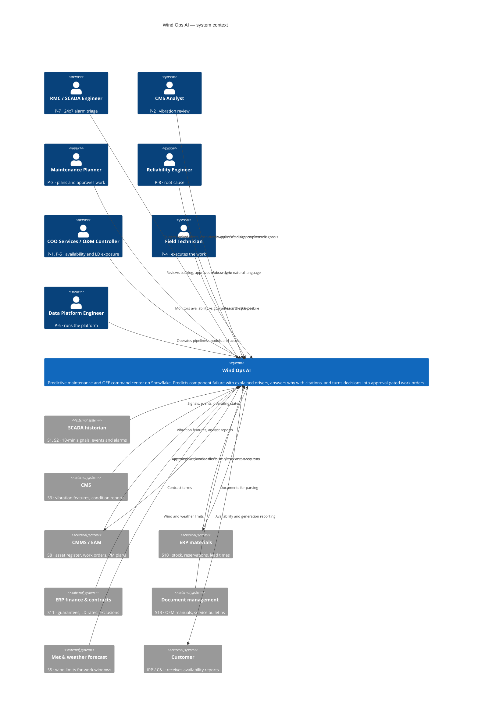

# C4 Level 1 — System Context

> **Status:** Draft v0.1 · **Owner:** NK · **Last updated:** 2026-09-17
>
> Actors are the personas from
> [personas-and-journeys.md](../01-business/personas-and-journeys.md). External systems are VWS's
> real source systems from
> [profile §7](../01-business/company-profile.md#7-systems-landscape-where-predictive-maintenance-data-comes-from).

---

## Boundaries

| Question | Answer |
| --- | --- |
| Does Wind Ops AI replace SCADA, CMS or the CMMS? | **No.** It converges their data. Scope item [`W10`](../02-functional/scope.md#6-wont-this-hackathon) |
| Which integrations are real in the prototype? | **None.** All seven external systems are simulated by `CMP-1`, because VWS is fictional. The *data shapes* are real; the connections are not. Stated in every artefact per `NFR-10` |
| Which arrows point *out* of the system? | Three: approved work orders to the CMMS, reservation requests to ERP materials, and reporting to the customer. All three are approval-gated ([ADR-0005](decisions/adr-0005-approval-gated-writes.md)) |
| What does the prototype write to? | Its own `ACTION` schema, which stands in for the CMMS. The write is real; the destination is modelled |

## Simulated versus real

Being explicit, because the honesty rule requires it and because a judge will ask.

| Element | In the prototype |
| --- | --- |
| Turbines, components, signals | Synthetic, generated (`CMP-1`) |
| SCADA 10-minute data and alarms | Synthetic, with plausible diurnal and seasonal behaviour |
| CMS vibration features | Synthetic, with **real pre-failure trends** (`FR-9`) |
| Work orders, stock, contracts | Synthetic, referentially consistent with the above |
| OEM manuals, bulletins, condition reports | Synthetic **files**, genuinely parsed (`FR-39`) |
| Weather | Synthetic, unless `C9` brings in Marketplace data |
| The prediction | **Real** — trained and evaluated (`FR-17`) |
| The metrics | **Real** — computed from the state data (`FR-22`…`FR-26`) |
| The retrieval and citations | **Real** — a search service over parsed files (`FR-40`) |
| The write, approval and audit | **Real** — into `ACTION` (`FR-35`…`FR-37`) |

The line to hold in the pitch: **the data is synthetic; the system is not.**
