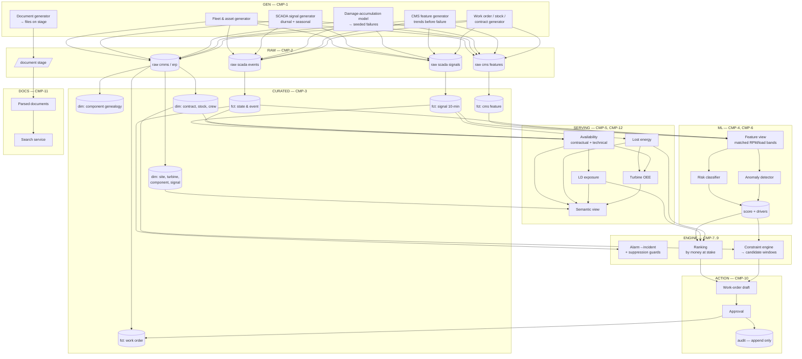
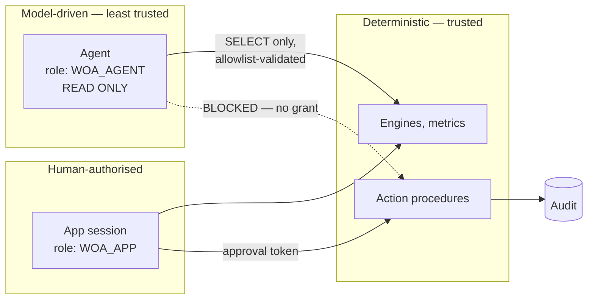

# C4 Level 2 — Containers

> **Status:** Draft v0.1 · **Owner:** NK · **Last updated:** 2026-09-17
>
> "Container" here means a separately deployable and separately grantable unit inside one Snowflake
> account — a schema with its objects, a model, a service, or an application. Components
> (`CMP-`) are defined in [requirements.md §1](../02-functional/requirements.md#1-components).

---

## 1. Containers

| Container | Technology | Components | Written by | Read by |
| --- | --- | --- | --- | --- |
| `RAW` | Tables, internal stages | `CMP-2` | Generator, simulated arrivals | `CURATED` |
| `CURATED` | Dynamic tables | `CMP-3` | Pipeline | `SERVING`, `ML`, engines |
| `SERVING` | Views, semantic view | `CMP-5`, `CMP-12` | Pipeline | App, agent, report |
| `ML` | Feature tables, Snowflake ML instances, score tables | `CMP-4`, `CMP-6` | Training and scoring jobs | Engines, app, agent |
| `ENGINE` | Views and stored procedures | `CMP-7`, `CMP-8`, `CMP-9` | — (pure computation) | App, agent |
| `ACTION` | Tables, stored procedures | `CMP-10` | **App only, with approval** | App, audit queries |
| `DOCS` | Stage, parsed tables, Cortex Search service | `CMP-11` | Document pipeline | Agent |
| `AGENT` | Cortex Agent + tool definitions | `CMP-13` | — | App, Snowflake Intelligence |
| `APP` | Streamlit in Snowflake ([`ADR-0020`](decisions/adr-0020-app-platform.md)) | `CMP-14` | — | Humans |
| `OPS` | Tables, views | `CMP-16` | Pipelines, jobs | `P-6`, cost reporting |
| `GEN` | Snowpark Python procedures | `CMP-1` | — | `RAW` |
| — | Roles, grants, secrets | `CMP-15` | Setup | — |

## 2. Data flow

Note the two places the diagram enforces a rule. `A2 → A3 → C6`: the audit append sits **between**
approval and the work-order write, so a failed audit blocks the write (`FR-37`). And `S1 → E1`:
the risk score feeds the suppression guard, so nothing can be suppressed on an at-risk asset
(`FR-32`).

## 3. Why these boundaries

| Boundary | Reason |
| --- | --- |
| `GEN` separate from `RAW` | The generator is a build-time tool, not part of the running system. It must be droppable without breaking anything, and it must not be grantable to the app |
| `CURATED` separate from `SERVING` | `CURATED` is the conformed truth; `SERVING` is the business interpretation. Metrics change more often than the model of an asset |
| `ENGINE` separate from `SERVING` | Feasibility and ranking are *decisions*, not *facts*. Keeping them apart is what makes [ADR-0004](decisions/adr-0004-determinism-boundary.md) testable — the agent can read both but write to neither |
| `ACTION` its own schema | It is the only writable container at runtime. A single schema makes the grant that permits writing small, obvious and auditable |
| `DOCS` separate | Different refresh cadence, different cost profile, and the only container the agent retrieves unstructured content from |
| `AGENT` separate from `APP` | The agent must be usable from Snowflake Intelligence as well as from the app, so it cannot depend on app state |
| `OPS` separate | Observability must survive the failure of what it observes |

## 4. Trust boundaries

`WOA_AGENT` holds **no** write privilege anywhere, and no privilege at all on `ACTION`. This is
enforced by grants, not by prompt instructions — a prompt can be argued with; a missing grant
cannot (`FR-53`, `NFR-2`, `NFR-3`).

## 5. Degraded modes per container

Required by `NFR-7`. Anything the core demo depends on has a written fallback.

| Container | Failure | Degraded mode |
| --- | --- | --- |
| `GEN` | Generation too slow or too costly | Reduce history window to the seeded-failure-rich period only (`Q-27`) |
| `CURATED` | Dynamic table refresh fails or lags | Switch the target to a plain table rebuilt by procedure. Drops `S1`, keeps everything above it |
| `ML` | Training fails, or a model type is unavailable | Fall back to anomaly detection alone, and **relabel the UI from "risk" to "anomaly"** — never present a rule as a prediction |
| `SERVING` | Semantic view invalid | App reads the metric views directly; agent loses text-to-SQL and keeps document retrieval |
| `ENGINE` | Constraint engine incomplete | Present constraints as a static checklist, unranked (`S3` cut) |
| `ACTION` | Audit unavailable | **Block the write.** No degraded mode by design |
| `DOCS` | Search service unavailable | Answer from parsed text with a document-level citation, no section anchor |
| `AGENT` | `claude-sonnet-4-5` unavailable, or cross-region inference disabled | Switch to an in-region model. Verified available: `llama3.1-8b`. Answer quality drops; grounding rules unchanged |
| `APP` | Streamlit in Snowflake unavailable | Run Streamlit locally against the same account. Same code, different host — which is why the app takes its connection from configuration and never from a Snowflake session token. **Object creation is verified working** (`Q-39` closed), so this is a genuine fallback rather than the expected path. A containerised web app is **not** a fallback: `APPLICATION SERVICE` is blocked on trial accounts ([`ADR-0020`](decisions/adr-0020-app-platform.md)) |
| `OPS` | — | Manual queries, screenshotted |

The `AGENT` row is the one to rehearse: `claude-sonnet-4-5` resolves **only** via cross-region
inference in `AZURE_CENTRALINDIA`, so that single account parameter is a real single point of
failure.
