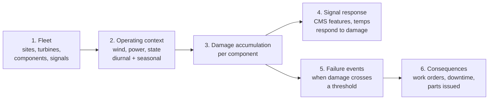
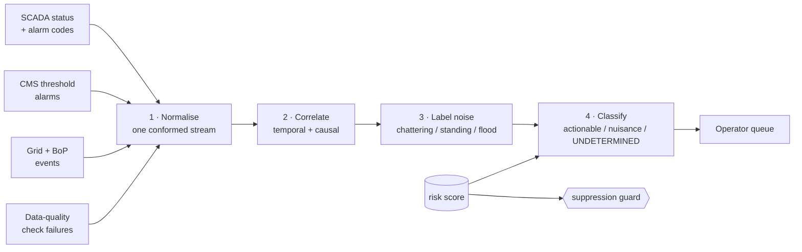
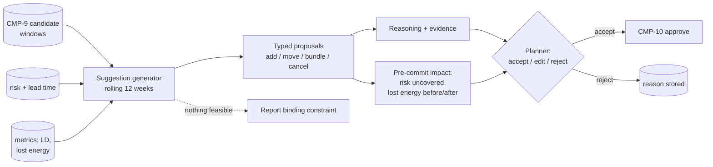
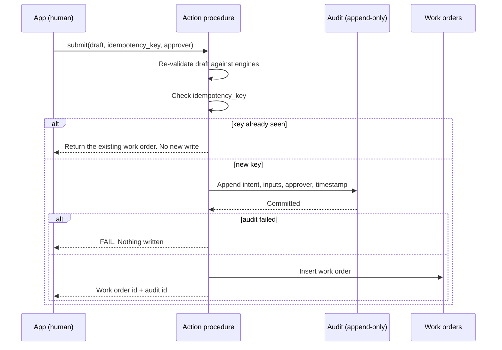

# C4 Level 3 — Components

> **Status:** Draft v0.2 · **Owner:** JP · **Last updated:** 2026-09-18
>
> One section per component, with its inputs, outputs, the requirements it implements, and the
> tests that prove it. Components are numbered in
> [requirements.md §1](../02-functional/requirements.md#1-components).

---

## CMP-1 Synthetic data generator

| | |
| --- | --- |
| Where | `GEN` schema, Snowpark Python procedures |
| Implements | `FR-8`…`FR-15` |
| Tests | `T-7`…`T-13` |

Five stages, run in order. The third is the one that matters.

**The design that separates this from the reference solution.** Damage is a state variable that
accumulates as a function of operating conditions, component age, platform and site stressor.
Signals are then generated *from* damage, and failure occurs *when damage crosses a threshold*.
So the causal chain runs `conditions → damage → signals` and `damage → failure`, which means the
signals genuinely carry information about the failure. Contrast the reference solution, where
failure was `UNIFORM(0,100) < 2` — independent of every signal, and therefore unlearnable
([analysis §3.2](../00-hackathon/reference-solution-analysis.md#32-two-arithmetic-bugs-make-it-worse-on-any-run-today)).

| Design rule | Why |
| --- | --- |
| Damage is monotonic per component life, and resets on replacement | Makes genealogy meaningful (`FR-5`) |
| Signal = f(damage) + f(operating point) + noise | Requires matched-condition comparison to see degradation, exactly as in real CMS practice |
| Noise amplitude is a stated parameter | Lets us tune difficulty deliberately, and report it honestly |
| Failure threshold varies per component instance | Prevents the model learning a single constant |
| No fixed row-count caps | The reference solution's staleness bug (`FR-12`) |
| Every threshold used downstream is reachable | The reference solution's dead-threshold bug (`FR-13`) |

## CMP-2 Landing & ingest

| | |
| --- | --- |
| Where | `RAW` |
| Implements | `FR-1`, `FR-3`, `FR-4` |
| Tests | `T-1` |

Raw tables mirroring the shape of each source system, plus an internal stage for documents.
Simulated arrival: the generator can emit a new batch on demand so `S1`'s incremental path is
demonstrable without claiming a live feed (`W2`).

## CMP-3 Curation pipeline

| | |
| --- | --- |
| Where | `CURATED` |
| Implements | `FR-2`…`FR-7` |
| Tests | `T-1`…`T-6`, `T-51` |

Dynamic tables from `RAW` to a conformed dimensional model. Dimensions for site, turbine,
component, signal, contract, stock and crew; facts for 10-minute signals, CMS features, states and
events, and work orders. Component genealogy is a slowly-changing dimension keyed on
position **and** serial, which is what makes `GS-2` answerable.

## CMP-4 Signal feature engine

| | |
| --- | --- |
| Where | `ML` |
| Implements | `FR-2`, `FR-16` |
| Tests | `T-2`, `T-3` |

The subtlest piece of data work in the build (`Q-36`). Features are computed **within matched
operating bands** — same RPM band, same load band — so that a rise in vibration means degradation
rather than a change in how hard the turbine is working. Without banding, wind variability swamps
the degradation signal and the model learns the weather.

| Feature family | Examples |
| --- | --- |
| CMS band energy | Per monitored point, per band, normalised within band |
| Trend | Slope and acceleration over rolling windows |
| Thermal | Bearing temperature rise above expected at matched condition |
| Cross-signal | Vibration-to-temperature divergence |
| Context | Component age, platform, site stressor, hours since last intervention |

## CMP-5 Metric layer

| | |
| --- | --- |
| Where | `SERVING` |
| Implements | `FR-22`…`FR-28` |
| Tests | `T-20`…`T-25` |

One view per metric, each the **only** definition of that metric. Availability from operating
states with contract exclusions; lost energy from the power curve at measured wind; LD exposure
from forecast shortfall against the applicable guarantee; Turbine OEE composed from stored
`A`, `P`, `Q` such that the product identity holds exactly (`T-23`).

`T-24` is the structural test that keeps this honest: the same question asked through the app, the
semantic view and the agent must return the same number.

## CMP-6 Risk model

| | |
| --- | --- |
| Where | `ML` |
| Implements | `FR-16`…`FR-21` |
| Tests | `T-10`, `T-14`…`T-19` |

Two independent signals, deliberately not merged into one score:

| Model | Purpose | Technology |
| --- | --- | --- |
| Failure-risk classifier | Probability of failure within the horizon | `SNOWFLAKE.ML.CLASSIFICATION` — verified available |
| Anomaly detector | Deviation from expected at matched conditions | `SNOWFLAKE.ML.ANOMALY_DETECTION` — verified available |

Every score is written with its **top drivers, with magnitude and direction**, and its **model
version**. A score without drivers is a defect, not a degraded mode (`FR-18`, `NFR-15`).
Splitting classifier from detector is what lets us catch novel behaviour the classifier was never
trained on — and `T-18` asserts the two are not collinear, which is precisely the check the
reference solution would have failed.

## CMP-7 Alarm engine

| | |
| --- | --- |
| Where | `ENGINE` |
| Implements | `FR-30`…`FR-32`, `FR-57`…`FR-64` |
| Tests | `T-27`…`T-30`, `T-60`…`T-68` |

Four stages. The fourth is the one that differentiates.

**1 · Normalise.** Four sources into one schema: source, turbine, component, code, severity, start,
end, auto-reset flag. Severity is mapped to one four-level scale while retaining each source's own
value (`Q-73`). Three of the four sources are **derived from data we already generate** — CMS
threshold alarms from CMS features, grid and BoP events from the state model, data-quality failures
from `OPS` assertions — so the expensive part is the conformed schema, not the ingestion. The schema
must accept further sources without change; oil-debris and overdue-PM were deliberately excluded
(`W15`).

**2 · Correlate.** Temporal, by turbine and component within a window. Plus one seeded causal pattern:
a site-wide grid dip becomes **one** incident rather than one per turbine, and a sensor fault
producing a code cascade becomes one incident.

**3 · Label noise.** Three independent windowed rules — chattering (repeated trip and auto-reset),
standing (open beyond a threshold with no acknowledgement), flood (rate above a per-site threshold).
Standing detection depends on acknowledgement timestamps from `CMP-17`, which is also what gives us
mean-time-to-respond for free.

**4 · Classify, with an explicit `UNDETERMINED` class.** Four evidence channels are weighed and
**stored** per incident:

| Evidence | Source |
| --- | --- |
| Does another channel agree at matched operating conditions? | `CMP-4` — reuses the matched-band work already on the critical path |
| Does load or RPM already explain the reading? | `CMP-4` |
| Did it auto-reset and never recur? | the normalised stream |
| What does the component's risk score say? | `CMP-6` |

`UNDETERMINED` is the point. When corroboration is missing, the system says so rather than forcing a
call. Its policy is binding: **stays in the queue, ranked below actionable, never hidden, never
auto-suppressible**, and the undetermined *rate* is published. A triage system that never says "I
don't know" is lying.

**Guards, in SQL and not in prompt text** (`FR-32`): refuse suppression if the asset's risk is
elevated; refuse for a safety-critical code; every suppression time-boxed, visible, reversible and
audited. `T-60` is the blocking test — no seeded real failure may ever be suppressed or dismissed,
zero tolerance.

## CMP-17 Alarm feedback & noise metrics

| | |
| --- | --- |
| Where | `ACTION` (capture) and `SERVING` (metrics) |
| Implements | `FR-65`…`FR-68`, `FR-87` |
| Tests | `T-69`, `T-70`, `T-74` |

Captures **confirm**, **dismiss-with-reason** and **reinstate** — all writes, so all through
`CMP-10`. No second write path, and the audit, idempotency and approval properties come for free.

Publishes the noise numbers: alarms in, incidents out, actionable count, compression ratio, alarms per
operator-hour, standing count, chattering count, and classification precision **per source** against
seeded ground truth.

**The anti-gaming rule is structural, not a convention.** The compression ratio may not be rendered or
exported without the count of real failures suppressed or dismissed beside it, because a 40:1
compression is trivially achieved by suppressing everything. `T-70` asserts the pairing.

**Not built:** suppression patterns proposed automatically from dismissal history (`W13`). Designed,
documented, deliberately absent — with no real operators we would seed the dismissals ourselves and
then present the loop "learning" a pattern we planted.

## CMP-18 Schedule suggestion & decision loop

| | |
| --- | --- |
| Where | `ENGINE` (suggestions) and `APP` (surface) |
| Implements | `FR-69`…`FR-80` |
| Tests | `T-71`…`T-75`, `T-80`…`T-83` |

| Property | Detail |
| --- | --- |
| Default horizon | **Rolling 12 weeks.** Recomputing a full year every run is waste — and a credit decision as much as a UX one |
| Season mode | Extends to 12 months for crane-dependent and long-lead work, returning a **ranked list of campaign proposals**, not a year grid (`W14`). This is where `C1` lives |
| Control | One — "Suggest schedule" — scoped by site or region |
| Free-text constraint | **Parse → echo the interpretation → refuse if unparseable.** The model translates; it never reasons about feasibility. See [ADR-0018](decisions/adr-0018-scheduling-suggestion-boundary.md) |
| Candidate discipline | Suggestions draw **only** from `CMP-9`'s windows. `T-71` asserts it adversarially |
| Infeasibility | Report the **binding constraint**. "No certified crew until week 44" is a good answer, not a failure |
| Decision loop | Accept, edit, or reject-with-reason. Acceptance goes through `CMP-10` — **no second write path** |
| Pre-commit impact | Two views only: **risk left uncovered**, and **expected lost energy before versus after**. Crew load and parts demand were dropped — a planner verifies those in their own systems |

## CMP-19 Notification & digest delivery

| | |
| --- | --- |
| Where | `OPS` |
| Implements | `FR-83`, `FR-84` |
| Tests | `T-77`, `T-79` |

Two delivery paths, deliberately different, because one constraint forces the split: **a scheduled run
cannot reach a locally configured MCP server.**

| Path | Runs | Carries |
| --- | --- | --- |
| Notification integration | **Server-side**, from the scheduled run | The daily digest |
| MCP connector | **Interactively**, from the app session | Approval notification on work-order or schedule acceptance |

One integration serves both work-order approval and schedule acceptance, because both funnel through
`CMP-10`. The MCP path is **optional**: its absence must never block an approval (`T-79`), and it is
never on the demo's critical path.

## CMP-20 Scheduled run

| | |
| --- | --- |
| Where | `OPS` |
| Implements | `FR-81`, `FR-82`, `FR-85`, `NFR-18`, `NFR-19` |
| Tests | `T-76`, `T-77`, `T-78` |

**One** daily run refreshing risk scores, schedule suggestions and the digest together — one task, one
schedule, one failure mode, one freshness stamp. Three separate runs would be strictly worse.

The digest reports **what changed since the previous run**: new elevated-risk components, new
actionable incidents, suggestions that moved, anything that became stale. It is written to be read by
a human before a shift, not to exist.

Two hard rules:

- **Refresh only, never apply** (`FR-85`, `T-76`). No scheduled path writes state or approves
  anything. An automation that can write is a different and far more dangerous system.
- **Runs as `WOA_SCHEDULER`** (`NFR-19`, `T-78`). Automations inherit their creator's default role, so
  the object must be created from a session whose default is `WOA_SCHEDULER` — not a human's, and
  never `ACCOUNTADMIN`. This is a **D1 decision**, not a D14 discovery.

Frequency is **daily**, not hourly. Hourly is the platform minimum, not a target; a pre-shift digest
is what a person would actually read.

## CMP-8 Ranking service

| | |
| --- | --- |
| Where | `ENGINE` |
| Implements | `FR-29` |
| Tests | `T-26` |

Orders alerts by money at stake — LD exposure plus lost energy — reading metrics from `CMP-5` and
risk from `CMP-6`. Contains **no metric arithmetic of its own** (boundary in
[scope §8](../02-functional/scope.md#8-explicit-boundaries-between-overlapping-items)), and does
**not** filter by feasibility, or easy-but-trivial work would outrank urgent-but-hard work.

## CMP-9 Constraint engine

| | |
| --- | --- |
| Where | `ENGINE` |
| Implements | `FR-33`, `FR-38` |
| Tests | `T-31`, `T-36` |

Produces candidate maintenance windows. Constraints are **hard filters, not weights** — a
candidate that violates a constraint is excluded, never ranked down, because an infeasible plan
offered to a planner is worse than no plan.

| Constraint | Source |
| --- | --- |
| Wind and weather within working limits | Met data / forecast |
| Crew certified and available | Workforce dimension |
| Part on hand, or lead time fits the window | ERP stock |
| Crane needed? Mobilisation lead time | Repair profile per component |
| Preventive visit already due — bundle it | PM plan |
| Outside the wind season where possible | Calendar |

## CMP-10 Action service

| | |
| --- | --- |
| Where | `ACTION` |
| Implements | `FR-34`…`FR-38` |
| Tests | `T-32`…`T-36` |

Three properties, each with a test: **approval-gated** (`T-33`), **idempotent** via a caller-supplied
key (`T-34`), **audit-first** so a failed audit blocks the write (`T-35`). The procedure
re-validates the draft rather than trusting what the caller sends, because the caller is a UI and
the engines are the authority.

## CMP-11 Document pipeline

| | |
| --- | --- |
| Where | `DOCS` |
| Implements | `FR-39`, `FR-40` |
| Tests | `T-37`, `T-38` |

Real synthetic files on a stage → `AI_PARSE_DOCUMENT` → parsed text with structure retained →
chunked with section identifiers → Cortex Search service on a declared lag. Section identifiers
are what allow a citation to name *where* in a document a claim came from, rather than just which
document.

## CMP-12 Semantic view

| | |
| --- | --- |
| Where | `SERVING` |
| Implements | `FR-43`, `FR-44` |
| Tests | `T-41`, `T-42` |

Deliberately **narrower and cleaner** than the reference solution's 18-table model. Depth over
breadth: fewer entities, every description correct for wind O&M, sample values that match the
loaded data, and verified queries for each golden scenario. `T-42` exists specifically because the
reference solution shipped descriptions about stocks, bonds and customer payments
([`G-12`](../00-hackathon/reference-solution-analysis.md#33-the-rest-of-the-gap-list)).

## CMP-13 Agent & tools

| | |
| --- | --- |
| Where | `AGENT` |
| Implements | `FR-41`, `FR-42`, `FR-52`…`FR-56` |
| Tests | `T-39`, `T-40`, `T-46`…`T-49` |

| Tool | Type | Access |
| --- | --- | --- |
| Metric and asset query | Text-to-SQL over `CMP-12` | Read-only, allowlist-validated |
| Document retrieval | Cortex Search over `CMP-11` | Read-only |
| Candidate reader | Views over `CMP-8`, `CMP-9` | Read-only |
| Similar-failure search | View over genealogy | Read-only |

**There is no write tool.** Not a disabled one — an absent one. The role holds no privilege on
`ACTION`. When the agent proposes an action, it returns a *draft reference* that the app renders
for human approval; the agent never carries it out.

## CMP-14 Command center app

| | |
| --- | --- |
| Where | `APP` |
| Implements | `FR-45`…`FR-51` |
| Tests | `T-26`, `T-33`, `T-43`, `T-44`, `T-45`, `T-55`, `T-57` |

Streamlit in Snowflake (`Q-12`), with a local-execution fallback. Adopting the reference
solution's genuinely good pattern: the ask box pinned beside the content as an isolated fragment,
so interacting with the page does not reset the conversation.

Every view has a defined empty state and error state. No traceback, no debug line, no `st.toast`
claiming something happened that did not.

## CMP-15 Governance & RBAC

| | |
| --- | --- |
| Where | Account-level and database-level grants |
| Implements | `NFR-3`, `NFR-6`, `NFR-11`, `NFR-17` |
| Tests | `T-50`, `T-52`, `T-56`, `T-59` |

Roles in [04-code.md](04-code.md). The rule from AGENTS.md holds absolutely: **no `ACCOUNTADMIN` in
application code**, no secrets in git.

## CMP-16 Observability

| | |
| --- | --- |
| Where | `OPS` |
| Implements | `NFR-8`, `NFR-14` |
| Tests | `T-54`, `T-58` |

Pipeline freshness and lag, row counts per layer, data-quality assertion results, model training
and evaluation runs with metrics, and credit consumption with the $100-band alert.

## Component-to-requirement matrix

| Component | Requirements | Scope |
| --- | --- | --- |
| `CMP-1` | `FR-8`…`FR-15` | `M2` |
| `CMP-2` | `FR-1`, `FR-3`, `FR-4` | `M1` |
| `CMP-3` | `FR-2`, `FR-5`, `FR-6`, `FR-7` | `M1`, `S1`, `S4` |
| `CMP-4` | `FR-2`, `FR-16` | `M1`, `M3` |
| `CMP-5` | `FR-22`…`FR-28` | `M4` |
| `CMP-6` | `FR-16`…`FR-21` | `M3` |
| `CMP-7` | `FR-30`…`FR-32`, `FR-57`…`FR-64` | `M9` |
| `CMP-8` | `FR-29` | `M5` |
| `CMP-9` | `FR-33`, `FR-38`, `FR-78` | `M10` |
| `CMP-10` | `FR-34`…`FR-37` | `M7` |
| `CMP-11` | `FR-39`, `FR-40` | `M6` |
| `CMP-12` | `FR-43`, `FR-44` | `M4` |
| `CMP-13` | `FR-41`, `FR-42`, `FR-52`…`FR-56` | `M6` |
| `CMP-14` | `FR-45`…`FR-51` | `M8` |
| `CMP-15` | `NFR-3`, `NFR-6`, `NFR-11`, `NFR-17` | `S5` |
| `CMP-16` | `NFR-8`, `NFR-14` | `S6` |
| `CMP-17` | `FR-65`…`FR-68`, `FR-87` | `M9` |
| `CMP-18` | `FR-69`…`FR-80` | `M10` |
| `CMP-19` | `FR-83`, `FR-84` | `M11` |
| `CMP-20` | `FR-81`, `FR-82`, `FR-85` | `M11` |
