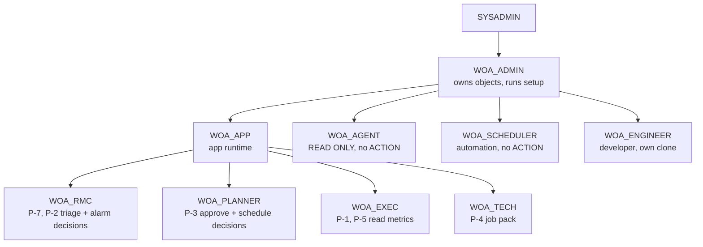

# C4 Level 4 — Code, naming & conventions

> **Status:** Draft v0.2 · **Owner:** JP · **Last updated:** 2026-09-18
>
> **This file is the naming authority.** `AGENTS.md` points here for databases, schemas, tables,
> procedures, warehouses and roles. Follow it. If a name is not covered, propose an addition here
> rather than inventing one per file.
>
> Decided in [ADR-0008](decisions/README.md#adr-0008--naming-and-environment-convention).

---

## 1. Databases

| Name | Purpose | Who writes |
| --- | --- | --- |
| `WIND_OPS_AI` | The shared build. The demo runs from here | Setup and pipelines only |
| `WIND_OPS_AI_DEV_<INITIALS>` | Personal clone per developer — `..._NK`, `..._JP`, `..._SA` | That developer |

**Never develop directly in `WIND_OPS_AI`.** Clone it, work, then promote by re-running the
setup scripts against the shared database. Zero-copy clone makes this cheap, which matters against
a $400 ceiling.

The database name is a **script parameter**, never a literal (`NFR-6`) — the reference solution
hardcoded its name in every file and consequently could not be cloned
([`G-13`](../00-hackathon/reference-solution-analysis.md#33-the-rest-of-the-gap-list)).

## 2. Schemas

| Schema | Contents | Container |
| --- | --- | --- |
| `GEN` | Synthetic data generator procedures | `CMP-1` |
| `RAW` | Landing tables, document stage | `CMP-2` |
| `CURATED` | Conformed dimensions and facts | `CMP-3` |
| `SERVING` | Metric views, semantic view | `CMP-5`, `CMP-12` |
| `ML` | Features, model instances, scores and drivers | `CMP-4`, `CMP-6` |
| `ENGINE` | Alarm correlation, ranking, constraints | `CMP-7`…`CMP-9` |
| `ACTION` | Work orders, approvals, audit | `CMP-10` |
| `DOCS` | Parsed documents, chunks, search service | `CMP-11` |
| `OPS` | Freshness, data quality, model runs, cost | `CMP-16` |
| `APP` | Streamlit object | `CMP-14` |

The agent lives in `SNOWFLAKE_INTELLIGENCE.AGENTS`, which is a platform-mandated location, not our
choice.

## 3. Object naming

| Kind | Pattern | Example |
| --- | --- | --- |
| Landing table | `RAW_<source>_<entity>` | `RAW_SCADA_SIGNAL_10MIN`, `RAW_CMS_FEATURE` |
| Dimension | `DIM_<entity>` | `DIM_TURBINE`, `DIM_COMPONENT`, `DIM_COMPONENT_GENEALOGY` |
| Fact | `FCT_<grain>` | `FCT_SIGNAL_10MIN`, `FCT_CMS_FEATURE`, `FCT_TURBINE_STATE` |
| Aggregate | `AGG_<grain>` | `AGG_TURBINE_DAY` |
| Metric view | `MET_<metric>` | `MET_AVAILABILITY_CONTRACTUAL`, `MET_LD_EXPOSURE`, `MET_TURBINE_OEE` |
| Feature table | `FEAT_<subject>` | `FEAT_COMPONENT_DAILY` |
| Score table | `SCORE_<subject>` | `SCORE_COMPONENT_RISK` |
| Driver table | `DRIVER_<subject>` | `DRIVER_COMPONENT_RISK` |
| Engine view | `ENG_<purpose>` | `ENG_ALERT_RANKED`, `ENG_WINDOW_CANDIDATE`, `ENG_INCIDENT`, `ENG_SUGGESTION` |
| Alarm stream | `FCT_ALARM_NORMALISED` | one row per alarm occurrence, any source |
| Procedure | `SP_<verb>_<object>` | `SP_APPROVE_WORK_ORDER`, `SP_GENERATE_FLEET` |
| Function | `FN_<returns>` | `FN_EXPECTED_POWER` |
| Dynamic table | same as its target; declare `TARGET_LAG` | `FCT_CMS_FEATURE` |
| Audit table | `AUD_<subject>` | `AUD_ACTION` |
| Semantic view | `SV_WIND_OPS` | |
| Search service | `CSS_<corpus>` | `CSS_MAINTENANCE_DOCS` |
| Test fixture | `FIX_<subject>` | `FIX_AVAILABILITY_HANDWORKED` |
| Data-quality assertion | `DQ_<subject>` in `OPS` | `DQ_ASSERTION`, `DQ_RESULT` |
| Generator state | `GEN_<subject>` in `GEN` | `GEN_DAMAGE_STATE`, `GEN_FAILURE_EVENT`, `GEN_SEEDED_PATTERN` |

Rules: upper snake case; singular entity names; no abbreviations beyond the profile's own component
codes (`GBX`, `MSB`, `GEN`, `PIT`, `BLD`, `CNV`, `TRF`, `YAW`, `NAC`, `TWR`); no dates or version
numbers in object names — versions live in columns.

## 4. Identifiers

Straight from [profile §4](../01-business/company-profile.md#asset-hierarchy--ids) — do not invent
a parallel scheme (`Q-14`).

| Level | Pattern | Example |
| --- | --- | --- |
| Site | `<ST>-<PARK>` | `KA-CTD` |
| Turbine | `<site>-T<nn>` | `KA-CTD-T07` |
| Component position | `<turbine>-<code>` | `KA-CTD-T07-GBX` |
| Signal | `<component>-<measure>-<location>` | `KA-CTD-T07-GBX-VIB-HSS` |
| Installed serial | `<code>-<yy>-<nnnnn>` | `GBX-24-00318` |

**Position ID and serial are different things** and both are keys. `DIM_COMPONENT` holds the
position; `DIM_COMPONENT_GENEALOGY` holds which serial occupied it when. Confusing them breaks
`GS-2`.

Also carried as an attribute, not a key: a Unified-Namespace-style path
(`vws/south/karnataka/ka-ctd/t07/gbx/vib-hss`). This borrows the one genuinely thoughtful idea from
the reference solution without adopting it as our primary key.

## 5. Warehouses

Two, deliberately. Every warehouse is a standing cost risk against $400.

| Name | Size | Purpose | Auto-suspend |
| --- | --- | --- | --- |
| `WOA_APP_WH` | `XSMALL` | App queries, agent queries, interactive work | 60 s |
| `WOA_BUILD_WH` | `XSMALL`, resizable | Generation, pipeline refresh, model training | 60 s |

Rules: `AUTO_SUSPEND = 60`, `AUTO_RESUME = TRUE`, `INITIALLY_SUSPENDED = TRUE`. Resize
`WOA_BUILD_WH` up only for a specific training or generation run, and size it back down in the same
script. Never grant warehouse usage to `PUBLIC` — the reference solution did
([`G-11`](../00-hackathon/reference-solution-analysis.md#33-the-rest-of-the-gap-list)).

## 6. Roles



**`WOA_SCHEDULER` exists for one structural reason.** Automations inherit their creator's default
role, so an automation created by a human runs as that human's role — `ACCOUNTADMIN` in our case,
which would violate `NFR-3` outright. The scheduled run's object must therefore be created from a
session whose **default** role is `WOA_SCHEDULER`. This is a **D1 decision**
([ADR-0019](decisions/adr-0019-automation-and-notification.md), `DEP-8`), not a D14 discovery.

| Role | Grants | Notably lacks |
| --- | --- | --- |
| `WOA_ADMIN` | Ownership of the database and its schemas; runs setup | Account-level privileges |
| `WOA_APP` | `SELECT` on `SERVING`, `ENGINE`, `ML`, `CURATED`; `USAGE` on `SP_APPROVE_*` | Direct DML on `ACTION` tables — writes only via procedure |
| `WOA_AGENT` | `SELECT` on `SERVING`, `ENGINE`; `USAGE` on the search service and semantic view | **Everything on `ACTION`.** No write anywhere |
| `WOA_PLANNER` | `WOA_APP` plus the approval procedure | — |
| `WOA_RMC` | `WOA_APP` plus the suppression procedure | Approval of work orders |
| `WOA_EXEC` | `SELECT` on `SERVING` only | Component-level detail, engine internals |
| `WOA_TECH` | `SELECT` on the job-pack view only | Everything else |
| `WOA_SCHEDULER` | Runs the daily automation. `SELECT` on `CURATED`, `ML`, `SERVING`, `ENGINE`; `INSERT` on score, suggestion and digest tables in `ML`/`ENGINE`/`OPS` | **Everything on `ACTION`.** It refreshes; it never applies |
| `WOA_ENGINEER` | `CREATE` in a personal clone | Any grant on `WIND_OPS_AI` |

**Absolute rules** (AGENTS.md rule 6, `NFR-3`):

1. **No `ACCOUNTADMIN` in any application code, script or connection used by the app or agent.**
   Setup may require elevated privileges once, for account-level objects; that is a separate,
   documented, one-time script — never the app's role.
2. `WOA_AGENT` write privileges: none, ever. Enforced by grant, not by prompt.
3 . `ALTER ACCOUNT` appears nowhere. The reference solution hijacked the account-wide event table;
   we do not touch account state.

## 7. Code layout

```
wind_ops_ai/
├── sql/
│   ├── 00_setup/          roles, warehouses, database, schemas  (parameterised)
│   ├── 10_generate/       CMP-1 generator procedures
│   ├── 15_quality/        OPS data-quality assertions (NFR-14)
│   ├── 20_curate/         CMP-3 dynamic tables
│   ├── 30_serve/          CMP-5 metric views, CMP-12 semantic view
│   ├── 40_engine/         CMP-7..9
│   ├── 50_action/         CMP-10 procedures, audit
│   ├── 60_docs/           CMP-11 parse + search service
│   ├── 70_agent/          CMP-13 agent + tools
│   ├── 90_teardown/       reverse of 00
├── python/
│   ├── generator/         Snowpark generation logic
│   ├── ml/                CMP-4, CMP-6 training and scoring
│   └── tests/             pytest — unit tests for engines and metrics
├── app/                   CMP-14 Streamlit
├── docs/                  this plan
├── skills/                reusable CoCo skills (E5)
└── justfile               every command the team runs
```

Numeric prefixes give a total run order. Setup is idempotent and re-runnable (`NFR-5`, `T-52`).

## 8. SQL conventions

| Rule | Reason |
| --- | --- |
| Lower-case keywords, upper-case identifiers | Consistency with generated SQL |
| Every metric view has a header comment stating its definition and the KPI it implements | So a reader can check it against [profile §8](../01-business/company-profile.md#8-kpis-the-company-runs-on) |
| No business logic in the app layer | The agent cannot reuse Python. This is the reference solution's biggest structural error |
| No `SELECT *` in anything the app or agent reads | Column drift breaks silently otherwise |
| `CREATE OR ALTER` over `CREATE OR REPLACE` for tables holding data | `CREATE OR REPLACE DATABASE` is how the reference solution can destroy a colleague's work |
| Parameters via script variables, never literals | `NFR-6` |
| Procedure parameters referenced with a colon prefix inside SQL bodies | Snowflake treats bare names as column identifiers |
| Every `INSERT` into `ACTION` goes through a procedure | Single audited path |

## 9. Python conventions

| Rule | Reason |
| --- | --- |
| `uv` for dependencies; ask before adding one | AGENTS.md |
| Type hints on anything crossing a module boundary | |
| No SQL built by f-string interpolation of user input | The reference solution did this throughout, including in its chat-logging path |
| Engine logic stays in SQL; Python orchestrates and trains | `NFR-1` |
| Every metric or engine rule has a `pytest` case with a hand-worked fixture | `T-20` and friends |

## 10. Git and delivery

Per AGENTS.md, restated because it is easy to forget under time pressure.

| Item | Convention |
| --- | --- |
| Branch | `<type>/<initials>/<short-desc>` — `feat`, `fix`, `chore`, `docs`, `spike` |
| Commits | Conventional Commits |
| `main` | Never committed to directly. PR with 2 approvals |
| Before a PR | `just check` green. Do not skip hooks |
| Docs | Change in the same PR as the code they describe |
| Secrets | Never in git. `~/.snowflake/connections.toml`, Snowflake secrets, or the OS keychain |
