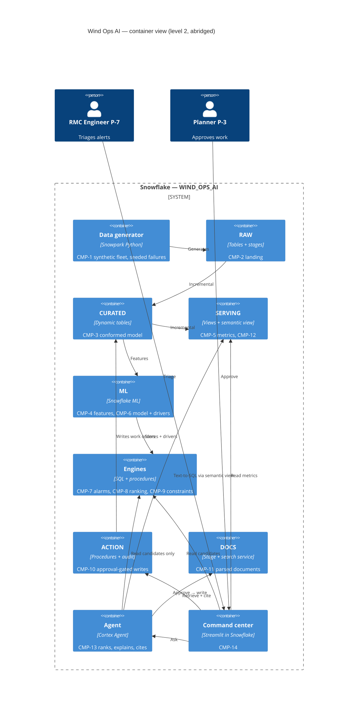

# Architecture

> **Status:** Draft v0.1 · **Owner:** NK · **Last updated:** 2026-09-17

Reading order. Each level answers one question.

| Doc | C4 level | Question it answers |
| --- | --- | --- |
| [01-context.md](01-context.md) | 1 — Context | Who uses this, and which of VWS's systems does it touch? |
| [02-container.md](02-container.md) | 2 — Container | What are the deployable pieces inside Snowflake? |
| [03-component.md](03-component.md) | 3 — Component | What is inside each container, and how does data flow? |
| [04-code.md](04-code.md) | 4 — Code | Naming, schemas, roles, warehouses — the conventions all code follows |
| [deployment.md](deployment.md) | — | Environments, setup, teardown, degraded modes |
| [cross-cutting-concerns.md](cross-cutting-concerns.md) | — | Security, governance, audit, cost, observability, failure handling |
| [decisions/README.md](decisions/README.md) | — | Every decision, made or pending |

## The architecture in one diagram

## The one architectural rule

Everything else follows from this, and it is the axis on which the entry is judged
([ADR-0004](decisions/adr-0004-determinism-boundary.md)):

> **Deterministic code decides state. The model explains it.**
>
> The engines (`CMP-5` to `CMP-10`) compute what is true and what is possible, in SQL that can be
> unit-tested. The agent (`CMP-13`) ranks and explains what the engines produced. It may choose
> among candidates; it may never invent one.

Read the arrows in the diagram above: **no arrow goes from the agent into `ACTION`.** The agent
cannot write. Only the app, carrying a human approval, can.
