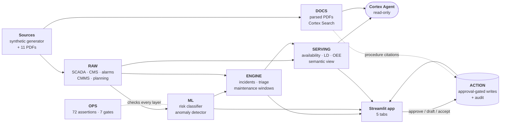
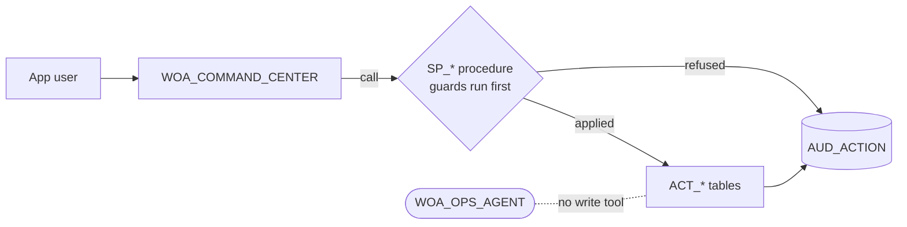

# Dataflow — as built

> **Status:** As built at `main` `33cad1c` + D10 incident evidence · **Last updated:** 2026-09-26 · **Verified against:**
> `WIND_OPS_AI_DEV_SB` on `JKDRJBB-MW27072` (`just verify` 72/72)

The C4 diagrams in [`01-context`](01-context.md), [`02-container`](02-container.md) and
[`03-component`](03-component.md) describe **what we planned**. This page describes **what exists**:
every box below is a deployed object, named exactly as it is in Snowflake. Where the build departs
from the plan, [§4](#5-where-the-build-differs-from-the-plan) says so.

All data is synthetic (`AGENTS.md` rule 5). There are no external source systems — the "sources"
are a deterministic generator standing in for SCADA, CMS, the alarm historian, the CMMS and ERP.

## 1. Overview

## 2. End-to-end flow, object by object

```mermaid
flowchart LR
    %% ---------- sources ----------
    subgraph SRC["Sources — synthetic, generated in-warehouse"]
        direction TB
        GENF["GEN functions<br/>FN_RAND · FN_WIND_SPEED<br/>FN_EXPECTED_POWER · FN_DAMAGE_RATE"]
        GENS["GEN state<br/>GEN_RUN_CONFIG · GEN_DAMAGE_STATE<br/>GEN_FAILURE_EVENT · GEN_SEEDED_PATTERN<br/>GEN_TURBINE_DAY · GEN_CMS_THRESHOLD"]
        PDF["scripts/generate_maintenance_docs.py<br/>11 maintenance PDFs"]
        GENF --> GENS
    end

    %% ---------- landing ----------
    subgraph RAW["RAW — landing"]
        direction TB
        DIMS["14+ dimensions<br/>DIM_SITE · DIM_TURBINE · DIM_COMPONENT<br/>DIM_CONTRACT · DIM_PART · DIM_STOCK · DIM_CREW …"]
        SCADA["FCT_SIGNAL_10MIN ~108M<br/>FCT_TURBINE_STATE"]
        CMS["FCT_CMS_FEATURE ~3.5M"]
        ALM["FCT_ALARM_NORMALISED ~340k"]
        CMMS["FCT_WORK_ORDER · FCT_PART_MOVEMENT"]
        PLANIN["Planning context<br/>FCT_WIND_FORECAST · FCT_CRANE_BOOKING<br/>FCT_PART_INBOUND · DIM_CREW_COVERAGE<br/>DIM_REPAIR_PLAN"]
    end

    GENS --> SCADA & CMS & ALM & CMMS & PLANIN
    GENF --> DIMS

    %% ---------- curated ----------
    subgraph CUR["CURATED"]
        AGG["AGG_TURBINE_DAY<br/>18,400 turbine-days"]
    end
    SCADA --> AGG

    %% ---------- ML ----------
    subgraph ML["ML — Snowflake ML"]
        direction TB
        FEAT["FEAT_COMPONENT_DAILY<br/>observable features only"]
        SPLIT["V_ML_TRAIN / V_ML_TEST<br/>component-disjoint split"]
        CLF(["RISK_CLASSIFIER<br/>SNOWFLAKE.ML.CLASSIFICATION"])
        AD(["ANOMALY_DETECTOR<br/>SNOWFLAKE.ML.ANOMALY_DETECTION"])
        SCORE["SCORE_COMPONENT_RISK (400)<br/>DRIVER_COMPONENT_RISK<br/>as of V_SCORING_ASOF"]
        ASCORE["SCORE_COMPONENT_ANOMALY"]
        FEAT --> SPLIT --> CLF --> SCORE
        FEAT --> AD --> ASCORE
    end
    CMS & SCADA & CMMS & DIMS --> FEAT

    %% ---------- engines ----------
    subgraph ENG["ENGINE — SQL procedures"]
        direction TB
        INC["SP_BUILD_INCIDENTS → ENG_INCIDENT<br/>ENG_INCIDENT_EVIDENCE (4 channels)<br/>ENG_SUPPRESSED_FAILURE"]
        QUE["ENG_OPERATOR_QUEUE<br/>actionable, then undetermined"]
        FUN["ENG_ALARM_FUNNEL / _DAILY"]
        RANK["ENG_ALERT_RANKED<br/>money-ranked triage"]
        WIN["SP_BUILD_WINDOW_CANDIDATES<br/>→ ENG_WINDOW_CANDIDATE (1,008)"]
        SUG["SP_BUILD_SUGGESTIONS<br/>→ ENG_SUGGESTION / _ITEM<br/>ENG_PLAN_IMPACT"]
        INC --> FUN
        INC --> QUE
        RANK --> WIN --> SUG
    end
    ALM --> INC
    ASCORE --> INC
    FEAT & SCORE --> INC
    SCORE & ASCORE --> RANK
    DIMS --> RANK
    PLANIN --> WIN

    %% ---------- serving ----------
    subgraph SRV["SERVING — metrics"]
        direction TB
        MET["MET_AVAILABILITY_CONTRACTUAL / _TECHNICAL<br/>MET_LD_EXPOSURE · MET_LOST_ENERGY<br/>MET_TURBINE_OEE · MET_NOISE · V_WINDOW"]
        FN["FN_AVAILABILITY_PCT · FN_GUARANTEE_PCT<br/>FN_LD_RUN_RATE_INR · FN_INTERVAL_KWH"]
        SV{{"SV_WIND_OPS<br/>semantic view"}}
        FN --> MET --> SV
    end
    AGG & SCADA & ALM & DIMS --> MET
    INC --> MET

    %% ---------- documents ----------
    subgraph DOC["DOCS — unstructured"]
        direction TB
        STG[("@MAINTENANCE_DOCS stage")]
        PARSE["SP_PARSE_DOCUMENTS<br/>AI_PARSE_DOCUMENT → DOC_PARSED"]
        CHK["DOC_CHUNK (53 sections)<br/>DOC_PART_PROCEDURE"]
        CSS{{"CSS_MAINTENANCE_DOCS<br/>Cortex Search"}}
        STG --> PARSE --> CHK --> CSS
    end
    PDF --> STG

    %% ---------- agent ----------
    subgraph AG["GEN — Cortex Agent"]
        AGENT(["WOA_OPS_AGENT<br/>claude-sonnet-4-5 · read-only"])
    end
    SV -- "fleet_data tool" --> AGENT
    CSS -- "maintenance_docs tool" --> AGENT

    %% ---------- action ----------
    subgraph ACT["ACTION — approval-gated writes"]
        direction TB
        SP["Owner's-rights procedures<br/>SP_APPROVE / REVOKE_SUPPRESSION → WOA_RMC<br/>SP_DRAFT / APPROVE / REJECT_WORK_ORDER → WOA_PLANNER<br/>SP_ACCEPT / REJECT_SUGGESTION → WOA_PLANNER"]
        ACTT["ACT_SUPPRESSION · ACT_WORK_ORDER_DRAFT<br/>ACT_WORK_ORDER · ACT_DECISION"]
        AUD[("AUD_ACTION<br/>append-only audit, refusals included")]
        SP --> ACTT
        SP --> AUD
    end
    CHK -. "procedure citation" .-> SP
    SUG --> SP

    %% ---------- quality ----------
    subgraph OPS["OPS — evidence and gates"]
        OPSM["ML_RUN · ML_METRIC"]
        DQ["DQ_ASSERTION (72) · DQ_RESULT<br/>SP_RUN_*_QUALITY · SP_ASSERT_QUALITY_GATE"]
    end
    CLF & AD --> OPSM

    %% ---------- UI ----------
    subgraph UI["APP — Streamlit in Snowflake (warehouse runtime)"]
        direction TB
        T1["Alarms"]
        T2["Risk triage"]
        T3["Is the model real?"]
        T4["Fleet & contracts"]
        T5["Audit"]
    end
    QUE & FUN --> T1
    RANK & SCORE & ASCORE & SUG & WIN --> T2
    T1 & T2 -- "approve / draft / accept" --> SP
    ACTT --> T2
    OPSM --> T3
    MET --> T4
    AUD --> T5

    USERS(("RMC engineer<br/>Planner<br/>Asset manager"))
    USERS --> UI
    USERS -. "Snowsight › Agents" .-> AGENT

    classDef src fill:#eef,stroke:#88a
    classDef model fill:#efe,stroke:#7a7
    classDef svc fill:#fee,stroke:#c77
    class GENF,GENS,PDF src
    class CLF,AD,AGENT model
    class SV,CSS svc
```

`DQ` checks every layer; its edges are left off the diagram to keep it readable. `just verify`
runs all seven suites and exits non-zero on any failure.

## 3. Layer by layer

| Layer | Schema | Built by | What it holds | Proven by |
| --- | --- | --- | --- | --- |
| Sources | `GEN` | `just seed` → `sql/10_generate/` | Deterministic, `HASH()`-seeded fleet: wind, power curve, damage accumulation, bad batches, 58 seeded failures, alarm patterns | `G1` — 16 assertions |
| Landing | `RAW` | `just deploy-data`, `just seed` | Dimensions, 10-min SCADA signals (long table, 4,100 tags), CMS features, normalised alarms, work orders, planning context | `G1` |
| Curated | `CURATED` | `SERVING.SP_BUILD_TURBINE_DAY` | `AGG_TURBINE_DAY` only | `G3` numbers |
| ML | `ML` | `just deploy-ml` → `sql/25_ml/` | Features, split views, classifier, anomaly detector, scores and drivers | `G2` — `T-10` 1.7×, `T-18` ρ 0.24 |
| Engines | `ENGINE` | `just deploy-engine` → `sql/40_engine/` | Alarm → incident with 4 stored evidence rows each, one operator queue, funnel, money-ranked triage, window candidates, schedule suggestions | engine + planning suites — `T-60`, `T-61`, `T-68` |
| Metrics | `SERVING` | `sql/30_serve/` | Availability, LD exposure, lost energy, OEE (A × P), semantic view | `G3` — hand-worked fixtures `T-20`…`T-22` |
| Documents | `DOCS` | `just deploy-agent` → `sql/60_docs/` | Parsed PDFs, section chunks, part → procedure map, Cortex Search | answers suite (`T-37`) |
| Agent | `GEN` | `sql/70_agent/01_agent.sql` | Cortex Agent with two read-only tools | `T-48` |
| Action | `ACTION` | `just deploy-action` → `sql/50_action/` | Approval-gated, idempotent, audited writes | `G4` — action suite, `T-33` × 3 roles, `T-47` |
| UI | `APP` | `just deploy-app` → `app/streamlit_app.py` | 5-tab command center | `T-86`, `T-87`, `T-94` |
| Evidence | `OPS` | `sql/15_quality/` | Run registry, metrics, 72 assertions and their results | `just verify` |

## 4. Write paths

Everything above `ACTION` is **read-only from the app and the agent**. The only way to change
state is through the owner's-rights procedures, each granted to exactly one persona role:

A refused request is audited as well as an applied one. The agent has no write tool at all.

## 5. Where the build differs from the plan

Each row is recorded in [`STATE.md`](../../STATE.md) §7 with its reason.

| Planned | Built |
| --- | --- |
| Snowpark Python generator (`python/generator/`) | Set-based SQL in `sql/10_generate/` (`I-9`) |
| `CURATED` as dynamic tables (`M12`) | One table, `AGG_TURBINE_DAY`; ML features read `RAW` directly (`I-10`) |
| Model feature importances as drivers | Train-split standardised mean difference; `SHOW_FEATURE_IMPORTANCE` errors in the account (`I-8`) |
| App on the container runtime | Warehouse runtime — the trial account cannot have external access (`I-17`) |
| Agent inside the app | Agent reachable only in Snowsight; the *Ask* tab is not built |
| Scheduled run, digest and notification (`T-76`, `T-77`) | Not built — everything runs from `just` |
| OEE = A × P × Q | A × P; Quality is NULL, never 1 (`ADR-0003` fallback) |
