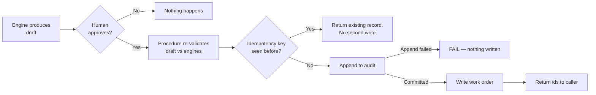

# ADR-0005 — Approval-gated, idempotent, audited writes

> **Status:** Accepted · **Owner:** NK · **Last updated:** 2026-09-17 ·
> **Related:** [ADR-0004](adr-0004-determinism-boundary.md)

---

## Context

The brief says "automate work orders". The word *automate* invites two readings, and the difference
between them is the difference between a useful product and a liability.

The reference solution takes the third option: it does neither, and says it did. Its buttons emit
`st.toast("✅ Work Order created for … in CMMS!")` and write nothing at all
([`G-3`](../../00-hackathon/reference-solution-analysis.md#33-the-rest-of-the-gap-list)). An
operator who trusts that message will believe a crew is scheduled when none is. That is worse than a
missing feature — it is a false confirmation of a safety-relevant action.

Meanwhile its agent's work-order tool is unreachable dead code, and its only real write path — chat
history — targets a schema the setup script never creates, through a `@st.cache_data`-wrapped
function, so identical writes are silently dropped.

## Decision

Every write is **approval-gated, idempotent and audited**, with no exceptions and no degraded mode
on the audit.

| Property | Mechanism | Test |
| --- | --- | --- |
| **Approval-gated** | Writes occur only through `SP_APPROVE_*`, which requires an approver identity. No role holds direct DML on `ACTION` tables | `T-33` |
| **Idempotent** | The caller supplies an idempotency key. A repeat returns the existing record rather than creating a second | `T-34` |
| **Audited** | Append to `AUD_ACTION` **precedes** the state change. A failed append fails the whole operation | `T-35` |
| **Re-validated** | The procedure re-checks the draft against the engines rather than trusting the caller, because the caller is a UI and the engines are the authority | `T-32` |
| **Reversible** | Suppressions and cancellations are new audited events, never deletions | `T-30` |
| **Attributable** | Actor, role, timestamp, inputs and model version are recorded | `T-35` |

**No agent path can write.** `WOA_AGENT` holds no privilege on `ACTION` (`FR-53`). When the agent
proposes an action it returns a draft reference; the human approves it through the app.

**The audit has no degraded mode.** If `AUD_ACTION` is unavailable, the write fails and the user is
told. An unaudited write is worse than no write, because nobody can later reconstruct what was
decided or by whom.

## Alternatives considered

| Option | Why not |
| --- | --- |
| **Autonomous write on high confidence** | Prohibited (`W3`). Model confidence is not calibrated to operational correctness, and the consequence is a crew dispatched up a mast |
| **Write first, notify a human after** | Reversal in the physical world is not free. A booked crane is a cost whether or not the record is deleted |
| **Audit asynchronously, so writes never block** | Creates a window where a state change exists with no record. That window is exactly when things go wrong |
| **Optimistic write with a rollback path** | More moving parts than a pre-write append, and rollback logic is itself untested code on the critical path |
| **Toast-only, like the reference solution** | Actively harmful. Tells an operator something happened that did not |

## Consequences

**Good.** Provable accountability: for any work order, we can show who approved it, when, and on
what evidence — including the risk score and drivers as they stood at decision time. Retries are
safe, which matters because demos involve double-clicking. The audit trail is itself a demo moment:
approve, then show the row.

**Costs.** Every write needs a procedure, an idempotency key and an audit schema, which is more work
than an `INSERT`. The demo cannot show fully autonomous action, which some judges may read as less
impressive — the counter is that it is the only version a maintenance organisation could deploy.

**Operational rule for the demo.** If the write path fails live, **say so and move on**. Never
narrate a write that did not happen. That is the precise error we are differentiating against.

## Compliance

| Requirement | Test |
| --- | --- |
| `FR-34` draft carries its evidence | `T-32` |
| `FR-35` no write without approval | `T-33` |
| `FR-36` idempotent | `T-34` |
| `FR-37` audit-first, append-only | `T-35` |
| `FR-32` suppression reversible and audited | `T-29`, `T-30` |
| `NFR-2` no destructive capability exposed | `T-47` |
| `NFR-4` auditability | `T-35` |
