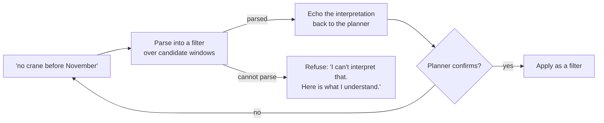

# ADR-0018 — The scheduling suggestion boundary

> **Status:** Accepted · **Owner:** NK · **Last updated:** 2026-09-18 ·
> **Related:** [ADR-0004](adr-0004-determinism-boundary.md), [ADR-0005](adr-0005-approval-gated-writes.md)

---

## Context

`M10` gives a planner suggested changes to the maintenance schedule: add, move, bundle or cancel. This
is the point where prediction becomes planned work, and it is also the point where
[ADR-0004](adr-0004-determinism-boundary.md) is most likely to be violated quietly.

The reason is the free-text constraint. A planner typing *"no crane before November"* is asking for
something that feels natural to hand to a language model. But a model asked to honour that constraint
while proposing a schedule is being asked to reason about feasibility — and it does not know whether a
crane is available, whether the crew is certified, or whether the bearing is in stock. It will answer
anyway, plausibly and confidently.

In maintenance planning a plausible wrong answer costs a crew a day and a customer an outage.

## Decision

**Three rules, in order of importance.**

### 1. Suggestions are drawn only from engine-produced windows

The constraint engine (`CMP-9`) produces candidate windows that already satisfy every hard constraint:
wind limits, crew certification and availability, parts on hand or lead time, crane need and
mobilisation lead time, preventive work already due. The suggestion layer **selects, groups, ranks and
explains** those candidates. It cannot construct one.

`T-71` asserts this by anti-joining every suggestion's window, crew and part against the candidate
table, and adversarially prompting for an invented slot.

### 2. Free text is parsed, echoed and refused — never reasoned about

The model's job is **translation**, not feasibility. It converts words into a filter over rows the
engine already produced, shows the planner what it understood, and refuses when it cannot parse rather
than guessing. A silently misread constraint is worse than a rejected one, because the planner would
never learn their instruction was dropped.

Recommendation on implementation: start with a **fixed grammar** over the constraint vocabulary that
actually exists — component, crane, date range, site, crew skill — and involve the model only if the
grammar proves too rigid (`Q-76`).

### 3. Infeasibility is an answer, not a failure

When nothing is feasible, report the **binding constraint**: *"no certified crew until week 44"*. An
empty list is unhelpful and a nearest-fit guess is dangerous. This is the same move as
`UNDETERMINED` in [ADR-0017](adr-0017-alarm-classification.md) — the system says what is blocking it
rather than forcing an answer — and the two reinforce each other as a design principle.

### Scope decisions that follow

| Decision | Rationale |
| --- | --- |
| **Rolling 12 weeks by default** | Recomputing a full year every run is waste. This is a credit decision as much as a UX one |
| **Season mode returns a ranked list**, not a 12-month grid | A year-wide visual for a demo that shows twelve weeks was decoration (`W14`). The seasonal idea is the value; the grid was not |
| **Two pre-commit impact views**, not five | Risk left uncovered, and lost energy before versus after. Those two *are* the decision. Crew load and parts demand are detail a planner verifies in their own systems |
| **Acceptance goes through `CMP-10`** | No second write path. Approval, idempotency and audit come for free ([ADR-0005](adr-0005-approval-gated-writes.md)) |
| **Reject-with-reason shares `M9`'s table, not its vocabulary** | Same storage and audit path; unrelated reason lists. Forcing one list would produce a dropdown useless in both places |
| **`C1` folds in** as the season mode | Pre-season bundling is a mode of this, not a separate capability |
| **No event-driven re-planning** (`W12`) | Button plus nightly refresh is the complete story. The third trigger adds a dependency nobody sees |

## Alternatives considered

| Option | Why not |
| --- | --- |
| **Let the model propose windows directly** | Makes the model a constraint engine. It would produce confident, infeasible plans — the reference solution's failure mode applied to scheduling |
| **Model proposes, engine validates afterwards** | The planner still sees a wrong window first, and the validator would need the full logic anyway |
| **No free-text constraint at all** | Safe but loses real value: "no crane before November" is how planners actually think, and parse-echo-refuse captures it without breaking the architecture |
| **Full-year horizon by default** | ~4× the computation every run for a view we show twelve weeks of |
| **All five pre-commit impact views** | Four more views than the decision needs. Volume is not rigour |

## Consequences

**Good.** The architecture's central rule holds at the point of maximum temptation, and `T-71` proves
it rather than asserting it. The planner gets natural-language input without the system inventing
state. Binding-constraint reporting turns dead ends into useful answers. And acceptance reuses the
existing write path, so `M10` adds no new audit surface.

**Costs.** A fixed grammar will reject phrasings a model would have understood, and the planner will
occasionally have to rephrase. That is the correct trade: a rejected constraint is visible, a
misread one is not.

**What this rules out.** The agent scheduling anything on its own, in any mode, including "just book
the obvious one". Acceptance is always a human act.

## Compliance

| Requirement | Test |
| --- | --- |
| `FR-73` parse, echo, refuse | `T-73` |
| `FR-77` suggestions only from engine windows | **`T-71` — gating** |
| `FR-78` binding constraint reported | `T-72` |
| `FR-79` accept / edit / reject via the action service | `T-74` |
| `FR-80` two pre-commit impact views | `T-75` |
| `FR-70`, `FR-71` rolling horizon and season mode | `T-81`, `T-82` |
| `NFR-1` determinism boundary | `T-46`, `T-71` |
