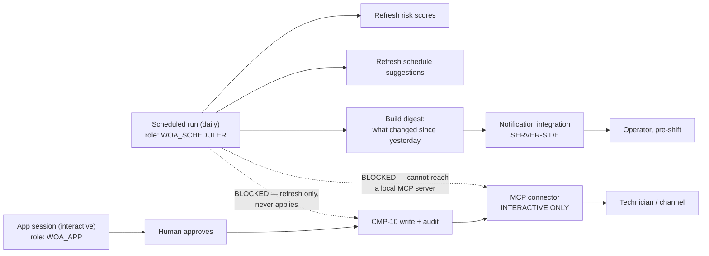

# ADR-0019 — Automation and notification split

> **Status:** Accepted · **Owner:** NK · **Last updated:** 2026-09-18 ·
> **Related:** [ADR-0005](adr-0005-approval-gated-writes.md), [ADR-0001](README.md#adr-0001--snowflake-native-single-account)

---

## Context

`M11` commits to two of the hackathon's ingenuity bonuses that were previously "if capacity allows":
a scheduled run, and an MCP connector. Both are small. Both have a platform constraint that
determines the design, and one of them would have failed silently on D14 if we had not looked.

| Constraint | Consequence |
| --- | --- |
| **A scheduled run cannot reach a locally configured MCP server** | A Slack digest sent from the nightly run is not possible |
| **An automation runs as its creator's default role** | Created by NK, it would run as `ACCOUNTADMIN` — violating `NFR-3` outright |
| Minimum frequency is hourly | Hourly is a floor, not a target |

The first constraint is the interesting one. The natural design — "the nightly run posts a digest to
Slack" — cannot work, and the natural workaround — "claim it anyway and demo it interactively" — would
be a claim the code does not support.

## Decision

**Two delivery paths, split by where they run.**

| Path | Runs | Carries | Why this path |
| --- | --- | --- | --- |
| **Notification integration** | Server-side, from the scheduled task | The daily digest | The only mechanism that works from a task |
| **MCP connector** | Interactively, from the app session | Approval notification | Closes the loop where technicians actually work |

**One run, not three.** Scores, suggestions and the digest refresh together: one task, one schedule,
one failure mode, one freshness stamp. Three separate runs would be strictly worse for no benefit.

**Two hard rules.**

1. **Refresh only, never apply** (`FR-85`). `WOA_SCHEDULER` holds no privilege on `ACTION`. An
   automation that can write state is a different and far more dangerous system than one that cannot,
   and `T-76` asserts both the grant and the behaviour.
2. **Runs as `WOA_SCHEDULER`** (`NFR-19`). Because automations inherit their creator's default role,
   the object must be created from a session whose default is `WOA_SCHEDULER` — not a human's, and
   never `ACCOUNTADMIN`. **This is a D1 decision**, recorded here so it is not discovered on D14 when
   the automation is built.

**Daily, not hourly.** A pre-shift digest is what a person would actually read. Hourly would be a cron
job that exists to claim a bonus.

**Freshness is visible** (`NFR-18`). Every surface showing derived output displays when it was last
refreshed. A silently stale suggestion is the same class of defect as a toast that lies — the user
believes something about the world that is not true.

**The MCP path is optional.** Its absence must never block an approval (`T-79`), and it is never on
the demo's critical path — shown if it works, skipped without comment if it does not. It is the only
external dependency in the entire plan, which is why it is **first in the cut order**.

## Alternatives considered

| Option | Why not |
| --- | --- |
| **Digest over MCP from the scheduled run** | Not possible. The constraint is decisive, and claiming it would be a claim the code cannot support |
| **Skip the notification integration; digest as a page in the app** | Weaker: the point is that a human reads it *before* their shift, without opening anything |
| **One path for both, interactive only** | The digest would then require someone to be logged in at 6 a.m., which defeats it |
| **Hourly refresh** | Nothing changes hourly in a maintenance plan. Cost with no benefit |
| **Let the automation apply approved suggestions** | Breaks [ADR-0005](adr-0005-approval-gated-writes.md). "Approved" would have to mean "approved earlier", and the gap between decision and action is exactly where the world changes |
| **Create the automation as NK** | Runs as `ACCOUNTADMIN`. Violates `NFR-3` |

## Consequences

**Good.** Two bonuses claimed honestly, each doing one real thing. The split is itself a good answer to
a judge's question, because it shows we read the platform's constraints rather than assuming. One run
means one thing to monitor. And the `WOA_SCHEDULER` role decision surfaced on D1 rather than breaking
`NFR-3` on D14.

**Costs.** Two delivery mechanisms instead of one, so two things to configure and test. The digest is
not in Slack, which is marginally less impressive than if it were — and saying why is better than
faking it.

**What this rules out.** Any automated path to a write, in any form, including a deferred one.

## Compliance

| Requirement | Test |
| --- | --- |
| `FR-81` one daily run refreshing scores, suggestions, digest | `T-76` |
| `FR-82` digest reports what changed | `T-77` |
| `FR-83` digest delivered server-side | `T-77` |
| `FR-84` MCP approval notification, optional | `T-79` |
| `FR-85` refresh only, never applies | **`T-76` — gating** |
| `NFR-18` freshness visible | `T-77` |
| `NFR-19` runs as `WOA_SCHEDULER` | `T-78` |
| `NFR-3` least privilege | `T-50`, `T-78` |
