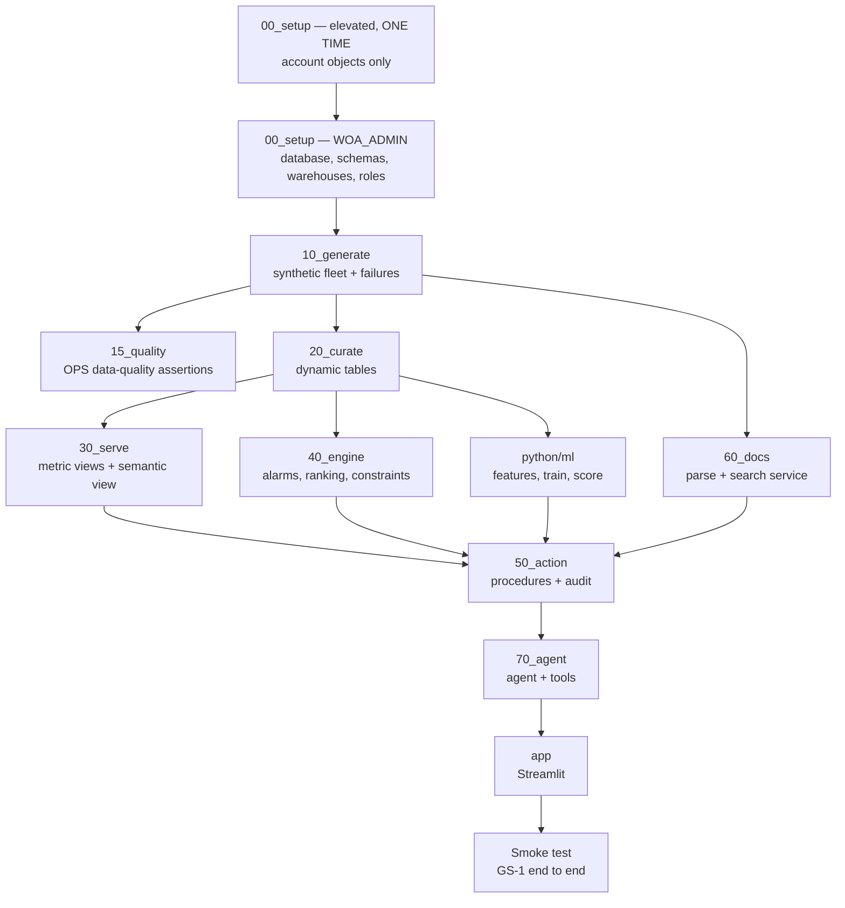

# Deployment

> **Status:** Draft v0.3 · **Owner:** NK · **Last updated:** 2026-09-21
>
> **v0.3** re-points §1 at account `JKDRJBB-MW27072` after the account move, and notes that planning
> credits were charged to the old account (§6).
> **v0.2** adds §3.1: the `just` recipes that run each setup step. Nothing is invoked by hand.

---

## 1. Target environment

Verified by direct execution on 2026-09-21, not read from documentation.

> **The account changed on 2026-09-21.** Planning ran against `BGTCHIX-UZ86048`, which is gone. The
> row below is the current account, re-verified by execution. Capability evidence from the old
> account does not carry over — see [`STATE.md`](../../STATE.md) §5 for what has and has not been
> re-proven.

| Property | Value |
| --- | --- |
| Account | `JKDRJBB-MW27072` (org `JKDRJBB`, account `MW27072`, locator `EB28292`) |
| Region | `AZURE_CENTRALINDIA` |
| Version at verification | 10.33.101 |
| Account type | **Trial**, with a $400 credit (Official Rules §4.3) |
| Edition | Not readable to our role. Design assumes the **lowest** plausible capability set (`Q-7`) |
| Cross-region inference | `CORTEX_ENABLED_CROSS_REGION = ANY_REGION` — **required** for `claude-sonnet-4-5`. Confirmed set at `ACCOUNT` level |
| Cortex Analyst | `ENABLE_CORTEX_ANALYST = true` (`SYSTEM` level) |
| Roles available to us | `ACCOUNTADMIN`, `ORGADMIN`, `SECURITYADMIN`, `SYSADMIN`, `USERADMIN`, `PUBLIC` |

## 2. Environments

| Environment | Database | Purpose | Who |
| --- | --- | --- | --- |
| Personal | `WIND_OPS_AI_DEV_NK` / `_JP` / `_SA` | All development. Zero-copy clone of shared | Each developer |
| Shared | `WIND_OPS_AI` | Integration and **the demo runs from here** | `WOA_ADMIN` via scripts |

There is no separate production. With 15 days and a trial account, a third environment would cost
more than it protects.

**Promotion** is re-running the numbered scripts against the shared database. Because setup is
idempotent (`T-52`), promotion is a re-run, not a migration.

## 3. Setup order

**The elevated step is isolated and one-time.** Only account-level objects that genuinely require
it. Everything else runs as `WOA_ADMIN`, and nothing the app or agent uses ever runs elevated
(`NFR-3`). We do not `ALTER ACCOUNT`.

### 3.1 The recipes that run it

**Nothing above is invoked by hand.** Every step is a `just` recipe — the rule and its rationale are in
[AGENTS.md · Deployment](../../AGENTS.md#deployment). The recipes exist as placeholders that exit
non-zero until implemented (`US-44`).

| Recipe | Steps it runs |
| --- | --- |
| `just target` | Nothing. Prints the database and connection a run would hit. **Run it first** |
| `just deploy-foundation` | `00_setup` (both stages) |
| `just deploy-data` | `10_generate`, `15_quality`, `20_curate`, `30_serve` |
| `just deploy-ml` | `python/ml` — fails loudly if the model does not beat both baselines (`T-10`) |
| `just deploy-engine` | `40_engine`, `50_action` |
| `just deploy-agent` | `60_docs`, `70_agent`, `30_serve/02_semantic_view` |
| `just deploy-action` | `50_action` (tables, approval procedures, grants), gated by `15_quality/06` and the `T-33` direct-write check |
| `just deploy-app` | `app` |
| `just deploy` | All of the above in dependency order, then `just verify` |
| `just update` | Only what changed. **Never drops or recreates anything holding rows** |
| `just verify` | `S11` smoke test plus the 18 gating tests against the live target. **Implemented for the `G1` data-quality suite** — runs `OPS.SP_RUN_DATA_QUALITY` and gates on it via `OPS.SP_ASSERT_QUALITY_GATE`, which raises so the recipe exits non-zero |
| `just seed` | Regenerates synthetic data with a deterministic seed (`T-8`). **Implemented** — calls `GEN.SP_GENERATE_ALL`, which runs the six stages in dependency order and records the run in `GEN.GEN_RUN_CONFIG`. Window, seed, damage multiplier, bad-batch share and signal interval are all recipe parameters |
| `just sql <file>` | One `.sql` file, **one statement at a time**. The only sanctioned ad-hoc path |
| `just teardown` | §5 below |
| `just cost` | §6 below, both credit sources summed |

`env=dev` (default) targets `WIND_OPS_AI_DEV_<INITIALS>`; `env=shared` must be typed deliberately.

## 4. What setup must not do

Each row is a defect found in the reference solution, turned into a prohibition.

| Prohibited | Why |
| --- | --- |
| `CREATE OR REPLACE DATABASE` | Silently destroys a same-named database, including a colleague's |
| `ALTER ACCOUNT SET EVENT_TABLE` | Hijacks account-wide state |
| `GRANT … TO ROLE PUBLIC` | Grants to every user in the account |
| Network rules with `0.0.0.0` | Unrestricted egress |
| Hardcoded database, account or region literals | Prevents cloning and breaks portability |
| Fixed `ROWCOUNT` caps that truncate generated history | Produces data stale on arrival |
| Manual copy-paste of a 3,000-line script as the documented install path | Not reproducible; not verifiable |

## 5. Teardown

`90_teardown` reverses `00_setup`, in dependency order, and is part of the definition of done —
partly because judges may run this in their own account, and partly because a $400 ceiling makes
leaving objects running an actual risk.

Order: app → agent → search service → ML instances → dynamic tables → views → procedures → tables
→ schemas → database → warehouses → roles.

## 6. Cost controls

`NFR-8`. An early planning snapshot recorded **≈16.75 credits** — 15.07 CoCo Desktop tokens plus 1.68
warehouse; by the end of planning [`STATE.md`](../../STATE.md) §6 recorded **≈51.18**. Both were
charged to the old account `BGTCHIX-UZ86048` and do **not** count against the current $400. Spend on
`JKDRJBB-MW27072` is tracked in `STATE.md` §6. Cost must be summed across **both** sources; warehouse
metering alone under-reports by roughly ten times. The CoCo column is `TOKEN_CREDITS`, not `CREDITS`.

| Control | Setting |
| --- | --- |
| Warehouse size | `XSMALL` for both; resize up only inside a training run and back down in the same script |
| Auto-suspend | 60 s everywhere |
| Dynamic table lag | Declared per table; the loosest lag that still demonstrates freshness |
| Search service lag | Hours, not minutes — the document corpus barely changes |
| History window | Recommended 6 months plus a failure-rich window, not 24 (`Q-27`) |
| Resource monitor | On the account, with a notification threshold well below $400 |
| Reporting | Credits reported to NK at each $100-equivalent band |
| Demo | Warm the warehouse once before the demo, then leave it alone |

The `AUTO_SUSPEND = 60` setting matters more than it looks: the biggest trial-credit risk in a
project like this is not a heavy query, it is an idle warehouse left running overnight.

## 7. Demo-day runbook

| Step | Action | Fallback |
| --- | --- | --- |
| T−60 min | Verify data reaches the current date; run the smoke test | Re-run `10_generate` for the recent window only |
| T−45 min | Confirm the model is scored and drivers are present | Re-score from the last trained model |
| T−30 min | Confirm the agent answers a known question with a citation | Switch to the in-region model (`llama3.1-8b`) |
| T−20 min | Confirm approval writes and the audit row appears | **If audit fails, the demo does not show the write.** Do not fake it |
| T−15 min | Warm `WOA_APP_WH`; load every page once | Local Streamlit against the same account |
| T−5 min | Screenshots of each key screen open in a second window | Narrate from screenshots |
| Live | Run `GS-1` | Fall back to the next `GS-` if a specific asset misbehaves |

Two rules for the demo. **Never fabricate a result to cover a failure** — say the component is
degraded and move on; the honesty is worth more than the screen. And a live demo is required at the
Finals with pre-recorded demos possibly not accepted (Official Rules §4.5c), so the fallbacks above
are *live* fallbacks, not a video.

## 8. Open questions

| ID | Question | Owner |
| --- | --- | --- |
| `Q-39` | ~~Can we create a Streamlit object on this trial account?~~ **Closed 2026-09-18 — yes.** And the wider question is answered: **Snowflake App Runtime is blocked on trial accounts**, so the app is Streamlit by decision, not by default ([`ADR-0020`](decisions/adr-0020-app-platform.md)) | NK |
| `Q-40` | Do we set an account resource monitor, given only one account and shared credits? Recommendation: yes, with notify-only at first | NK |
| `Q-41` | Who holds the elevated credential for the one-time setup step, and where does it live? Recommendation: NK, in the OS keychain, never in git. **Re-opened 2026-09-21** by the move to `JKDRJBB-MW27072` — the answer was scoped to the old account | NK |
