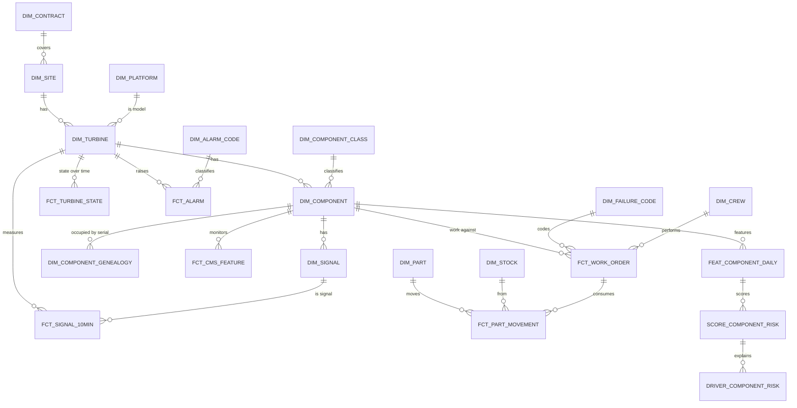
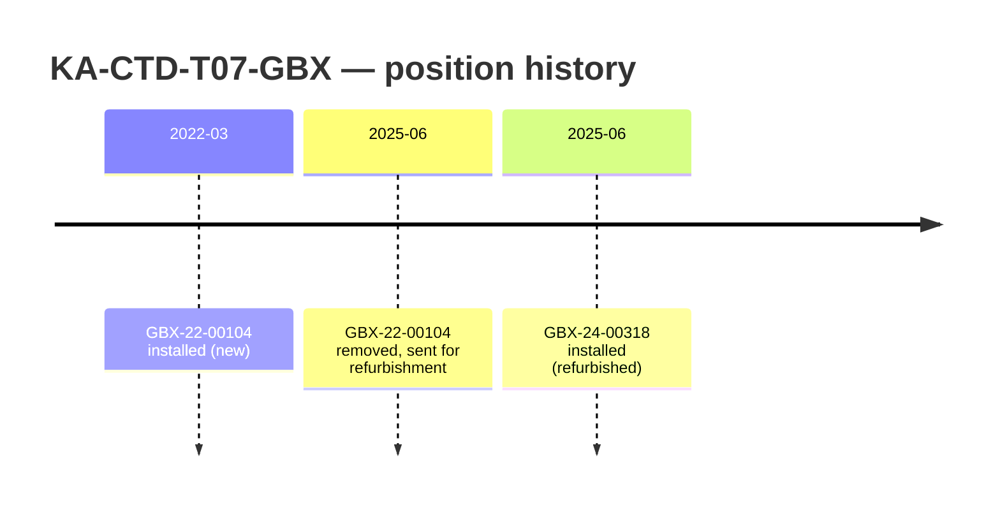

# Data Model

> **Status:** Draft v0.2 · **Owner:** JP · **Last updated:** 2026-09-18
>
> Replaces Plant/Line/Asset with Region/State/Site/Turbine/Component/Signal as
> [profile §12](../01-business/company-profile.md#12-impact-on-other-planning-docs) requires.
> Naming follows [04-code.md](../03-architecture/04-code.md).

---

## 1. Curated model

## 2. Grain — stated explicitly

Ambiguous grain is how fact tables quietly double-count.

| Table | Grain |
| --- | --- |
| `FCT_SIGNAL_10MIN` | one row per turbine × signal × 10-minute interval |
| `FCT_CMS_FEATURE` | one row per component × monitored point × feature × hour |
| `FCT_TURBINE_STATE` | one row per turbine × state interval (start, end) |
| `FCT_ALARM_NORMALISED` | one row per alarm occurrence, **any of the four sources** |
| `ENG_INCIDENT` | one row per incident, with its classification and noise labels |
| `ENG_INCIDENT_EVIDENCE` | one row per incident × evidence channel |
| `ENG_SUGGESTION` | one row per schedule suggestion × run |
| `FCT_WORK_ORDER` | one row per work order |
| `FCT_PART_MOVEMENT` | one row per part movement |
| `FCT_SCHEDULE_DEVIATION` | one row per turbine × 15-minute block |
| `FEAT_COMPONENT_DAILY` | one row per component × day |
| `SCORE_COMPONENT_RISK` | one row per component × scoring run |
| `DRIVER_COMPONENT_RISK` | one row per component × scoring run × driver |

`FCT_TURBINE_STATE` is interval-based, not snapshot-based, because availability is
`available time ÷ (period − exclusions)` and intervals make that a sum rather than a count. Snapshots
would force an assumption about what happened between them.

## 3. Position versus serial — the distinction that matters

The single modelling idea the reference solution lacks entirely.

| Concept | Table | Key | Answers |
| --- | --- | --- | --- |
| **Position** | `DIM_COMPONENT` | `KA-CTD-T07-GBX` | "How often has *this slot* failed?" |
| **Installed serial** | `DIM_COMPONENT_GENEALOGY` | `GBX-24-00318` + valid-from/to | "How often has *this part* failed, and where else has it been?" |

Why it earns its place: when the same failure mode appears on several serials from one supplier
batch, that is a **supplier quality problem**, not six unlucky turbines. Reading history by position
alone hides it completely. This is `GS-2`, and it gives Procurement the evidence
[profile §6](../01-business/company-profile.md#6-organisation-departments-roles--needs) says they
cannot produce today.

Genealogy is also what makes damage reset meaningful — a replaced component starts fresh, so
component age is a real feature rather than turbine age in disguise.

## 4. Contract model

Drives every rupee figure in the system.

| Table | Contents |
| --- | --- |
| `DIM_CONTRACT` | Site, customer type, start date, guarantee by contract year (95% years 1–2, 97% from year 3), LD rate per turbine per 1% shortfall, scheduled-maintenance hour allowance |
| `DIM_EXCLUSION_CLASS` | Grid outage, force majeure, balance-of-plant, curtailment, scheduled allowance — which state reasons do not count against us |

Contract year is not calendar year, and availability must be computed against the **contract year in
force at that date**, since the guarantee steps from 95% to 97%. Getting this wrong makes every LD
figure wrong, which is why `T-20` uses a hand-worked fixture that spans a step.

## 5. Serving model

One view per metric, each the only definition of it (`FR-27`).

| View | Definition source |
| --- | --- |
| `MET_AVAILABILITY_CONTRACTUAL` | Available hours ÷ (period hours − exclusions) |
| `MET_AVAILABILITY_TECHNICAL` | Turbine-caused downtime only |
| `MET_LOST_ENERGY` | Expected energy from the power curve at measured wind, minus actual, while unavailable or underperforming |
| `MET_LD_EXPOSURE` | Forecast shortfall vs guarantee in force × LD rate |
| `MET_TURBINE_OEE` | `A × P × Q` per [ADR-0003](../03-architecture/decisions/adr-0003-turbine-oee.md) |
| `MET_MTBF_MTTR` | Per component class, from work-order history |
| `MET_MTTRESPOND` | Mean time to respond — from alarm acknowledgement timestamps |
| `MET_NOISE` | The alarm noise numbers, with compression and real-failures-suppressed inseparable |

Each carries a header comment stating its formula and the
[profile §8](../01-business/company-profile.md#8-kpis-the-company-runs-on) KPI it implements, so a
reader can check it against the definition rather than reverse-engineering it.

## 6. Engine and action model

| Table / view | Purpose |
| --- | --- |
| `FCT_ALARM_NORMALISED` | All four alarm sources in one conformed schema |
| `ENG_INCIDENT` | Alarms correlated into incidents, with noise labels and classification |
| `ENG_INCIDENT_EVIDENCE` | **Per-incident evidence rows** — the four channels weighed, stored so a human can disagree |
| `ENG_SUPPRESSION_CANDIDATE` | Proposed nuisance patterns with evidence |
| `ENG_ALERT_RANKED` | Alerts ordered by money at stake |
| `ENG_WINDOW_CANDIDATE` | Feasible windows with **per-constraint results** |
| `ENG_SUGGESTION` | Typed schedule proposals with reasoning, evidence and impact |
| `ACT_WORK_ORDER_DRAFT` | Draft with its justifying evidence snapshot |
| `ACT_WORK_ORDER` | The written work order |
| `ACT_SUPPRESSION` | Active suppressions, time-boxed and reversible |
| `ACT_DECISION` | **Confirm, dismiss, reinstate, accept, reject** — one table, two reason vocabularies |
| `AUD_ACTION` | Append-only audit |

`ENG_WINDOW_CANDIDATE` stores **each constraint's result**, not just a pass/fail. A planner needs to
know *which* constraint excluded a window — "no certified crew" and "bearing arrives too late" lead
to different actions. `ENG_INCIDENT_EVIDENCE` exists for the same reason on the alarm side.

`ACT_DECISION` is the one genuine shared structure between `M9` and `M10`: **same table, same audit
path, two unrelated reason vocabularies.** Forcing one list would produce a dropdown useless in both
places (`Q-81`).

## 7. Conventions

| Rule | Reason |
| --- | --- |
| Surrogate keys on dimensions; natural keys retained and unique | Natural keys are how humans and the agent refer to assets |
| `FCT_SIGNAL_10MIN` and `FCT_CMS_FEATURE` clustered on `(turbine/component, timestamp)` | The dominant access pattern is one asset over a window |
| All timestamps `TIMESTAMP_NTZ` in IST | One fleet, one timezone. Mixed zones cause silent interval errors |
| No `SELECT *` in anything the app or agent reads | Column drift otherwise breaks silently |
| Every fact carries operating state or a join to it | `FR-7`, and availability depends on it |
| UNS-style path as an attribute, never a key | Borrowed idea, `Q-14` |
| Every table has a `IS_SYNTHETIC` marker | `FR-15` |

## 8. Open questions

| ID | Question | Owner |
| --- | --- | --- |
| `Q-46` | Does `FCT_SIGNAL_10MIN` stay long (one row per signal) or go wide (one row per turbine-interval)? Recommendation: long for flexibility, with a wide view for the app | JP |
| `Q-47` | Is `FEAT_COMPONENT_DAILY` the right feature grain, or should it be hourly? Recommendation: daily — matches the planning horizon and cuts cost | SA |
| `Q-48` | Do we model curtailment separately from grid outage? Recommendation: yes — different exclusion classes, and it affects `MET_LOST_ENERGY` | JP |
