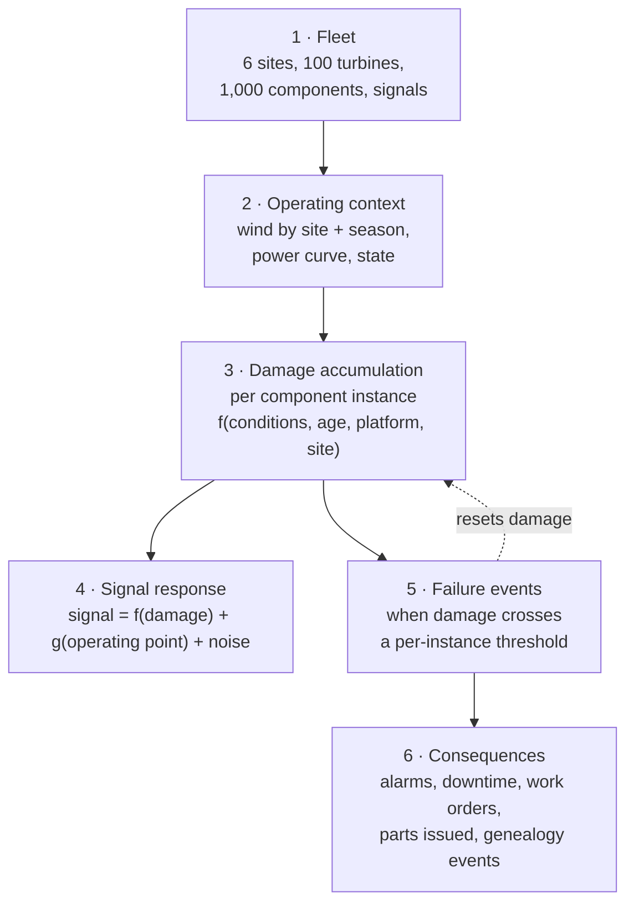

# Data Sources & Synthetic Data Strategy

> **Status:** Draft v0.2 · **Owner:** SA · **Last updated:** 2026-09-18
>
> Replaces the plant scenario as [profile §12](../01-business/company-profile.md#12-impact-on-other-planning-docs)
> requires. Sources are the systems in
> [profile §7](../01-business/company-profile.md#7-systems-landscape-where-predictive-maintenance-data-comes-from);
> the generator design is [ADR-0006](../03-architecture/decisions/adr-0006-synthetic-data.md).
>
> **All data is synthetic.** VWS is fictional. No real company, customer or personal data
> (`NFR-10`, Official Rules §5).

---

## 1. Sources in scope

Simulate column follows the profile's own must/should/could judgement.

| # | System | Profile says | We build | Feeds |
| --- | --- | --- | --- | --- |
| S1 | SCADA historian — 10-minute statistics | **Must** | **Yes** | `FCT_SIGNAL_10MIN` |
| S2 | SCADA events & alarms | **Must** | **Yes** — **alarm source 1** | `FCT_TURBINE_STATE`, `FCT_ALARM_NORMALISED` |
| S3 | CMS — vibration features, condition reports | **Must** | **Yes** (features only, per `W1`) — **alarm source 2** via threshold crossings | `FCT_CMS_FEATURE`, `FCT_ALARM_NORMALISED`, documents |
| S8 | CMMS — asset register, PM plans, work orders | **Must** | **Yes** | dimensions, `FCT_WORK_ORDER` |
| S10 | ERP materials — stock, reservations, lead times | **Must** | **Yes** | `DIM_STOCK`, reservations |
| S11 | ERP finance & contracts | **Must** | **Yes** | `DIM_CONTRACT` |
| S13 | Document management — manuals, bulletins | **Must** | **Yes**, as real files | `DOCS` |
| S6 | Grid meter & substation | Could | **Yes, minimal** — **alarm source 3** (grid and BoP events) | `FCT_ALARM_NORMALISED` |
| — | **Platform data-quality checks** | not in profile | **Yes** — **alarm source 4**, derived from `OPS` assertions | `FCT_ALARM_NORMALISED` |
| S4 | Oil condition monitoring | Should | **No** (`W15`) — CMS band energy plus bearing temperature already corroborate gearbox wear | — |
| S5 | Met mast & forecast | Should | **Minimal** — wind limits for windows | `DIM_WEATHER_WINDOW` |
| S12 | Component genealogy / repair shop | Should | **Yes** — a differentiator | `DIM_COMPONENT_GENEALOGY` |
| S14 | Workforce & certifications | Should | **Minimal** — crew skill and availability | `DIM_CREW` |
| S7 | Forecasting & scheduling (DSM) | Could | Partial — schedule tolerance for OEE Quality | `FCT_SCHEDULE_DEVIATION` |
| S9, S15, S16, S17 | Mobile app, crane logistics, HSE, portal | Could | **No** — modelled as constraint attributes | — |

**The fourth alarm source is worth noting because it is not in the profile.** Data-quality check
failures become alarms on the same stream as SCADA and CMS, which costs almost nothing (the `OPS`
assertions already exist for `NFR-14`) and produces a genuinely good story: **the platform tells the
operator when it does not trust its own input**, in the same queue as everything else.

Oil-debris and overdue-PM were considered and excluded (`W15`). Oil debris adds a third corroborating
channel the demo cannot show much with; overdue PM is a *state*, not an *event*, and folding it into
an alarm stream would muddle the ontology.

Crane availability, permits and weather limits appear as **constraint attributes** on the components
that need them, not as separate simulated systems. That is a deliberate simplification: the
constraint engine needs to know a crane is required and its lead time, not to model a logistics
company.

## 2. Generation strategy

Six stages. Stage 3 is the one that makes the dataset worth modelling.

The direction of causality is the whole point: **conditions → damage → signals**, and
**damage → failure**. Signals therefore carry genuine information about failures, which is what makes
`M3` a real model rather than a relabelled rule.

Degradation is only visible **after controlling for the operating point**, because `g(operating
point)` is large relative to `f(damage)`. That is true of real CMS practice and it is why the feature
engine bands by RPM and load (`CMP-4`).

## 3. Volume and window

Recommendation, pending `Q-27` / [ADR-0016](../03-architecture/decisions/README.md#adr-0016--history-window).
Profile §11's figures are *(illustrative)* by its own statement, so reducing them contradicts nothing.

| Data | Profile §11 (per year) | We generate | Reason |
| --- | --- | --- | --- |
| Turbines / components | 100 / 1,000 | **Same** | Fleet realism is cheap; it is dimension data |
| SCADA 10-minute rows | ≈5.26 M | **≈2.6 M** (6 months) | Largest cost driver |
| CMS feature rows | ≈7.0 M | **≈3.5 M** (6 months) | Hourly, 8 points per turbine |
| SCADA events / alarms | ≈1–2 M | **≈0.3 M** | Enough for a credible alarm flood in `GS-4` |
| **Alarms, all four sources** | — | **≈0.4 M** | Includes seeded chattering, a site-wide grid dip and a sensor-fault code cascade |
| Work orders | thousands | **≈1,500** | PM visits plus correctives |
| Seeded failures | dozens per year | **≈40–60** in window | The binding constraint — see below |
| Documents | — | **8–12 real files** | `Q-26` |

**Seeded failures are the binding constraint, not row count.** A classifier needs enough positive
examples for a credible held-out evaluation. 40–60 failures split into train and test is thin, and
the evaluation must report that honestly rather than quoting one flattering number. If the count
proves too low, the lever is a **higher failure rate over the same window**, not a longer window —
failures are what cost us statistically, rows are what cost us credits.

## 4. Fidelity, per source

Where we are faithful, where we simplify, stated so nobody overclaims.

| Element | Fidelity | Simplification |
| --- | --- | --- |
| Wind regime | Diurnal and seasonal pattern, May–September high season, per-site mean | Weibull-shaped, not a real met record |
| Power curve | Per platform, cut-in / rated / cut-out | Idealised, no air-density correction |
| CMS features | Band energies, trend, kurtosis per monitored point | Features only, never waveforms (`W1`) |
| Temperatures | Rise above expected at matched condition | Simple thermal lag, no full thermal model |
| Operating states | IEC-61400-26-style Ready / Unavailable / Neglected, with exclusions | Simplified state list |
| Alarms | Codes with start/end, auto-resets, nuisance patterns, safety-critical flags. **Plus seeded chattering, a site-wide grid dip, and a sensor-fault code cascade** so correlation and noise labelling have something real to find | Invented code list *(illustrative)* |
| Work orders | Type, failure code, cause, remedy, labour hours, downtime, notes | Notes generated from templated causes — **but with real variety**, see §5 |
| Genealogy | Serial per position over time, refurbishment cycles | No repair-shop workflow |
| Stock | Per warehouse and site, reservations, lead times | No purchase-order lifecycle |
| Contracts | Guarantee by year, LD rate, exclusion classes | One contract shape per site |
| Documents | Real files, real structure | Written by us, 8–12 of them |

## 5. Technician notes — a specific trap

The reference solution's `TECHNICIAN_NOTES` column looked like free text and was in fact
`CASE MOD(asset_id, 6)` producing **19 distinct strings** across ~2,000 rows — a low-cardinality
categorical column in a `VARCHAR` costume, over which nothing performed retrieval
([`G-1`](../00-hackathon/reference-solution-analysis.md#33-the-rest-of-the-gap-list)).

We avoid this two ways. Notes are composed from a symptom, an action, a part and an observation
drawn independently, with real lexical variety including the messiness of field writing —
abbreviations, inconsistent component naming, occasional contradiction with the structured failure
code. And **the retrieval story does not depend on them**: `M6` retrieves from genuine document files
(`CMP-11`), so notes are corroborating evidence rather than a fake unstructured corpus.

## 6. Quality assertions

These run as assertions in `OPS`, not as hopes. Each corresponds to a specific reference-solution
failure.

| Assertion | Test | The failure it prevents |
| --- | --- | --- |
| Data reaches the generation date; no row-count cap truncates it | `T-11` | Telemetry ending 9 months in the past; a "last 24 hours" panel returning zero rows |
| Every threshold used downstream is crossed by real rows | `T-12` | `vibration > 1.5` against a maximum of 0.70 |
| Degradation trends before every seeded failure | `T-8` | A decay term evaluating to zero for every row |
| Failure correlates with accumulated damage, not with asset ID | `T-9` | Health as a function of primary key |
| The label is learnable, and beats a trivial single-signal rule | `T-10` | A feature store whose target is a coin flip |
| Every seeded failure has a corrective work order | `T-7` | Sensor record and maintenance history disagreeing |
| Referential integrity across all facts and dimensions | `T-1` | 51 of 54 sensors with no data |
| Every row is marked synthetic | `T-13` | — |
| **Every seeded noise pattern is detectable** — chattering, grid dip, code cascade | `T-64`–`T-67` | A noise labeller that finds nothing, or everything |
| **Every alarm source conforms to the normalised schema** | `T-62` | Four sources that cannot be compared |

## 7. Licensing

Official Rules §4.4 requires every dataset to be listed, with a licence for anything not provided by
Snowflake.

| Dataset | Origin | Licence |
| --- | --- | --- |
| All fleet, sensor, maintenance, stock and contract data | Generated by us | Ours, under the repository licence |
| All documents | Written by us | Ours |
| Weather, if `C9` proceeds | Snowflake Marketplace | Per listing terms — **must be recorded before use** (`Q-25`) |

No public wind dataset is used. Real public SCADA data was considered and rejected in
[ADR-0006](../03-architecture/decisions/adr-0006-synthetic-data.md): licence verification cost,
sparse labels, and a fleet that would not match our contracts or component model.

## 8. Open questions

| ID | Question | Owner |
| --- | --- | --- |
| `Q-42` | Is 40–60 seeded failures enough for a credible held-out evaluation, or do we raise the rate? Recommendation: raise the rate rather than the window | SA |
| `Q-43` | Do we generate oil-debris counts (`C6`)? Recommendation: yes if cheap — it is the profile's stated gearbox confirmation signal and strengthens `H-2` | SA |
| `Q-44` | Alarm code list: invent one, or map to a documented standard? Recommendation: invent, marked *(illustrative)*, with a safety-critical flag | JP |
| `Q-45` | Does the schedule-deviation model needed for OEE Quality survive the cut? Ties to [ADR-0003](../03-architecture/decisions/adr-0003-turbine-oee.md) | SA |
