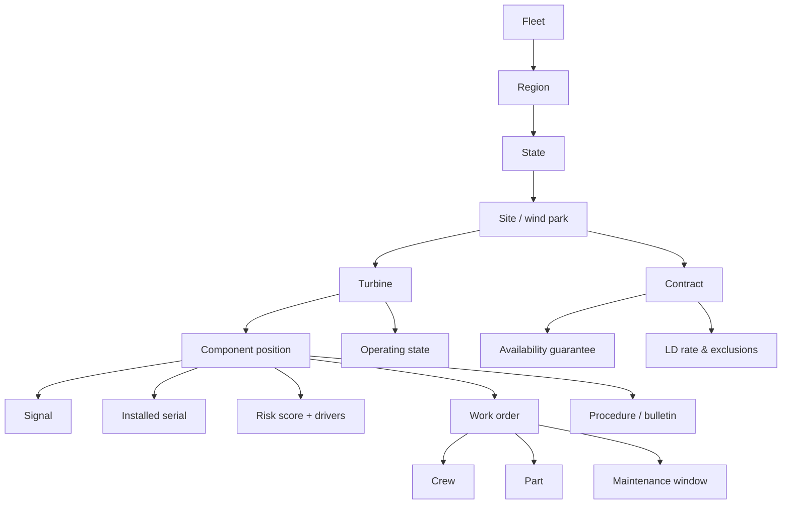

# Semantic Model & Ontology

> **Status:** Draft v0.1 · **Owner:** JP · **Last updated:** 2026-09-17
>
> Rewritten in wind terms as [profile §12](../01-business/company-profile.md#12-impact-on-other-planning-docs)
> requires. Decision: [ADR-0009](../03-architecture/decisions/README.md#adr-0009--native-semantic-view-as-the-nl-interface).

---

## 1. Principle: depth over breadth

The reference solution's semantic view is its genuine strength — ~1,500 lines, 18 tables, 20
relationships. We will not out-scale it in 15 days and should not try.

We go the other way: **fewer entities, every description correct, sample values that match the loaded
data, and more verified queries.** Text-to-SQL quality depends far more on description accuracy than
on table count, and the reference solution demonstrates the cost of neglecting it — its shipped
descriptions include `FAILED_IN_NEXT_7_DAYS` as *"whether the customer failed to make a payment"* and
`ASSET_ID` as *"a financial asset, such as a stock, bond, or commodity"*, plus `sample_values` that
contradict the loaded data (`EQ-PUMP-001-VIB` where the data holds `eq_pump_001_vib`). Cortex Analyst
uses sample values for literal mapping, so filters on part numbers silently miss
([`G-12`](../00-hackathon/reference-solution-analysis.md#33-the-rest-of-the-gap-list)).

`T-42` exists precisely because of that.

## 2. Ontology

The vocabulary the business already uses, so questions can be asked in the words people say.

| Concept | Means | Not to be confused with |
| --- | --- | --- |
| **Component position** | A slot on a turbine, e.g. `KA-CTD-T07-GBX` | The **serial** currently in it |
| **Installed serial** | A physical part with its own history | The position it occupies |
| **Availability** | Contractual by default, per the O&M agreement | Technical availability, or energy-based |
| **Lost energy** | Energy not produced versus power-curve expectation | Revenue — that is the **customer's**, not VWS's |
| **LD exposure** | Forecast liability from shortfall | LDs actually paid |
| **Risk** | Predicted probability of failure within the horizon | An alarm, which is a present event |
| **Incident** | A group of related alarms | A single alarm occurrence |
| **Window** | A feasible time slot satisfying every constraint | A preferred slot |
| **Turbine OEE** | Our adaptation ([ADR-0003](../03-architecture/decisions/adr-0003-turbine-oee.md)) | An industry standard — it is not one |

Terms carry into [glossary.md](../glossary.md) unchanged. One term, one meaning, everywhere.

## 3. Semantic view scope

| Included | Why |
| --- | --- |
| Site, turbine, component, component class, platform, signal | The questions are about assets |
| Component genealogy | "Has this part failed before?" is a headline question |
| Contract, guarantee, exclusion class | Every rupee answer needs it |
| Operating state and alarm facts | Availability and triage |
| CMS feature fact (aggregated, not raw) | Enough to answer "is vibration rising?" without exposing 3.5 M rows to text-to-SQL |
| Work order, crew, part, stock | Maintenance history and readiness |
| Risk score and drivers | So the agent can explain rather than re-derive |
| All `MET_*` metric views | **The only source of metric values** |

| Excluded | Why |
| --- | --- |
| `FCT_SIGNAL_10MIN` raw | 2.6 M rows; text-to-SQL over it invites expensive scans. Exposed via daily aggregate |
| Engine internals (`ENG_WINDOW_CANDIDATE` detail) | Exposed as candidate *reads*, not as a modelling surface |
| `ACTION` and `AUD_ACTION` | The agent has no grant here ([ADR-0005](../03-architecture/decisions/adr-0005-approval-gated-writes.md)) |
| `GEN`, `OPS` | Not business concepts |

## 4. Metrics — defined once, elsewhere

The semantic view **references** `CMP-5`'s metric views. It does not restate a formula. This is the
structural guarantee behind `FR-27`: if the semantic view carried its own OEE expression, it could
drift from the app's, which is exactly what happened in the reference solution — its semantic view
told the model that `OEE = A × P × Q` while the stored column was computed with an independent random
draw.

| Metric | Source view | Definition owner |
| --- | --- | --- |
| Contractual availability | `MET_AVAILABILITY_CONTRACTUAL` | [profile §8](../01-business/company-profile.md#8-kpis-the-company-runs-on) |
| Technical availability | `MET_AVAILABILITY_TECHNICAL` | profile §8 |
| Lost energy | `MET_LOST_ENERGY` | profile §8 |
| LD exposure | `MET_LD_EXPOSURE` | profile §8 |
| Turbine OEE and its factors | `MET_TURBINE_OEE` | [ADR-0003](../03-architecture/decisions/adr-0003-turbine-oee.md) |
| MTBF / MTTR | `MET_MTBF_MTTR` | profile §8 |

## 5. Verified queries

One per golden scenario plus the executive framing. These are the questions the demo asks, so they
must be right rather than merely answerable.

| ID | Question | Scenario |
| --- | --- | --- |
| `VQ-1` | Which components are at highest risk in the next 30 days, ranked by LD exposure and lost energy? | `GS-1`, `M5` |
| `VQ-2` | Why is `KA-CTD-T07`'s gearbox at risk — what are the drivers, and what changed? | `GS-1`, `D-3` |
| `VQ-3` | Has this failure mode occurred before on this component class, and on which serials? | `GS-2` |
| `VQ-4` | What is contractual availability by site this contract year, against the guarantee in force? | `J-5` |
| `VQ-5` | What is our LD exposure this contract year, by site? | `J-5` |
| `VQ-6` | Show Turbine OEE decomposed into availability, performance and quality for a site this month | `M4` |
| `VQ-7` | Which turbines are underperforming their power curve while available? | `GS-5` |
| `VQ-8` | Which elevated-risk components at one site could be bundled into one crane campaign before the wind season? | `GS-3` |
| `VQ-9` | Which alarms in the last 7 days are candidate nuisance patterns, and what is the evidence? | `GS-4` |
| `VQ-10` | What is the approved procedure for an up-tower HSS bearing replacement on a VW-3.0? | `GS-1`, `M6` |

`VQ-10` resolves through document retrieval, not text-to-SQL — deliberately included so the verified
set covers both tools.

## 6. Description standards

Every description must state, in the business's own words: what the thing is, its unit where it has
one, and its grain where ambiguous.

| Rule | Bad | Good |
| --- | --- | --- |
| Domain-correct | "Unique identifier for a financial asset" | "Component position on a turbine, e.g. `KA-CTD-T07-GBX`" |
| Unit stated | "Energy value" | "Energy in MWh not produced versus power-curve expectation" |
| Grain stated | "Vibration reading" | "Mean band energy per monitored point per hour, normalised within band" |
| Sample values match loaded data | `EQ-PUMP-001-VIB` when data holds `eq_pump_001_vib` | Values copied from the table |
| No leaked internals | "`FK` to `DIM_X`" | "The site this turbine belongs to" |

`T-42` checks every description against these rules, and `T-41` checks that each verified query
returns the expected shape.

## 7. Open questions

| ID | Question | Owner |
| --- | --- | --- |
| `Q-49` | Do we expose CMS features at daily or hourly grain to the semantic view? Recommendation: daily, to keep text-to-SQL scans cheap. Ties to `Q-47` | JP |
| `Q-50` | Does the agent get a "similar failures" tool, or does the semantic view answer `VQ-3` through genealogy joins? Recommendation: semantic view — fewer moving parts | JP |
| `Q-51` | How many verified queries can we actually author and validate? Recommendation: `VQ-1`, `VQ-2`, `VQ-4`, `VQ-6`, `VQ-10` first — they cover the demo | JP |
