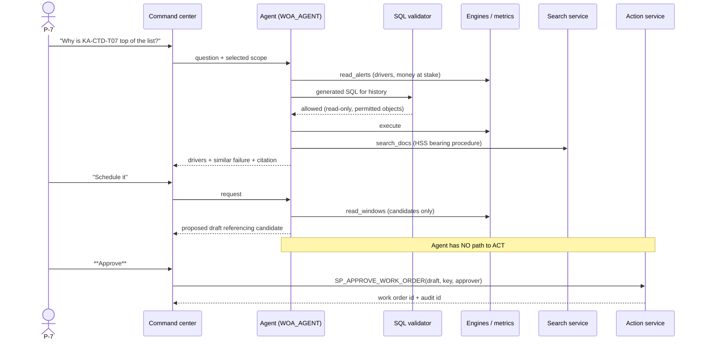

# Agents, Tools & Guardrails

> **Status:** Draft v0.2 · **Owner:** SA · **Last updated:** 2026-09-18
>
> Governed by [ADR-0004](../03-architecture/decisions/adr-0004-determinism-boundary.md) — the engine
> decides state, the model explains it — and
> [ADR-0005](../03-architecture/decisions/adr-0005-approval-gated-writes.md).

---

## 1. What the agent is for

| The agent does | The agent never does |
| --- | --- |
| Explains why a component is at risk, using stored drivers | Compute a risk score |
| **Explains why an alarm was set aside, or why it is `UNDETERMINED`** | **Classify an alarm** |
| Ranks and narrates candidates the engines produced | Invent a window, crew, part or incident |
| Retrieves and cites procedures and bulletins | Assert an uncited fact |
| Reports metric values by reading the metric views | Recalculate a metric |
| Finds similar past failures by serial or position | Write anything, anywhere |
| Says "I cannot answer that from the data" | Guess plausibly |

One agent, not several. Multi-agent orchestration is listed as a hackathon ingenuity bonus, but with
~90 person-hours it would add handoff complexity and failure modes without adding capability. If time
appears, the honest version is a **second, narrow agent for document-only Q&A** — not a swarm.

## 2. Tools

Every tool is read-only. There is no write tool — not a disabled one, an **absent** one.

| Tool | Type | Reads | Purpose |
| --- | --- | --- | --- |
| `query_fleet` | Cortex Analyst over `SV_WIND_OPS` | `SERVING` | Metrics, assets, history, availability |
| `search_docs` | Cortex Search over `CSS_MAINTENANCE_DOCS` | `DOCS` | Procedures, bulletins, condition reports |
| `read_alerts` | View | `ENG_ALERT_RANKED` | The ranked alert list with drivers |
| `read_incidents` | View | `ENG_INCIDENT` | Alarm incidents with their classification and stored evidence — including why something is `UNDETERMINED` |
| `read_windows` | View | `ENG_WINDOW_CANDIDATE` | Feasible windows and per-constraint results |
| `read_suggestions` | View | `ENG_SUGGESTION` | Schedule proposals with reasoning and impact |
| `read_similar_failures` | View | genealogy join | Prior failures by serial and by position |

`read_windows` and `read_suggestions` are where [ADR-0004](../03-architecture/decisions/adr-0004-determinism-boundary.md)
becomes concrete. Asked *"when can we do this repair?"*, the agent must read candidates the constraint
engine produced. It cannot compute one, because it has no access to crew rosters, stock or crane lead
times except through those views — and they only contain windows that already satisfy every
constraint. `T-71` asserts this adversarially.

`read_incidents` matters for a different reason: it lets the agent explain **why an alarm was set
aside**, which is the question an operator most wants answered about a system that filters their work.

## 3. Guardrails

Ordered by strength. The first two cannot be talked around; the rest are defence in depth.

| # | Guardrail | Mechanism | Test |
| --- | --- | --- | --- |
| 1 | **No write capability** | `WOA_AGENT` holds no write grant anywhere and no privilege at all on `ACTION`. Structural, not instructional | `T-47` |
| 2 | **SQL validation before execution** | Generated SQL checked against a read-only operation allowlist and a permitted-object list. Anything else is refused and logged | `T-48` |
| 3 | **Candidate-only selection** | Actionable answers must reference a row from `read_alerts`, `read_windows` or `read_similar_failures` | `T-46` |
| 4 | **Citation required** | Factual claims from documents carry document and section. Claims from data carry the table | `T-39`, `T-40` |
| 5 | **Grounding refusal** | Cannot ground it → says so. No plausible substitute | `T-49` |
| 6 | **Metric deference** | Metric values come from `MET_*` views only. Never arithmetic in the answer | `T-24` |
| 7 | **Output treated as untrusted** | Rendered as text. **Never** as raw HTML | `T-45` |
| 8 | **No internals leaked** | Errors become a user-facing message; stack traces and SQL go to `OPS` | `T-45` |
| 9 | **Everything logged** | Question, tool calls, validation outcome, grounding outcome → `OPS` | `T-58` |

Guardrail 7 is worth stating because the reference solution rendered model output with
`unsafe_allow_html=True`, which turns any prompt injection into markup executing in the operator's
browser.

## 4. Why grants, not prompts

A system prompt is a request. A missing grant is a wall.

The reference solution instructed its agent to *"Avoid conversational fillers or hedging language"*
and hand-fed it the boundaries of its own random-number generator as though they were physics —
*"Health scores range from 10-100"*, *"RUL … typically ranges from 10-500 days"*. The result is a
model steered toward confident, unhedged causal claims about `UNIFORM(25, 45, RANDOM())`. Its
work-order tool then carried the comment *"For now, we'll simulate"*.

So our prompt states what the agent must not do **and** the grants make it impossible. If the prompt
is bypassed by injection, `WOA_AGENT` still cannot write, and the validator still refuses non-read
SQL.

## 5. Prompt design

| Element | Content |
| --- | --- |
| Role | A wind O&M reliability assistant for VWS. Audience is `P-2`, `P-3`, `P-7`, `P-8` |
| Grounding | Every factual claim cites its source. Uncertain → say so |
| Boundary | Never compute a metric, a window, or a risk score. Read them |
| Action | You may *propose* a draft. Only a human approves. Never state that anything was created |
| Data honesty | The data is synthetic. Never present it as a real fleet's history |
| Vocabulary | Use the [ontology](../04-data/semantic-model-and-ontology.md#2-ontology). Distinguish position from serial, and availability from lost energy |
| Style | Plain, short, quantitative. Give the number and its driver, not adjectives |
| Refusal | Outside the semantic view or corpus → say what you cannot answer and what you would need |

Adopted from the reference solution's genuine craft: chart-type routing, anti-re-query rules, and
explicit data-gap handling. Their prompt engineering was good work aimed at hollow numbers.

## 6. Interaction model

The gap between the last two arrows is the architecture. "Schedule it" produces a **proposal**; only
the human's approval, travelling through the app under a different role, causes a write.

## 7. Failure modes

| Failure | Behaviour | Fallback |
| --- | --- | --- |
| Primary model unavailable | Detected on smoke test | Switch to `llama3.1-8b`, verified in-region. Guardrails unchanged |
| Cross-region inference disabled | `claude-sonnet-4-5` stops resolving | Same as above. This is a **single account parameter** and the top agent risk |
| Semantic view invalid | `query_fleet` fails | Document retrieval still works; app reads metric views directly |
| Search service unavailable | `search_docs` fails | Answer from parsed text with document-level citation, no section anchor |
| Validator rejects legitimate SQL | Refusal, logged | Widen the allowlist deliberately, never disable the validator |
| Model asserts something ungrounded | Caught by `T-49` and review | Tighten the prompt; if it recurs, narrow the tools |
| Agent asked to act | Returns a proposal | By design, not a failure |

## 8. CoCo ingenuity mapping

For `E5`, honestly scoped to what we will actually build.

| Bonus capability | Our plan | Confidence |
| --- | --- | --- |
| Reusable, shareable skills | Four skills in `skills/` — synthetic degradation data, semantic-view audit, metric-parity check, **alarm-noise audit** | **Claimed** — headline bonus |
| Custom tools / function calling | Seven read tools plus the approval-gated procedure | **Claimed** |
| Guardrails and graceful fallback | §3 and §7, each tested | **Claimed** |
| Automations / scheduled runs | One daily run — scores, suggestions, digest. Refreshes only | **Claimed** (`M11`) |
| MCP connectors | Approval notification, **interactive only** — a scheduled run cannot reach a local MCP server | **Claimed, scoped** (`M11`) |
| Multi-agent orchestration | Deliberately **declined** (§1) | Declined, with a reason |
| Working across surfaces | Four surfaces, each with a named evidence artefact | **Claimed** |

The full CLAIMED/DECLINED table with reasons is in
[coco-usage-plan.md §4](../06-coco/coco-usage-plan.md#4-ingenuity--e5).

## 9. Open questions

| ID | Question | Owner |
| --- | --- | --- |
| `Q-56` | Does `read_similar_failures` stay a tool, or fold into the semantic view? Ties to `Q-50` | JP |
| `Q-57` | Should the agent be able to *propose* a suppression, or is that `P-7`-only in the UI? Recommendation: UI-only — suppression hides information, and the bar should be higher | NK |
| `Q-58` | Which skills do we publish, and where? Ties to `Q-8` — user has said keep them in-repo for now | NK |
| `Q-59` | Validator implementation: parse the SQL, or run it under a hard read-only role and let the engine refuse? Recommendation: **both** — belt and braces (`Q-32`) | NK |
