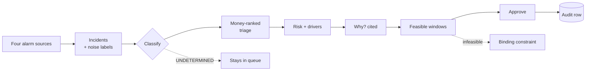

# Evaluation Traceability

> **Status:** Draft v0.2 · **Owner:** NK · **Last updated:** 2026-09-18
>
> **v0.2** folds in `FR-97`…`FR-99`, `T-94`…`T-96` and the D14 cold external scoring run: `E2` gains
> two rows for proof that is *shown* rather than only tested, and `E9` names what its verdict depends on.
>
> **One table per criterion, mapping it to the artefact and the demo moment that proves it.**
> If a criterion has no proof, that is a gap to close, not a line to argue.
>
> Criteria IDs are `E1…E9` from
> [problem-statement.md §4](../00-hackathon/problem-statement.md#4-evaluation-criteria--consolidated-scorecard),
> which remains our operative scorecard. The published weights on the event page apply to `E1`–`E3`
> only and are recorded here for prioritisation, not to replace the given scorecard.

---

## 1. Weighting reality

| Criterion | Published weight | Our reading |
| --- | --- | --- |
| `E1` Real World Relevance | **30%** | Our strongest dimension, and the most robust to a thin build |
| `E2` Technical Execution | **40%** | **Highest weight and highest variance.** Where the entry is won or lost |
| `E3` Solution Completeness | **30%** | Measured as *end to end*, so a missing link costs more than a shallow one |
| `E4`–`E9` | not published | Mandatory (`E4`) or general (`E6`–`E9`). Treated as necessary, not scored |

**Consequence for prioritisation:** anything serving `E2` outranks anything serving `E4`–`E9` when
they compete for the same day. `E4` is the exception — it is mandatory, so it is a floor rather than a
trade.

## 2. The brief's four asks

No placeholders. Every row names something a judge can watch happen.

| Brief ask | Proved by | Demo moment | Verdict |
| --- | --- | --- | --- |
| "Correlate **real time** sensor streams (vibration, temperature, RPM) with ERP and maintenance records" | `M1` converged model; `M12` one incremental path with a **declared target lag**; `CMP-4` matched-band features | Drivers panel showing CMS band energy **and** bearing temperature at matched RPM/load, beside work-order history — with a visible refresh time | **Ready.** `M12` exists specifically so we can say "incremental, declared lag" truthfully rather than dropping the word |
| "Predict failures in advance" | `M3` trained model, held-out evaluation, `FR-19` lead-time distribution | Risk score with horizon, **and the held-out metric on screen** (`FR-90`) | **Strong.** The metric on screen is the highest-credibility fact we own |
| "…and support root cause investigation in natural language" | `M6` real documents parsed and indexed; `S4` genealogy | "Why is this at risk, and has it happened before?" → drivers, a similar failure on another serial, a cited procedure | **Ready** |
| "Deliver a command center experience for alert triage and action" | `M9` alarm intelligence, `M5` money ranking, `M10` planned work, `M7` audited writes, `M8` two views | 900 alarms → 14 incidents → 3 actionable / 2 undetermined, as a **funnel**; then money-ranked; then approve → audit row | **Strongest.** This is where our differentiation concentrates |
| "Lift Overall Equipment Effectiveness" | `M4` Turbine OEE, `A × P × Q` identity enforced | OEE decomposed at the selected scope | **Adequate**, and declared as our adaptation ([ADR-0003](../03-architecture/decisions/adr-0003-turbine-oee.md)) |

## 3. Criterion by criterion

### E1 — Real World Relevance · 30%

| What judges look for | Our proof | Where |
| --- | --- | --- |
| A believable scenario | A fictional Indian wind OEM that **manufactures** turbines and maintains its own fleet under multi-year O&M contracts | [company-profile.md](../01-business/company-profile.md), [ADR-0002](../03-architecture/decisions/adr-0002-scenario.md) |
| The right personas | Ten personas mapped to the company's actual org chart, two splits flagged rather than silent | [personas-and-journeys.md](../01-business/personas-and-journeys.md) |
| Quantified downtime impact | **Contractual** liquidated damages plus lost energy, with the arithmetic shown and inputs marked *(illustrative)* | [business-case.md §2.1](../01-business/business-case.md#21-illustrative-value-of-one-avoided-gearbox-failure) |
| Actions a real team would take | Up-tower versus crane campaign; work before the wind season; suppression that a controller would accept | `J-1`, `J-3`, `J-6` |
| Industry grounding | Cited sources for every real-world fact; CMS practice, IEC 61400-26, Indian DSM | [company-profile.md §13](../01-business/company-profile.md#13-sources) |

**Risk:** the brief says *"Manufacturers"*, and we lean on the O&M side. **Mitigation:** the deck
establishes "designs and manufactures turbines" **before** it says "and maintains them", so the
manufacturing framing lands before OEE appears.

### E2 — Technical Execution · 40%

The criterion that decides the entry.

| What judges look for | Our proof | Verdict |
| --- | --- | --- |
| A working IT/OT convergence pipeline | Four source systems plus four alarm sources in one governed model; `M12` incremental path with declared lag | Ready |
| **Real, not faked, predictions** | Trained `SNOWFLAKE.ML.CLASSIFICATION`; held-out evaluation; **`T-10` requires beating a trivial single-signal rule, not just random** | **The single strongest claim we own** |
| **Shown, not just tested** | `FR-97`: the **rule-versus-model comparison is displayed** — deck slide 9, demo 2:10–2:30, gated by **`T-94`** | **The most persuasive twenty seconds we have** |
| Guards that hold | `FR-32` guards, `T-60` across the dataset — **and `FR-99`/`T-96` make one refuse visibly on screen at 0:45** | Demonstrated, not asserted |
| Explainability | Drivers with magnitude and direction on every score; `T-16` makes a score without drivers a defect | Strong |
| Sound agent design | Engine decides state, model explains; candidates-only selection; validated SQL; **no write grant** | Strong |
| Governance | Least-privilege roles; audit-before-write; no `ACCOUNTADMIN` in application code | Strong |
| Honest data | Damage-driven generator; label learnability tested; every threshold reachable; no stale data | **Rare.** Most entries will not test this at all |

**The quiet advantage.** Snowflake's own certified reference solution for this problem statement
computes its health score as `CASE` on `asset_id` plus `UNIFORM()`, and its feature-store label is a
coin flip independent of every feature. Judges from Snowflake may know that guide. Showing a held-out
metric and a learnability test demonstrates what their flagship example does not — **and we never
mention it** (`R-REF-5`).

### E3 — Solution Completeness · 30%

Measured end to end. The chain must be unbroken.

Every box is demonstrable and every arrow is testable. The two dotted paths are the honest ones and
are shown deliberately.

**Risk:** if `M10`'s surface slips, the chain still completes via work-order draft → approve → audit.
Scheduling is additive, never load-bearing.

### E4 — CoCo across the full lifecycle · mandatory

| Phase | Proof |
| --- | --- |
| Planning | [Evidence entry](../06-coco/evidence/planning/01-plan-generation.md) with **session ID, request IDs, token and credit figures from `ACCOUNT_USAGE`** |
| Development | Entry per meaningful session, same format |
| Execution | Setup and scoring run from the **CLI**, verifiable in `CORTEX_CODE_CLI_USAGE_HISTORY` |
| Testing | The gating suite and adversarial prompts authored through CoCo |

**Differentiator most teams will miss:** our evidence is tied to **server-side telemetry Snowflake
itself holds**, not self-reported prose. A judge can verify the session happened.

### E5 — CoCo ingenuity · bonus

Seven capabilities, each CLAIMED or DECLINED with a reason:
[coco-usage-plan.md §4](../06-coco/coco-usage-plan.md#4-ingenuity--e5).

Four skills published during the build, not after. Multi-agent **declined with a stated reason** —
deliberate judgement beats a fragile demonstration.

### E6 — Impact

| Beneficiary | Proof |
| --- | --- |
| VWS | LD exposure avoided; fewer emergency cranes; planned instead of reactive work |
| The customer (IPP / C&I) | Fewer outages, planned in low-wind windows, communicated ahead |
| The operator (`P-7`) | A short honest list instead of a flood — and told when the system is unsure |
| The grid | Fewer unscheduled deviations |

The operator row is the one most entries omit, and it is the one a judge with operations experience
will notice.

### E7 — Creativity

| Original element | Why it is original |
| --- | --- |
| **`UNDETERMINED` classification** | No prior art found in alarm-triage demos. Everyone classifies confidently; abstention with stored evidence is a capability, not a caveat |
| **Compression paired with real-failures-suppressed** | A headline metric designed so it cannot be gamed by suppressing everything |
| **Damage-driven generator with a learnability gate** | Treats the dataset as something to be *proved* useful, not assumed |
| **Binding-constraint reporting** | "No certified crew until week 44" as a first-class answer |
| **Position versus serial genealogy** | Makes "has this *part* failed before?" answerable, which is a different question from "has this *slot*?" |

### E8 — Design

| What judges look for | Our proof | Verdict |
| --- | --- | --- |
| A well-thought-out blueprint | C4 levels 1–4, deployment, cross-cutting concerns, 19 ADRs | Strong |
| Crash-proof front end | Defined empty and error states; no traceback or debug output; forced-failure test `T-45` | Adequate |
| UI/UX | Two views done properly; one reusable evidence panel used three times; **the alarm funnel as the one striking visual** | **Weakest criterion** — we cut the only thing that photographs well, so the funnel carries it |

**Honest note:** we will not out-pretty a team that ships glassmorphism. The funnel plus consistent
evidence panels is the most visual credibility available without overclaiming.

### E9 — Execution

| What judges look for | Our proof |
| --- | --- |
| A clear timeline | [project-plan.md](project-plan.md) — real dates, five gates, dated cut triggers, a defined minimum viable submission |
| Effective results | **[results-summary.md](results-summary.md)** — one page of measured outcomes: model metrics, compression with failures-suppressed, gating tests passing, credits consumed |

The results summary is the artefact that turns "we built it" into "here is what it does". It is
written on D15 from `OPS`, not composed by hand.

## 4. Readiness verdict, weakest first

| Criterion | Verdict | The gap |
| --- | --- | --- |
| `E8` Design | **Amber** | `ADR-0012` still Open (`Q-39`). Visual appeal is our thinnest dimension; the funnel is the mitigation |
| `E9` Execution | **Amber-green** | Depends on the results summary actually being generated (`T-92`), the **aggregate outcome sentence reconciling** (`T-95`), and the **cold external scoring run on D14** (`US-97`) surfacing gaps while there is still a day to fix them |
| `E5` Ingenuity | **Green** | Four skills, automation, MCP, four surfaces, one honest decline |
| `E4` Lifecycle | **Green** | Planning complete with verifiable IDs; three phases pending by definition |
| `E6` Impact | **Green** | Contractual money, four beneficiaries |
| `E7` Creativity | **Green** | Five original elements, three of them demo-visible |
| `E3` Completeness | **Green** | Unbroken chain, with two honest branches |
| `E1` Relevance | **Green** | Scenario given, cited, structurally better than a factory |
| `E2` Technical Execution | **Green if `M2`/`M3` land** | Everything rests on `T-10` at D4 |

**Single point of failure:** `T-10`. If the generated label is not learnable, `E2` collapses from our
strongest claim to our weakest, and no other criterion compensates for 40%.

## 5. Where each criterion is proved in the five minutes

| Demo time | Beat | Serves |
| --- | --- | --- |
| 0:00–0:25 | Alarm funnel: 900 → 14 → 3 + 2 undetermined, with failures-suppressed | `E3`, `E7`, `E8` |
| 0:25–0:45 | Open a nuisance, then an undetermined one | `E7`, `E2` |
| 0:45–0:55 | **A guard refuses, visibly** | **`E2`**, `E8` |
| 0:45–1:05 | Stakes: guarantee, LD exposure | `E1`, `E6` |
| 1:05–1:30 | Money ranking versus severity ranking | `E3` |
| 1:30–2:10 | Risk, drivers, **held-out metric on screen** | **`E2`** |
| 2:10–2:30 | **Rule versus model comparison** | **`E2`** |
| 2:15–2:55 | Why, with a citation | `E3` |
| 2:55–3:35 | Suggested window → **planner rejects one, with a reason** → approve → audit row | `E3`, `E8`, `E6` |
| 3:35–4:00 | What the agent *cannot* do; engine/model/human boundary; **closing aggregate outcome sentence** | **`E2`**, `E6`, `E9` |
| 4:00–5:00 | Q&A | `E5`, `E9` |

Every criterion is touched, and the 40%-weighted one is touched twice — once as a number on screen,
once as an architectural claim.

## 6. Open questions

| ID | Question | Owner |
| --- | --- | --- |
| `Q-84` | Do we show this matrix to judges, or keep it internal? Recommendation: keep it internal, but let it drive the deck's slide order | NK |
| `Q-85` | `E8`: is one striking visual enough, or do we need two? Recommendation: one, done well; a second competes for build time with `E2` | NK |
