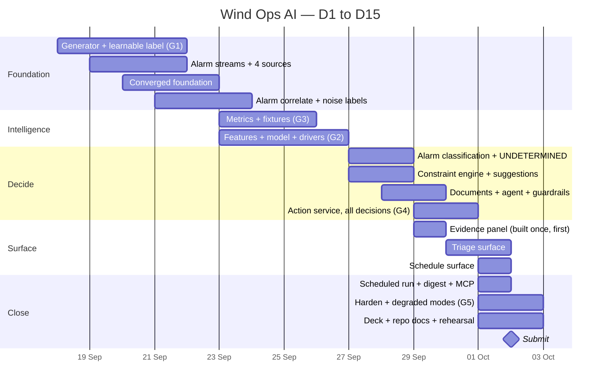

# Project Plan

> **Status:** Draft v0.4 · **Owner:** NK · **Last updated:** 2026-09-18
>
> Dates are real, from the [Official Rules](https://docs.google.com/document/d/e/2PACX-1vTrXSK6v7T9tP3-Ab8LuFCDOuuW90debariK5I3PsIF0TrQ4A6q5RSC2B2wA4WM7Qif16AgynvdA4XL/pub) §1.1
> and the event page. `D1` is Fri 18 Sep 2026.

---

## 1. The calendar

| Milestone | Date (IST) |
| --- | --- |
| Submission period opened | 13 Sep 2026 |
| **Registration closes** | **30 Sep 2026** — the 4th member must be registered by then (`Q-5`) |
| **Prototype submission deadline** | **Sun 4 Oct 2026, 11:59 PM** |
| Evaluation | 5 – 22 Oct |
| Shortlist announced | ~23 Oct |
| Finalist induction | 26 Oct |
| Grand Finale — **live** demo | 27 – 30 Oct |

**We aim to submit on D15, Fri 2 Oct**, leaving 3–4 Oct as buffer. Official Rules §12 puts the risk of
a late or failed submission entirely on us.

Note what is due at submission: a **deck** and a **documented GitHub repo** (§4.5a, §4.5b). The live
demo is a Finals obligation, and pre-recorded demos may not be accepted (§4.5c) — so demo fallbacks
must be live fallbacks.

## 2. Capacity and what actually constrains us

| | |
| --- | --- |
| Confirmed | NK, JP, SA |
| Window | D1–D15 |
| 4th member | Unconfirmed (`Q-5`). Must be **registered by 30 Sep** |

**Person-hour estimates have been dropped.** They implied a precision we did not have. Four things
actually constrain the plan:

| Constraint | How it binds |
| --- | --- |
| **The calendar and gates `G1`–`G5`** | Work has to land somewhere real, behind a gate that proves it |
| **Human review and decision load** | **The scarce resource.** Every change needs reading, testing and approving. See [§5](#7-review-and-decision-load) |
| **Credits against $400** | Warehouse cost is manageable; **CoCo token spend is the real consumer** — 90% of planning spend |
| **Risk and blast radius** | What breaks, and how far, if an item lands late or misbehaves. See [§7](#9-risk-and-blast-radius) |

The gap is managed by the [cut order](../02-functional/scope.md#cut-order) and the
[cut triggers](#8-cut-triggers), not by optimism. Recorded as `R-1`.

## 3. Ownership

| Person | Owns | Rationale |
| --- | --- | --- |
| **NK** — senior data engineer, lead | `EP-2` foundation, `EP-7` action service, `EP-11` planned work, `EP-12` ingenuity, `EP-13` scoring surface, `EP-9` platform, `EP-10` submission | The action service carries the audit and approval invariants — the least forgiving code in the build — and `EP-11` writes through it. `EP-13` is the scoring surface and cannot be delegated away |
| **JP** — data engineer | `EP-3` metrics, `EP-5` alarm intelligence, `EP-6` documents & agent, `CMP-4` feature engine | `EP-5`'s classification reuses the matched-band feature work, so keeping both with one person avoids a handoff on the subtlest piece of data work |
| **SA** — data scientist | `EP-1` generator (incl. four alarm streams and seeded patterns), `EP-4` model | The generator and the model are one problem; splitting them would be a mistake |
| **Unconfirmed 4th** | `EP-8` command center | The most separable epic, so an unconfirmed member is least disruptive there |

**If no 4th member joins**, `EP-8` goes to NK and the app collapses toward the triage view alone (cut
order step 7). Plan for this shape rather than fearing it.

## 4. Phases

| Phase | Days | Gate | Exit condition |
| --- | --- | --- | --- |
| **Foundation** | D1–D6 | **G1** | Data plausible, non-stale, self-consistent, label **learnable**; alarm streams generated and noise conditions detectable |
| **Intelligence** | D6–D9 | **G2**, **G3** | Model beats both baselines and carries drivers; metrics reconcile to hand-worked fixtures |
| **Decide** | D10–D12 | **G4** | Alarms classified with `UNDETERMINED`; suggestions drawn only from engine windows; nothing writes without approval and an audit row; **`T-60`, `T-71`, `T-76` pass** |
| **Surface** | D12–D14 | — | `GS-4` then `GS-1` runnable end to end by a human |
| **Close** | D14–D15 | **G5** | Degraded modes exercised; deck and repo done; rehearsed twice |

Gates are defined in [testing-and-validation.md §9](../07-quality/testing-and-validation.md#9-milestone-gates).

## 5. Day by day

| Day | Date | Focus | Checkpoint |
| --- | --- | --- | --- |
| D1 | Fri 18 Sep | Setup scripts, roles, schemas. **Name `WOA_SCHEDULER`.** ~~Test Streamlit object creation~~ — **`Q-39` closed early, verified working**. **Draft the 15-slide deck as a specification.** Generator: fleet + operating context | Environment reproducible; `T-52` runs; **`ADR-0012` and `ADR-0020` both closed**; **deck exists** |
| D2 | Sat 19 Sep | **Spike: matched-band feature join** (`Q-36`). Generator: damage model. Alarm sources begin. **Book a 20-minute call with a wind O&M or industrial-monitoring practitioner** to sanity-check `J-6` and `J-3` (`Q-90`) | Banding demonstrably removes load effects (`T-3`) |
| D3 | Sun 20 Sep | Generator: signal response, failure events, **four alarm streams + seeded grid dip, code cascade, chattering**. Landing tables | Degradation visible before failures (`T-8`); each alarm source populated |
| D4 | Mon 21 Sep | Generator: consequences — alarms, work orders, stock, genealogy. **First learnability test** | **`T-10` — the decision point** |
| D5 | Tue 22 Sep | Fix whatever `T-10` exposed. Curation. **Alarm normalisation.** **One incremental path with declared lag** (`M12`) | `T-62`, `T-88` |
| D6 | Wed 23 Sep | **G1.** Alarm correlation + three noise conditions. Metric layer begins | **G1 passed, or stop and fix.** `T-63`–`T-67` |
| D7 | Thu 24 Sep | Metrics + hand-worked fixtures. Feature engineering | `T-20`, `T-21`, `T-22` |
| D8 | Fri 25 Sep | Model training + evaluation. **Define the trivial baseline rule — before seeing the comparison.** Documents written | `T-15`, `T-17` |
| D9 | Sat 26 Sep | **G2 + G3.** Drivers. **Baseline comparison computed** (`T-94`). Semantic view + descriptions. Verified queries | **Model and metrics trustworthy.** `T-16`, `T-42`, `T-94` |
| D10 | Sun 27 Sep | **Alarm classification + `UNDETERMINED` + evidence rows.** Constraint engine restored. Document parse + search | `T-68`, `T-61`, `T-31` |
| D11 | Mon 28 Sep | Schedule suggestions + binding-constraint reporting. Agent + tools + validator + adversarial suite | `T-71`, `T-72`, `T-46`–`T-48` |
| D12 | Tue 29 Sep | **G4.** Action service carrying **all four decision types**. Noise metrics + anti-gaming pairing | **`T-60`, `T-70`, `T-74`, `T-76`, `T-33`–`T-35`** |
| D13 | Wed 30 Sep | **Evidence panel built once, first.** Triage surface with the **funnel** and noise header. **Held-out metric and baseline comparison on screen.** **Guard refusal reachable in the UI.** MCP notification. **Record the 2-minute walkthrough.** **Registration closes today** | `T-85`, `T-86`, `T-87`, **`T-94`**, **`T-96`**, `T-79`, `T-90` |
| D14 | Thu 1 Oct | Schedule surface with reject-with-reason. Scheduled run + digest. **Judge-facing README.** **Cold external scoring run — findings triaged today** (`US-97`). Harden: empty/error states, degraded modes | `T-91`, `T-77`, `T-78`, `T-45`, `T-53` |
| D15 | Fri 2 Oct | **G5.** **`T-89` — a stranger follows the README.** Generated results summary **led by the aggregate outcome sentence**. Licences, CLAIMED/DECLINED table, criteria traceability check, rehearse twice, **submit** | **Submitted.** `T-89`, `T-92`, `T-93`, `T-95` |
| D16–17 | 3–4 Oct | Buffer only. No new work | — |

**D1 now carries four things that are cheap and unblock everything else**: the scheduler role, the
Streamlit test (two minutes, closes the last Open ADR), the deck as a specification, and the start of
the generator. Writing the deck first turns it into a cut-decision tool — **a slide that cannot be
filled by D13 means that feature is cut**, decided early rather than argued late.

**D4 remains the pivot.** If `T-10` fails, D5 goes to fixing the generator and the buffer absorbs the
slip. If it still fails on D6, reduce scope drastically and ship a smaller true thing rather than a
dashboard over noise.

**D12 is the second pivot.** Four decision types now flow through one action service: work-order
approval, suppression, alarm confirm/dismiss/reinstate, and schedule accept/reject. If that converges,
three surfaces become straightforward. If it does not, cut order steps 1–3 apply the same day.

### The minimum viable submission

Defined in [scope §7](../02-functional/scope.md#minimum-viable-submission). If the build collapses,
this is what still goes in on D15 — and it still addresses all four brief asks. Everything above the
floor is optional; nothing below it is.

## 6. Fixed daily rhythm

Short daily sessions mean the ritual matters more than it would in long blocks.

| When | What |
| --- | --- |
| Start | Async standup in writing: yesterday, today, blocked |
| During | Work in a personal clone. Small PRs |
| End | Push, open PR, record CoCo evidence **with its session and request IDs** if the session produced anything meaningful |

Rules that protect a team working in short sessions: **never end a session with a broken `main`**;
**never start a story you cannot finish or park cleanly**; PRs need 2 approvals (AGENTS.md), so open
them early rather than at the end of a session.

## 7. Review and decision load

The scarce resource. Ranked by how much of **NK's** attention each item needs.

| Item | Load | What specifically, and when |
| --- | --- | --- |
| **Schedule suggestion quality** (`EP-11`) | **Highest, and taste-dependent** | Only a human can say whether a suggestion reads as credible to a planner. I can test that constraints hold; I cannot test that the reasoning persuades. Expect 2–3 rounds of "this one is obviously wrong and here's why" around **D11**. This is the one item where NK's judgement *is* the deliverable |
| **Alarm classification policy** (`EP-5`) | High, front-loaded | Sign off [ADR-0017](../03-architecture/decisions/adr-0017-alarm-classification.md): the three classes, the evidence channels, the `UNDETERMINED` policy. **D3–D5**, then low ongoing |
| **Free-text constraint behaviour** | Medium, one decision | Confirm parse-echo-refuse, since it is where `ADR-0004` is most at risk. **D11** |
| **Metric fixtures** (`EP-3`) | Medium | Hand-work the availability and LD answers on paper so `T-20` and `T-22` test a formula rather than two copies of the same misunderstanding. **D7** |
| **Impact views** | Medium | Confirm two views is enough, and which two. **D14** |
| **`WOA_SCHEDULER` role** | Low, but **blocking on D1** | Automations inherit their creator's default role. Discovering this on D14 breaks `NFR-3` |
| **MCP target** | Low, one decision | Slack workspace and who holds the credential. **D13** |
| **CLAIMED/DECLINED table** | Low | Read it once; it is NK's voice more than mine. **D15** |
| **Cold external scoring** (`US-97`) | Medium, one afternoon | Hand someone outside the team the deck, README and walkthrough on **D14** and have them score us against the rubric. Whatever they cannot find, a judge will not find. Triage the findings the same day |
| **Practitioner sanity-check** (`Q-90`) | Low — one 20-minute call | We currently have **zero external signal** on whether the scenario is credible to someone who has done this work. Judges may include industry specialists. Book it on **D2**, while the scenario can still change cheaply |
| Surfaces, licences, secrets | Near zero | Mechanical, test-verified |

This is also why the **evidence panel is built once** (`US-75`): three separately-designed panels
would be three design conversations, and design conversations are the expensive kind.

## 8. Cut triggers

| Item | If it lands late or misbehaves | Blast radius |
| --- | --- | --- |
| Generator / learnable label | Nothing downstream means anything | **Highest.** Contained by `T-10` on D4 |
| Alarm classification | Over-suppression hides a real failure | **Contained by `T-60`** — the build fails rather than the demo lying. The right shape |
| Alarm surface | Demo loses its opening beat | Medium. Falls back to the money-ranked triage beat |
| Constraint engine | Scheduling has nothing to rank | **High** — now load-bearing for `M10`, which is why it sits on D10 rather than D13 |
| Schedule surface | No schedule beat | **Low, and reassuring.** `J-1`'s action beat still works: draft → approve → audit row. Scheduling is additive, never load-bearing |
| Scheduled run | Suggestions stale | Low **only because staleness is visible** (`NFR-18`). A silently stale suggestion is the same class of defect as a toast that lies |
| MCP notification | External dependency fails live | **Optional by design, never on the critical path.** First in the cut order for exactly this reason |
| Action service | Four decision types converge here | **High on D12.** Single point of convergence, and the reason D12 is the second pivot |

## 9. Risk and blast radius

Pre-committed, so nobody has to argue at 11 pm on D13.

| If, by… | …this has not happened | Then |
| --- | --- | --- |
| End of D6 | **G1** not passed | Cut `S4`. Reduce history window. Alarm work reduces to normalisation and correlation only |
| End of D9 | **G2** or **G3** not passed | Model degrades to anomaly detection only, **relabelled from "risk" to "anomaly"**. Alarm classification loses its risk-score evidence channel and must say so |
| End of D12 | **G4** not passed | **Cut the write path entirely and remove every action claim** from deck and UI. Do not ship a fake button. `M10` becomes read-only suggestions |
| End of D13 | Triage surface not clickable | Apply cut order steps 1–3: MCP, then the scheduled run, then the schedule surface. **The triage surface itself is not cuttable** — it carries the funnel, the `UNDETERMINED` class and the opening beat |
| End of D14 | Deck not **filled** (it was drafted on D1) | Stop all build work. Submission beats features. Any slide still empty marks a feature as cut |
| Any day | A slide in the D1 deck cannot be filled | **That feature is cut, that day.** The deck is the cut-decision tool |

The D12 trigger is the important one: shipping a button that pretends to write is the exact defect we
differentiate against, and doing it ourselves under time pressure would be worse than not shipping the
feature.

## 10. Dependencies

| ID | Dependency | Needed by | Risk if late |
| --- | --- | --- | --- |
| `DEP-1` | 4th member confirmed and registered | D13 (registration closes) | `EP-8` falls to NK; app collapses to one page |
| `DEP-2` | ~~`Q-39` — Streamlit object creation on trial account~~ | — | **Closed 2026-09-18** — verified working, no fallback needed |
| `DEP-3` | Cross-region inference stays enabled | D11 | Fallback to `llama3.1-8b` |
| `DEP-8` | **`WOA_SCHEDULER` named and its default role set** | **D1** | Automation cannot be created without breaking `NFR-3` |
| `DEP-9` | **MCP target workspace and credential** | D13 | `FR-84` cut; it is first in the cut order anyway |
| `DEP-4` | $400 credit not exhausted | D15 | Reduce data volume; suspend everything not in use |
| `DEP-5` | Verified platform features remain available | D9 | Degraded modes per [container](../03-architecture/02-container.md#5-degraded-modes-per-container) |
| `DEP-6` | Two reviewers available for PRs | daily | Batch reviews once a day rather than blocking |

## 11. What is deliberately not in this plan

| Not planned | Why |
| --- | --- |
| Work after D15 | D16–17 are buffer. Planning work into buffer consumes it |
| Anything in `Could` | They are opportunistic. Planning them invites overcommitment |
| Multi-agent orchestration | Declined with a reason ([agents §1](../05-ai-ml/agents-and-tools.md#1-what-the-agent-is-for)) |
| Finals preparation | Only if shortlisted on ~23 Oct. A separate, later plan |

## 12. Open questions

| ID | Question | Owner |
| --- | --- | --- |
| `Q-64` | Does the team accept this ownership split, especially the generator and model going to one person? | NK |
| `Q-65` | Is 2 h/day realistic on weekends (D2, D3, D9, D10), or should the plan assume less? | NK |
| `Q-66` | Who are the two PR reviewers when only three people are active? Recommendation: whoever did not write it, and treat review as part of the daily 2 h | NK |
